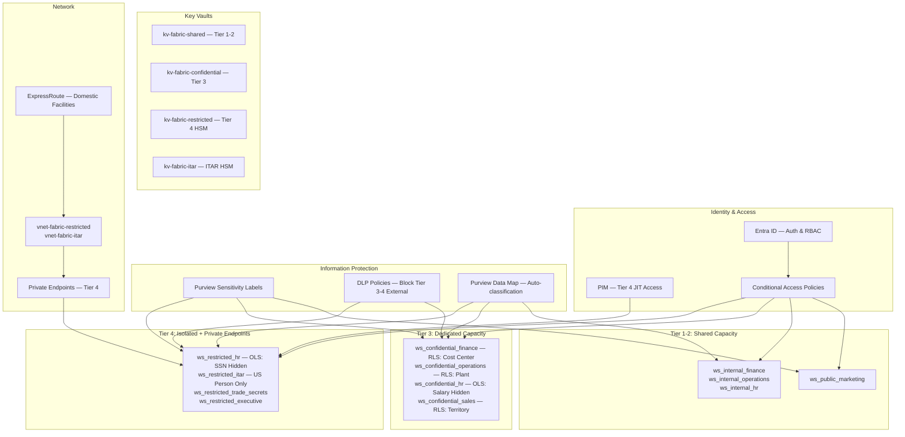

# Fabric Security Model — Classification-to-Controls Mapping
> Module: ISL-04 | Version: 1.0 | Type: Example

## Purpose

This example demonstrates a fully completed mapping of ISL-04 classification tiers to Microsoft Fabric security controls for a manufacturing client operating across four data domains: Finance, Operations, HR, and Engineering. It covers workspace access, OneLake permissions, Power BI RLS/OLS, sensitivity labels, pipeline security, and network isolation.

---

## 1. Workspace Access Model

### 1.1 Design Principle

Each combination of data domain and classification tier receives a dedicated Fabric workspace. Workspace-level RBAC provides a hard boundary between sensitivity tiers, preventing accidental exposure of higher-tier data through shared membership.

### 1.2 Workspace Inventory

| Workspace Name | Domain | Tier | Purview Label | Capacity |
|---------------|--------|------|---------------|----------|
| `ws_public_marketing` | Marketing | 1 | Public | Shared F64 |
| `ws_internal_finance` | Finance | 2 | Internal | Shared F64 |
| `ws_internal_operations` | Operations | 2 | Internal | Shared F64 |
| `ws_internal_hr` | HR | 2 | Internal | Shared F64 |
| `ws_confidential_finance` | Finance | 3 | Confidential | Dedicated F64 |
| `ws_confidential_operations` | Operations | 3 | Confidential | Dedicated F64 |
| `ws_confidential_hr` | HR | 3 | Confidential | Dedicated F64 |
| `ws_confidential_sales` | Sales | 3 | Confidential | Dedicated F64 |
| `ws_confidential_engineering` | Engineering | 3 | Confidential | Dedicated F64 |
| `ws_restricted_hr` | HR | 4 | Highly Confidential | Dedicated F64 (isolated) |
| `ws_restricted_itar_engineering` | Engineering | 4 | HC — ITAR | Dedicated F64 (isolated) |
| `ws_restricted_trade_secrets` | R&D | 4 | HC — Trade Secret | Dedicated F64 (isolated) |
| `ws_restricted_executive` | Executive | 4 | HC — Executive | Dedicated F64 (isolated) |

### 1.3 Role Assignments

| Workspace | Admin | Member | Contributor | Viewer |
|-----------|-------|--------|-------------|--------|
| `ws_public_marketing` | `SG-Fabric-Admin` | `SG-Marketing-Analysts` | `SG-Marketing-Contributors` | `SG-AllEmployees` |
| `ws_internal_finance` | `SG-Fabric-Admin` | `SG-Finance-Analysts` | `SG-Finance-Contributors` | `SG-AllEmployees` |
| `ws_confidential_finance` | `SG-Fabric-Admin` | `SG-Finance-Confidential` | `SG-Finance-DataEng` | `SG-Finance-Viewers` |
| `ws_confidential_hr` | `SG-Fabric-Admin` | `SG-HR-Confidential` | `SG-HR-DataEng` | `SG-HR-Viewers` |
| `ws_confidential_sales` | `SG-Fabric-Admin` | `SG-Sales-Confidential` | `SG-Sales-DataEng` | `SG-Sales-Viewers` |
| `ws_restricted_hr` | `SG-Fabric-Admin-Restricted` | `SG-HR-Restricted-Named` | — | — |
| `ws_restricted_itar_engineering` | `SG-Fabric-Admin-ITAR` | `SG-ITAR-Engineers-Named` | — | — |
| `ws_restricted_trade_secrets` | `SG-Fabric-Admin-Restricted` | `SG-TradeSecret-Named` | — | — |
| `ws_restricted_executive` | `SG-Fabric-Admin-Restricted` | `SG-Executive-Named` | — | — |

Tier 4 workspaces use only Admin and Member roles. All access is limited to named individuals with JIT provisioning through PIM.

---

## 2. OneLake Folder Permissions

| Lakehouse | Folder Path | OneLake Role | Assigned Group | Tier |
|-----------|------------|--------------|---------------|------|
| `lh_internal_operations` | `/Tables/production_summary/` | ReadAll | `SG-AllEmployees` | 2 |
| `lh_confidential_operations` | `/Tables/production_detail/` | ReadAll | `SG-Operations-Confidential` | 3 |
| `lh_confidential_operations` | `/Tables/ncr_records/` | ReadAll | `SG-Quality-Confidential` | 3 |
| `lh_confidential_finance` | `/Tables/gl_transactions/` | ReadAll | `SG-Finance-Confidential` | 3 |
| `lh_confidential_hr` | `/Tables/employee_master/` | ReadAll | `SG-HR-Confidential` | 3 |
| `lh_restricted_itar` | `/Tables/defense_drawings/` | ReadAll | `SG-ITAR-Engineers-Named` | 4 |
| `lh_restricted_trade_secrets` | `/Tables/welding_params/` | ReadAll | `SG-TradeSecret-Named` | 4 |
| `lh_restricted_trade_secrets` | `/Tables/alloy_compositions/` | ReadAll | `SG-TradeSecret-Named` | 4 |

**Principles:** Tier 1-2 grant ReadAll to broad groups. Tier 3 restricts to domain-specific confidential groups. Tier 4 restricts to PIM-managed named-individual groups. Write access is granted only to data engineering service principals. OneLake shortcuts are prohibited from Tier 4 lakehouses to any lower-tier workspace.

---

## 3. Lakehouse and Warehouse Access by Tier

| Tier | Data Write | Data Read | Shortcut From | Shortcut To |
|------|-----------|-----------|---------------|-------------|
| 1 | Data pipeline SP only | All workspace members | Any tier | Tier 1 only |
| 2 | Data pipeline SP only | Workspace members | Tier 1-2 | Tier 1-2 only |
| 3 | Data pipeline SP only | OneLake role assignments | Tier 1-3 | Not to lower tiers |
| 4 | Data pipeline SP only | PIM-activated named users | Not permitted | Not permitted |

**Dynamic Data Masking in Warehouses:**

| Warehouse | Column | Masking Function | Unmasked Group |
|-----------|--------|-----------------|---------------|
| `wh_confidential_hr` | `employee.personal_email` | `email()` | `SG-HR-Confidential` |
| `wh_confidential_hr` | `employee.personal_phone` | `partial(0,"XXX-XXX-",4)` | `SG-HR-Confidential` |
| `wh_restricted_hr` | `employee_sensitive.ssn` | `partial(0,"XXX-XX-",4)` | `SG-HR-Restricted-Named` |
| `wh_restricted_hr` | `employee_sensitive.bank_account` | `default()` | `SG-HR-Restricted-Named` |
| `wh_confidential_finance` | `vendor_pricing.unit_cost` | `random(1,999)` | `SG-Procurement-Confidential` |

---

## 4. Power BI Row-Level Security (RLS)

### 4.1 Financial Data — Cost Center Filter (Tier 3)

**Semantic model:** `sm_confidential_finance` | **RLS role:** `CostCenterFilter`

**DAX filter on `dim_cost_center`:**
```dax
[CostCenterCode] IN
    SELECTCOLUMNS(
        FILTER('dim_cost_center_access',
            'dim_cost_center_access'[UserPrincipalName] = USERPRINCIPALNAME()),
        "CC", 'dim_cost_center_access'[CostCenterCode])
```

**Effect:** A North American finance analyst sees GL transactions only for cost centers 1000-1499. A Mexico plant controller sees only cost centers 3000-3199.

### 4.2 Sales Data — Territory Filter (Tier 3)

**Semantic model:** `sm_confidential_sales` | **RLS role:** `SalesTerritoryFilter`

**DAX filter on `dim_sales_rep`:**
```dax
[SalesRepEmail] = USERPRINCIPALNAME()
    || [ManagerEmail] = USERPRINCIPALNAME()
```

**Effect:** A sales rep sees their 25 assigned accounts. Their manager sees all accounts across the 4-person team.

### 4.3 ITAR Quality Data — US Person Filter (Tier 4)

**Semantic model:** `sm_restricted_itar_quality` | **RLS role:** `ITARFilter`

**DAX filter on `fact_inspection_results`:**
```dax
[IsITAR] = FALSE()
    || ([IsITAR] = TRUE()
        && USERPRINCIPALNAME() IN
            SELECTCOLUMNS('dim_itar_access', "UPN", [UserPrincipalName]))
```

**Effect:** Non-ITAR-cleared users see only commercial inspection results. ITAR-cleared engineers see both commercial and defense results.

---

## 5. Power BI Object-Level Security (OLS)

### 5.1 Hide Salary Data (Tier 4)

**Semantic model:** `sm_confidential_hr` | **OLS role:** `HideSalaryData`

| Table | Hidden Columns | Visible To |
|-------|---------------|-----------|
| `fact_employee` | AnnualSalary, BonusTarget, StockOptions, PayGrade, SalaryBand | `SG-Compensation-Team` only (excluded from this role) |

**Effect:** HR business partners see employee name, department, title, hire date, and location. Salary columns are invisible. Compensation analysts see the full dataset.

### 5.2 Hide Sensitive PII (Tier 4)

**Semantic model:** `sm_restricted_hr` | **OLS role:** `HideSensitivePII`

| Table | Hidden Columns | Visible To |
|-------|---------------|-----------|
| `dim_employee_sensitive` | SSN, BankAccountNumber, BankRoutingNumber, DriversLicenseNumber, PassportNumber | `SG-HR-Restricted-Named` (payroll processors, excluded from this role) |

---

## 6. Sensitivity Labels in Power BI

| Artifact Type | Label Source | Downstream Inheritance |
|--------------|-------------|----------------------|
| Semantic model | Inherited from source lakehouse/warehouse; manual upgrade allowed | Reports and dashboards inherit dataset label |
| Report | Inherited from semantic model | Dashboards referencing report inherit label |
| Dashboard | Highest label from all referenced reports | App inherits dashboard label |
| Dataflow Gen2 | Manual label required; default Tier 2 | Target lakehouse inherits if higher |

**Export restrictions by label:**

| Label | Excel | PDF | PowerPoint | CSV | Print |
|-------|-------|-----|-----------|-----|-------|
| Public | Allowed | Allowed | Allowed | Allowed | Allowed |
| Internal | Allowed | Allowed | Allowed | Allowed | Allowed |
| Confidential | Blocked | Watermarked | Blocked | Blocked | Watermarked |
| Highly Confidential | Blocked | Blocked | Blocked | Blocked | Blocked |

---

## 7. Data Pipeline Security

### 7.1 Service Principals by Tier

| Service Principal | Tier | Key Vault | Permitted Workspaces |
|-------------------|------|-----------|---------------------|
| `sp-fabric-pipeline-public` | 1 | `kv-fabric-shared` | `ws_public_*` |
| `sp-fabric-pipeline-internal` | 2 | `kv-fabric-shared` | `ws_internal_*` |
| `sp-fabric-pipeline-confidential` | 3 | `kv-fabric-confidential` | `ws_confidential_*` |
| `sp-fabric-pipeline-restricted` | 4 | `kv-fabric-restricted` (HSM) | `ws_restricted_*` |
| `sp-fabric-pipeline-itar` | 4 (ITAR) | `kv-fabric-itar` (HSM) | `ws_restricted_itar_*` |

### 7.2 Pipeline Data Flow Rules

| Source Tier | Target Tier | Permitted | Conditions |
|------------|------------|-----------|-----------|
| Lower | Higher or same | Yes | Target label upgraded to match or exceed source |
| Higher | Lower | No | Blocked — data cannot flow to lower tier |
| Tier 4 (ITAR) | Tier 4 (non-ITAR) | No | Blocked — ITAR isolation boundary |
| Any | Tier 1 | Conditional | Only aggregated/anonymized data with Public release sign-off |

---

## 8. Network Isolation for Tier 4

### 8.1 Private Endpoints

| Resource | Private Endpoint | VNet/Subnet | Tier |
|----------|-----------------|-------------|------|
| Fabric (Restricted HR) | `pe-fabric-restricted-hr` | `vnet-fabric-restricted/snet-restricted` | 4 |
| Fabric (ITAR) | `pe-fabric-itar` | `vnet-fabric-itar/snet-itar` | 4 |
| Key Vault (Restricted) | `pe-kv-restricted` | `vnet-fabric-restricted/snet-keyvault` | 4 |
| Key Vault (ITAR) | `pe-kv-itar` | `vnet-fabric-itar/snet-keyvault` | 4 |

### 8.2 Managed VNet Configuration

| Configuration | Tier 1-2 | Tier 3 | Tier 4 |
|--------------|----------|--------|--------|
| Managed VNet | No | Yes | Yes |
| Outbound access | Unrestricted | Approved destinations | Blocked (private endpoints only) |
| Internet egress | Allowed | Allowed (logged) | Blocked |
| Cross-tenant access | Allowed | Blocked | Blocked |
| Data exfiltration protection | None | Managed private endpoints | All outbound blocked |

---

## 9. Security Architecture Diagram



---

## 10. Entra ID Group Structure

```
SG-Fabric-Admin                              (Tenant admins — all workspaces)
SG-Fabric-Admin-Restricted                   (Tier 4 non-ITAR workspace admins)
SG-Fabric-Admin-ITAR                         (ITAR workspace admins — US Persons)
├── SG-AllEmployees                          (Tier 1-2 Viewer — dynamic membership)
├── Finance
│   ├── SG-Finance-Analysts                  (Tier 2 Member)
│   ├── SG-Finance-Confidential              (Tier 3 Member — need-to-know)
│   ├── SG-Finance-DataEng                   (Tier 3 Contributor — data engineers)
│   └── SG-Finance-Viewers                   (Tier 3 Viewer — report consumers)
├── Operations
│   ├── SG-Operations-Analysts               (Tier 2 Member)
│   ├── SG-Operations-Confidential           (Tier 3 Member)
│   └── SG-Quality-Confidential              (Tier 3 — NCR/CAPA access)
├── HR
│   ├── SG-HR-Analysts                       (Tier 2 Member)
│   ├── SG-HR-Confidential                   (Tier 3 Member)
│   ├── SG-HR-Restricted-Named               (Tier 4 — SSN/medical — PIM)
│   └── SG-Compensation-Team                 (Tier 4 OLS exemption — salary)
├── Sales
│   ├── SG-Sales-Confidential                (Tier 3 Member)
│   └── SG-Sales-Viewers                     (Tier 3 Viewer)
├── Engineering
│   ├── SG-Eng-Confidential                  (Tier 3 Member)
│   ├── SG-ITAR-Engineers-Named              (Tier 4 ITAR — US Persons; PIM)
│   └── SG-TradeSecret-Named                 (Tier 4 — trade secret; PIM)
├── Executive
│   └── SG-Executive-Named                   (Tier 4 — M&A/board; PIM)
└── Governance
    ├── SG-Data-Steward-{Domain}             (Purview classification by domain)
    ├── SG-Purview-LabelAdmin                (Label creation/management)
    └── SG-Security-Analyst                  (DLP incident investigation)
```

**Group governance:** Tier 1-2 groups use dynamic membership based on department attribute. Tier 3 groups require manager approval via access packages. Tier 4 groups require data owner + CISO two-stage approval and are PIM-eligible with 8-hour maximum activation. ITAR groups enforce `itarUSPerson = true` via conditional access. Nested groups are prohibited for Tier 4. All memberships are reviewed quarterly (Tier 4 monthly).

---

## Cross-References

- **ISL-04 Classification Tier Definitions** — tier model driving workspace and access design
- **ISL-04 Sensitivity Labeling Standards** — Purview labels referenced throughout
- **ISL-04 Manufacturing Classification Example** — client data classification mapped to controls here
- **ISL-02 Metadata & Lineage** — lineage tracking across workspace boundaries
- **ISL-03 Naming Conventions** — workspace and object naming (`ws_`, `lh_`, `wh_` prefixes)
- **ISL-01 API Governance** — API security for data pipeline service principals

---

## Revision History

| Version | Date | Author | Changes |
|---------|------|--------|---------|
| 1.0 | 2025-01-15 | Data Platform Architect | Initial Fabric security model |
| 1.0 | 2025-01-15 | Cybersecurity Lead | Security architecture and ITAR isolation review |
| 1.0 | 2025-01-15 | Fabric Administrator | Workspace and capacity configuration verification |
