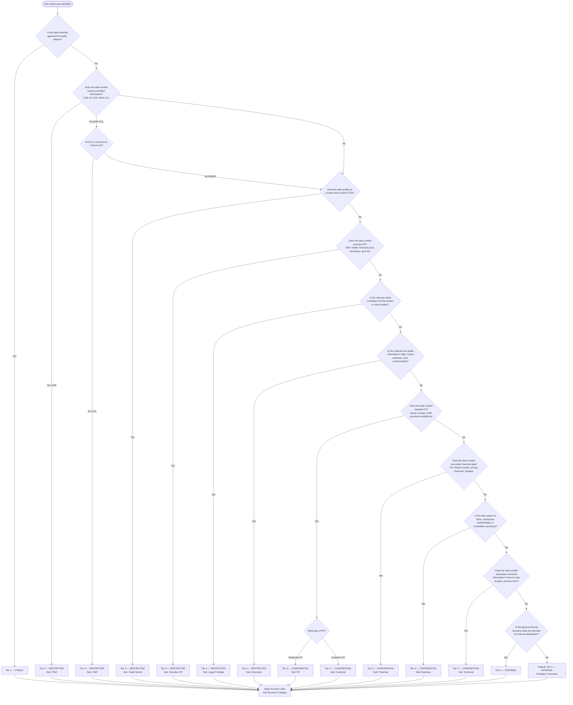

# Classification Decision Tree
> ISL-04 | Integration Standards Library | v1.0

**Module:** ISL-04 — Data Classification & Sensitivity Framework
**Purpose:** Provide a visual flowchart and step-by-step decision process for data stewards to consistently classify new data assets, with edge case resolution, bulk classification guidance, auto-labeling rules, escalation processes, and reclassification workflows
**Adaptation Effort:** 2-3 hours
**Dependencies:** All other ISL-04 templates (classification-tier-definitions, sensitivity-labeling-standards, access-control-alignment, compliance-mapping-matrix, data-handling-requirements), ISL-03 (naming conventions)

---

## 1. Purpose

Consistent data classification depends on clear, repeatable decision logic. When data stewards classify assets using subjective judgment alone, the same data type may be classified differently across departments, leading to under-protection (compliance risk) or over-protection (productivity loss). This standard provides a structured decision tree that guides stewards through a deterministic classification process.

The decision tree is designed to be used in three ways: (1) as a visual flowchart for quick reference during classification exercises, (2) as a step-by-step walkthrough for training new data stewards, and (3) as the logical foundation for Purview auto-labeling rule configuration. The decision tree incorporates all classification criteria from the tier definitions, regulatory requirements from the compliance mapping matrix, and access control implications from the access control alignment standard.

Use this standard when:
- Classifying new data assets during onboarding or migration
- Training data stewards on classification methodology
- Resolving disputed classifications between data owners and stewards
- Configuring auto-labeling policies in Microsoft Purview
- Conducting bulk classification exercises for large datasets
- Reviewing and reclassifying existing data assets
- Auditing classification consistency across the data estate

---

## 2. Scope

### 2.1 In Scope

- Primary classification decision tree (Mermaid flowchart)
- Step-by-step decision process with yes/no questions
- Edge case resolution guidelines (25+ scenarios)
- Bulk classification guidance for large datasets
- Automated classification rules for Purview auto-labeling
- Escalation process for disputed classifications
- Data steward quick reference card
- Reclassification triggers and workflow
- Annual review process
- Sub-classification assignment (after tier determination)

### 2.2 Out of Scope

- Purview label configuration steps (covered in sensitivity-labeling-standards)
- Access control provisioning after classification (covered in access-control-alignment)
- Regulatory control implementation (covered in compliance-mapping-matrix)
- Data handling procedures post-classification (covered in data-handling-requirements)
- Physical records classification (digital data only)

---

## 3. [ADAPTATION REQUIRED] Client Context

> Customize the following parameters for each engagement. The decision tree logic may change based on client-specific regulatory obligations and data types.

| Parameter | Default Value | Client Value | Notes |
|-----------|--------------|-------------|-------|
| **Classification Default** | Tier 2 — Internal | ___________ | Unclassified data defaults to this tier |
| **ITAR/EAR Applicable** | Yes | ___________ | If No, remove ITAR/EAR decision nodes |
| **HIPAA Applicable** | Limited (employee benefits) | ___________ | If full HIPAA, expand PHI decision logic |
| **SOX Applicable** | Yes (public company) | ___________ | If No, simplify financial data decisions |
| **Trade Secret Definition** | DTSA standard | ___________ | Client may have broader/narrower definition |
| **PII Definition Standard** | GDPR + CCPA (broadest applicable) | ___________ | Adjust PII identification criteria |
| **Auto-Classification Enabled** | Yes (Purview auto-labeling) | ___________ | If No, all classification is manual |
| **Escalation Contact** | Data Governance Council | ___________ | Client's escalation body for disputes |
| **Classification SLA** | 5 business days for new assets | ___________ | Time to classify from discovery |
| **Steward Training Required** | Yes (annual certification) | ___________ | Training prerequisite for classification authority |
| **Client-Specific Data Types** | None | ___________ | Add industry-specific classification criteria |

---

## 4. Primary Classification Decision Tree

### 4.1 Mermaid Flowchart

---

## 5. Step-by-Step Decision Process

### 5.1 Decision Sequence

The following questions must be evaluated in order. The first "Yes" answer determines the classification tier. Higher-tier checks are performed first to ensure sensitive data is never under-classified.

| Step | Question | If Yes | If No | Reference |
|------|----------|--------|-------|-----------|
| **1** | Has this data been explicitly approved for unrestricted public release by an authorized approver? | **Tier 1 — Public** | Continue to Step 2 | Tier Definitions Sec. 3 |
| **2** | Is this data controlled under ITAR (22 CFR 120-130)? Does it relate to defense articles, defense services, or technical data on the US Munitions List? | **Tier 4 — Restricted (ITAR)** | Continue to Step 3 | Compliance Matrix Sec. 5.4 |
| **3** | Is this data controlled under EAR with an ECCN on the Commerce Control List (not EAR99)? | **Tier 4 — Restricted (ITAR sub-class)** | Continue to Step 4 | Compliance Matrix Sec. 5.5 |
| **4** | Does this data qualify as a trade secret under the Defend Trade Secrets Act? Does the organization derive economic value from its secrecy, and has it taken reasonable measures to keep it secret? | **Tier 4 — Restricted (Trade Secret)** | Continue to Step 5 | Compliance Matrix Sec. 13.3 |
| **5** | Does this data contain sensitive PII: Social Security Numbers, health/medical information, financial account numbers (bank, credit card), biometric identifiers, or government-issued IDs (passport, driver's license)? | **Tier 4 — Restricted (Sensitive PII)** | Continue to Step 6 | Tier Definitions Sec. 6 |
| **6** | Is this data protected by attorney-client privilege or work product doctrine? | **Tier 4 — Restricted (Legal Privilege)** | Continue to Step 7 | Tier Definitions Sec. 6.3 |
| **7** | Is this material non-public information? M&A transaction data, board meeting materials (pre-approval), executive compensation details, or information that could affect stock price if disclosed? | **Tier 4 — Restricted (Executive)** | Continue to Step 8 | Tier Definitions Sec. 6.3 |
| **8** | Does this data contain standard PII: names combined with personal contact information (home address, personal email, personal phone), date of birth, employee IDs, or other identifiers linked to a natural person? | **Tier 3 — Confidential (PII or Customer)** | Continue to Step 9 | Tier Definitions Sec. 5 |
| **9** | Does this data contain non-public financial information: pre-release financial results, internal pricing, revenue forecasts, budget details, or cost structures? | **Tier 3 — Confidential (Financial)** | Continue to Step 10 | Tier Definitions Sec. 5.3 |
| **10** | Is this data subject to a non-disclosure agreement, contractual confidentiality clause, or would its disclosure cause material competitive harm? | **Tier 3 — Confidential (Business)** | Continue to Step 11 | Tier Definitions Sec. 5.3 |
| **11** | Does this data contain proprietary technical information: source code, engineering designs, process documentation, proprietary algorithms, or product specifications not publicly available? | **Tier 3 — Confidential (Technical)** | Continue to Step 12 | Tier Definitions Sec. 5.3 |
| **12** | Is this general internal business data not intended for external distribution? (e.g., org charts, meeting notes, internal policies, operational reports) | **Tier 2 — Internal** | **Default to Tier 2; escalate to data steward if uncertain** | Tier Definitions Sec. 4 |

### 5.2 Key Decision Principles

1. **Classify Up, Not Down:** When in doubt, classify at the higher tier. It is easier to downgrade a classification than to recover from under-protection.
2. **First Yes Wins:** The decision tree evaluates from highest sensitivity (Tier 4) to lowest (Tier 1). The first "Yes" answer determines the tier.
3. **Aggregation Elevates:** Data that is individually low-sensitivity may become higher-sensitivity when aggregated. Re-evaluate classification after joins, enrichments, or aggregations.
4. **Default is Internal:** Unclassified data defaults to Tier 2 — Internal. Data is never unclassified; the absence of a classification implies Tier 2.
5. **Public is Opt-In:** Data is never Public by default. Tier 1 requires explicit approval from an authorized approver.
6. **Regulatory Floor:** If a regulation mandates a minimum tier (see compliance-mapping-matrix), that floor cannot be overridden by the decision tree.
7. **Highest Element Wins:** If a data asset contains elements at different tiers, the asset is classified at the highest tier present.

---

## 6. Edge Case Resolution Guidelines

The following table documents common edge cases encountered during classification exercises, with recommended resolution and rationale.

| # | Edge Case | Scenario | Recommended Tier | Rationale |
|---|-----------|----------|-----------------|-----------|
| 1 | Aggregated anonymous data re-identification | Combining ZIP + DOB + gender can re-identify 87% of US population | Tier 3 (PII) | Aggregation creates indirect PII; upgrade required |
| 2 | Published financial data | Quarterly results after SEC filing and earnings call | Tier 1 (Public) | Data is now public record; downgrade from Tier 3 |
| 3 | Expired NDA data | Vendor data where NDA has expired | Tier 2 (Internal) | NDA obligation removed; downgrade from Tier 3 |
| 4 | Tokenized PII — tokenized dataset | Customer data where PII replaced with tokens | Tier 2 (Internal) | Tokenized data alone is not PII |
| 5 | Tokenized PII — mapping table | Token-to-PII mapping table | Tier 4 (Sensitive PII) | Mapping table enables re-identification |
| 6 | Employee business contact info | Name, title, business email, business phone | Tier 2 (Internal) | Business contact only; not personal PII |
| 7 | Employee personal phone on business card | Name, title, personal cell number | Tier 3 (PII) | Personal phone elevates to PII |
| 8 | IoT sensor data — basic telemetry | Temperature, vibration with no IP context | Tier 2 (Internal) | Operational data without competitive significance |
| 9 | IoT sensor data revealing process IP | Sensor data showing proprietary manufacturing settings | Tier 4 (Trade Secret) | Context reveals trade secret process parameters |
| 10 | Email subject referencing ITAR project | Subject: "RE: ITAR Project X Meeting" — no technical data in body | Tier 2 (Internal) | Subject reference alone is not technical data |
| 11 | Email with ITAR technical attachment | Email with attached ITAR-controlled drawing | Tier 4 (ITAR) | Attachment drives classification; email inherits |
| 12 | Synthetic test data | Generated to match production PII patterns | Tier 2 (Internal) | Synthetic is not real PII; verify no real values leak |
| 13 | Production database copy in dev | Full copy of Tier 3 production database | Tier 3 (Confidential) | Copy retains original classification; mask to downgrade |
| 14 | Aggregated production OEE | OEE at plant level, monthly summary | Tier 2 (Internal) | Aggregated; not competitively sensitive at summary |
| 15 | Detailed OEE with yield rates | OEE by product line with proprietary yield % | Tier 3 (Technical) | Yield rates reveal process capability |
| 16 | Aggregated customer count | "We have 10,000 customers" | Tier 2 (Internal) | Aggregated metric; not customer PII |
| 17 | Customer list with contacts | Names, addresses, purchase history | Tier 3 (Customer) | Contains PII; CCPA/GDPR applies |
| 18 | Approved board minutes | Board minutes ratified and filed | Tier 3 (Business) | Even approved, board content is confidential |
| 19 | Draft board minutes | Pre-approval minutes with unratified decisions | Tier 4 (Executive) | May contain material NPI |
| 20 | Open-source library in product | React.js, Apache Kafka, OSS dependencies | Tier 1 (Public) | Publicly available open-source |
| 21 | Proprietary OSS fork | Modified OSS with proprietary enhancements | Tier 3 (Technical) | Modifications are proprietary IP |
| 22 | Competitor public pricing | Price list from competitor website | Tier 2 (Internal) | Public data but not for redistribution as ours |
| 23 | Internal competitive analysis | Our analysis comparing to competitors | Tier 3 (Business) | Reveals strategic assessment and competitive plans |
| 24 | Headcount by department | Aggregated HR metric | Tier 2 (Internal) | No individual PII; organizational metric |
| 25 | Aggregated salary bands | Salary ranges by role/level, no names | Tier 3 (Financial) | Compensation data even aggregated is confidential |
| 26 | Published patent | Patent filed with USPTO, published | Tier 1 (Public) | Public record after publication |
| 27 | Pre-filing patent draft | Patent application not yet filed | Tier 4 (Trade Secret) | Disclosure before filing could invalidate rights |

---

## 7. Bulk Classification Guidance

### 7.1 When Bulk Classification Applies

Bulk classification is used when many data assets must be classified simultaneously, typically during:
- Initial platform migration to Fabric/Azure
- Purview Data Map scan of existing data estate
- New data domain onboarding
- Post-acquisition data integration

### 7.2 Bulk Classification Process

| Phase | Activity | Tool | Output |
|-------|----------|------|--------|
| 1. Discovery | Scan data estate to inventory all assets | Purview Data Map scan | Asset inventory with schema/column metadata |
| 2. Pattern Matching | Apply auto-classification rules to identify sensitive columns | Purview classifiers + custom SITs | Candidate classifications per column/table |
| 3. Domain Mapping | Map assets to business domains | Purview collections + manual review | Domain-assigned asset list |
| 4. Steward Review | Stewards review auto-classified assets for accuracy | Purview Data Catalog | Validated classifications (approve/override) |
| 5. Gap Identification | Identify assets not matched by auto-classification | Purview unclassified report | Assets requiring manual classification |
| 6. Manual Classification | Classify remaining assets using decision tree | Decision tree + Purview manual labeling | Complete classification coverage |
| 7. Label Application | Apply Purview sensitivity labels | Purview bulk labeling or API | Labeled data estate |
| 8. Validation | Sample audit of classifications for accuracy | Random sample (10% minimum) | Accuracy report; remediate errors |

### 7.3 Bulk Classification Rules

| Rule | Description | Example |
|------|------------|---------|
| **Schema-Level Default** | If all tables in a schema share classification, apply at schema level | `confidential` schema defaults to Tier 3 |
| **Source System Inheritance** | Data from classified source inherits source classification | PLM data inherits ITAR classification |
| **Column Name Pattern** | Columns matching sensitive patterns auto-classified | `*ssn*`, `*salary*` trigger auto-classification |
| **Domain Default** | Assets default to domain's typical tier unless exceptions | HR defaults to Tier 3; Marketing to Tier 2 |
| **Highest Column Wins** | Table classified at highest tier of any column | Table with T2 and T3 columns = Tier 3 |
| **20% Split Rule** | If >20% of columns require different tier, split the table | Separate `employee_directory` (T2) from `employee_pii` (T3) |

---

## 8. Automated Classification Rules (Purview Auto-Labeling)

### 8.1 Auto-Labeling Decision Logic

The following rules map decision tree steps to Purview auto-labeling configurations.

| Decision Step | Auto-Label Rule | Detection Method | Label Applied | Confidence | Action |
|--------------|----------------|-----------------|---------------|------------|--------|
| Step 5 — SSN | `AutoLabel-SSN-Detection` | Regex: `\b\d{3}-\d{2}-\d{4}\b` (3+ matches) | HC — Sensitive PII | High | Auto-apply |
| Step 5 — Credit Card | `AutoLabel-CreditCard-PAN` | Luhn-validated 16-digit patterns (3+ matches) | HC — Sensitive PII | High | Auto-apply |
| Step 5 — Health Data | `AutoLabel-HIPAA-PHI` | SIT: US Health Insurance Data, ICD-10 codes | HC — Sensitive PII | High | Auto-apply |
| Step 5 — Bank Account | `AutoLabel-BankAccount` | SIT: ABA routing + account patterns | HC — Sensitive PII | High | Auto-apply |
| Step 5 — Passport | `AutoLabel-Passport` | SIT: multi-country passport patterns | HC — Sensitive PII | High | Auto-apply |
| Step 2 — ITAR Keywords | `AutoLabel-ITAR-Keywords` | Keywords: "ITAR", "22 CFR", "USML", "defense article" | HC — ITAR | Medium | Recommend |
| Step 4 — Trade Secret | `AutoLabel-TradeSecret` | Keywords: "TRADE SECRET", "PROPRIETARY AND CONFIDENTIAL" | HC — Trade Secret | Medium | Recommend |
| Step 8 — Employee PII | `AutoLabel-Employee-PII` | EDM: employee name + personal data fields | Confidential — PII | High | Auto-apply |
| Step 8 — Customer PII | `AutoLabel-Customer-PII` | EDM: customer name + contact fields | Confidential — Customer | High | Auto-apply |
| Step 9 — Financial | `AutoLabel-Financial-SOX` | Keywords: "10-K DRAFT", "PRELIMINARY FINANCIAL" | Confidential — Financial | Medium | Recommend |
| Step 6 — Legal | `AutoLabel-Legal-Privilege` | From/to legal@ + keywords: "privileged" | HC — Legal Privilege | Medium | Recommend |

### 8.2 Auto-Classification for Schematized Data

| Column Pattern | Auto-Label | Tier | Detection |
|---------------|-----------|------|-----------|
| `*ssn*`, `*social_security*`, `*tax_id*` | HC — Sensitive PII | 4 | Column name match |
| `*dob*`, `*date_of_birth*`, `*birth_date*` | Confidential — PII | 3 | Column name match |
| `*salary*`, `*compensation*`, `*wage*`, `*pay_rate*` | Confidential — Financial | 3 | Column name match |
| `*bank_account*`, `*routing*`, `*iban*` | HC — Sensitive PII | 4 | Column name match |
| `*credit_card*`, `*card_number*`, `*pan*` | HC — Sensitive PII | 4 | Column name match |
| `*personal_email*`, `*home_email*` | Confidential — PII | 3 | Column name match |
| `*personal_phone*`, `*home_phone*`, `*mobile*` | Confidential — PII | 3 | Column name match |
| `*diagnosis*`, `*medical*`, `*health*`, `*icd*` | HC — Sensitive PII | 4 | Column name match |
| `*home_address*`, `*street*` + personal context | Confidential — PII | 3 | Column name + context |
| `*unit_price*`, `*cost*`, `*margin*` (vendor context) | Confidential — Financial | 3 | Column name + context |

---

## 9. Escalation Process for Disputed Classifications

### 9.1 When to Escalate

Escalation is required when:
- The data steward and data owner disagree on classification tier
- Data spans multiple criteria with no clear dominant tier
- A regulatory determination is needed (e.g., is this data ITAR-controlled?)
- A downgrade is requested for Tier 3 or Tier 4 data
- Auto-labeling produces a classification the data owner disputes
- A new data type not covered by the decision tree is encountered

### 9.2 Escalation Hierarchy

| Level | Escalation Body | Scope of Authority | Response SLA |
|-------|----------------|-------------------|-------------|
| Level 1 | Data Steward (domain) | Classify within established criteria; resolve Tier 2-3 disputes | 2 business days |
| Level 2 | Data Owner (business) | Override steward within domain; approve Tier 3 | 3 business days |
| Level 3 | Data Governance Council | Cross-domain disputes; approve Tier 4; establish precedent | 5 business days |
| Level 4 | CISO + Legal | Regulatory determinations (ITAR, HIPAA); Tier 4 downgrades | 10 business days |
| Level 5 | Executive Sponsor (CIO/CDO) | Final authority on disputes; policy exceptions | 15 business days |

### 9.3 Escalation Documentation Requirements

| Element | Description |
|---------|------------|
| **Data Asset ID** | Purview catalog identifier or fully qualified name |
| **Current Classification** | Existing tier and sub-classification (or "Unclassified") |
| **Proposed Classification** | Recommended tier and sub-classification |
| **Dispute Description** | Clear statement of the disagreement or uncertainty |
| **Decision Tree Path** | Which step(s) apply and why the result is ambiguous |
| **Regulatory Considerations** | Applicable regulations (ITAR, GDPR, SOX, etc.) |
| **Business Impact** | Impact of over-classification (productivity) vs. under-classification (risk) |
| **Recommendation** | Steward's recommended resolution with justification |

---

## 10. Data Steward Quick Reference Card

> This section is designed as a 1-page printable reference for data stewards.

### Classification Quick Reference -- ISL-04

**Step 1: Check for Tier 4 (Restricted) -- Any YES = Tier 4**

| Question | Sub-Class |
|----------|-----------|
| Export-controlled (ITAR/EAR CCL)? | ITAR |
| Trade secret (economic value from secrecy)? | Trade Secret |
| Sensitive PII (SSN, health, financial acct, biometric, govt ID)? | Sensitive PII |
| Attorney-client privileged? | Legal Privilege |
| Material non-public information (M&A, board, exec comp)? | Executive |

**Step 2: Check for Tier 3 (Confidential) -- Any YES = Tier 3**

| Question | Sub-Class |
|----------|-----------|
| Standard PII (name + personal contact, DOB)? | PII or Customer |
| Non-public financial data (pre-release, pricing, forecasts)? | Financial |
| NDA-protected or competitively sensitive? | Business |
| Proprietary technical (source code, designs, processes)? | Technical |

**Step 3: Check for Tier 1 (Public) -- Requires explicit approval**

| Question | Result |
|----------|--------|
| Explicitly approved for unrestricted public release? | Tier 1 -- Public |

**Step 4: Everything else = Tier 2 (Internal)**

| Rule | Description |
|------|------------|
| Default | Unclassified data = Tier 2 -- Internal |
| Uncertain | When in doubt, classify UP (higher tier) |
| Aggregation | Re-evaluate after data joins or enrichment |
| Escalate | Contact your domain data steward if unsure |

---

## 11. Reclassification Triggers and Workflow

### 11.1 Triggers Requiring Reclassification Review

| # | Trigger | Likely Direction | Example | Review Owner |
|---|---------|-----------------|---------|-------------|
| 1 | Data aggregation | Upgrade | Anonymous records combined become re-identifiable | Data Steward |
| 2 | Regulation change | Either | New privacy law covers previously unregulated data | Data Governance Council |
| 3 | Public disclosure | Downgrade | Financial results published in 10-K filing | Data Owner |
| 4 | Contract/NDA expiration | Downgrade | NDA expires; vendor data becomes Internal | Data Owner |
| 5 | M&A activity | Upgrade | Standard data becomes material NPI during deal | Legal + Executive |
| 6 | Data anonymization | Downgrade | PII removed/tokenized; Confidential becomes Internal | Data Steward |
| 7 | Export control determination | Upgrade | Engineering data determined to be ITAR-controlled | Empowered Official |
| 8 | Security incident | Upgrade | Data integrity compromised; higher controls needed | CISO |
| 9 | Business decision | Either | Executive decision to publish or restrict data | Data Owner |
| 10 | Data enrichment | Upgrade | Internal data joined with PII becomes Confidential | Data Steward |
| 11 | Organizational restructuring | Either | Department merger changes ownership and sensitivity | Data Governance Council |
| 12 | Vendor/partner change | Either | New vendor with different contractual requirements | Procurement + Legal |

### 11.2 Reclassification Approval Matrix

| Current Tier | New Tier | Approver | Documentation Required | SLA |
|-------------|----------|----------|----------------------|-----|
| Any | Upgrade to Tier 3 | Data Owner | Change request with justification | 3 business days |
| Any | Upgrade to Tier 4 | Data Owner + CISO/DPO | Change request, risk assessment, control gap analysis | 5 business days |
| Tier 3 | Downgrade to Tier 2 | Data Owner + Governance Council | Justification, regulatory review, 30-day comment period | 30 business days |
| Tier 4 | Downgrade to any | Data Owner + CISO + Legal | Declassification review, regulatory clearance, legal sign-off | 45 business days |
| Any | Tier 1 (Public) | Data Owner + Communications + Legal | Public release approval, regulatory check, competitive review | 20 business days |

### 11.3 Reclassification Workflow Steps

1. **Trigger Identification** — Reclassification need identified per triggers above
2. **Impact Assessment** — Data steward evaluates scope (how many assets affected)
3. **Decision Tree Re-Evaluation** — Run affected assets through decision tree with updated context
4. **Approval Request** — Submit reclassification request per approval matrix
5. **Comment Period** — For downgrades: 30-day comment period for stakeholders
6. **Approval/Denial** — Approver(s) review and decide
7. **Label Update** — Purview sensitivity label updated on approved assets
8. **Access Control Adjustment** — Security groups updated per access-control-alignment
9. **Notification** — Affected data consumers notified of classification change
10. **Audit Record** — Change logged in Purview audit trail with full justification

---

## 12. Annual Classification Review Process

### 12.1 Review Scope and Schedule

| Activity | Frequency | Owner | Deliverable |
|----------|-----------|-------|-------------|
| Full data estate classification review | Annual (Q1) | Data Governance Council | Classification accuracy report |
| Random sample audit (10% of assets) | Quarterly | Data Steward team | Sample audit results |
| Auto-labeling rule effectiveness review | Semi-annual | IT Security + Data Governance | Rule accuracy metrics |
| Decision tree update review | Annual | Data Governance Council | Updated decision tree (if needed) |
| Steward training and certification | Annual | Data Governance + HR | Training completion records |
| Regulatory landscape review | Annual | Legal + Compliance | Updated regulation applicability |

### 12.2 Annual Review Checklist

- [ ] Run Purview Data Map scan to identify new/unclassified assets
- [ ] Review all Tier 4 classifications: confirm continued Tier 4 justification
- [ ] Review all Tier 3 classifications: confirm PII, financial, or business sensitivity still applies
- [ ] Validate auto-labeling rules against current data patterns (false positive/negative rates)
- [ ] Update edge case table with new scenarios encountered during the year
- [ ] Review reclassification requests from prior year for patterns or policy gaps
- [ ] Confirm all data stewards have completed annual training and certification
- [ ] Update decision tree if new data types, regulations, or changes require new questions
- [ ] Validate compliance mapping matrix against current regulatory obligations
- [ ] Report classification metrics to Data Governance Council

### 12.3 Classification Metrics

| Metric | Target | Measurement Method |
|--------|--------|-------------------|
| Classification coverage (% assets classified) | >= 98% | Purview: labeled vs. total assets |
| Classification accuracy (sample audit) | >= 95% | Quarterly random sample results |
| Auto-labeling precision | >= 90% | Steward override rate on auto-labels |
| Auto-labeling recall | >= 80% | Manual classifications that should have been auto-detected |
| Time to classify new assets | <= 5 business days | Discovery date to label date |
| Escalation resolution time | <= 10 business days | Ticket open-to-close time |
| Reclassification backlog | <= 10 open requests | Active reclassification requests |

---

## 13. Fabric / Azure Implementation Guidance

### 13.1 Decision Tree Implementation in Purview

| Component | Implementation | Configuration |
|-----------|---------------|---------------|
| Auto-labeling policies | Purview Information Protection auto-labeling | Rules per Section 8.1; simulation mode first |
| Schematized data classification | Purview Data Map scanning | Column-level per Section 8.2 |
| Manual labeling workflow | Purview Data Catalog + label picker | Stewards assign during catalog curation |
| Bulk classification | Purview API + PowerShell scripting | Bulk label application per Section 7.2 |
| Classification dashboard | Power BI report on Purview metadata | Metrics per Section 12.3; daily refresh |
| Escalation tracking | ServiceNow + Power Automate | Workflow per Section 9.2; SLA monitoring |

### 13.2 Purview Auto-Labeling Deployment Sequence

| Phase | Activity | Duration | Success Criteria |
|-------|----------|----------|-----------------|
| 1. Simulation | Deploy policies in simulation mode | 2 weeks | Review matches; confirm < 5% false positive |
| 2. Pilot | Enable auto-apply for high-confidence rules on pilot workspace | 2 weeks | Zero false positives; steward validation |
| 3. Tier 4 Rollout | Enable auto-apply for all Tier 4 rules organization-wide | 1 week | All Tier 4 data auto-labeled or recommended |
| 4. Tier 3 Rollout | Enable auto-apply for Tier 3 rules organization-wide | 2 weeks | All PII, financial, customer data labeled |
| 5. Recommend Mode | Enable recommend-only for medium-confidence rules | Ongoing | Stewards review and accept/override |
| 6. Continuous Improvement | Monitor metrics; tune rules quarterly | Ongoing | >= 90% precision, >= 80% recall |

---

## 14. Manufacturing Overlay [CONDITIONAL]

> Include this section when the client operates in manufacturing with ITAR/EAR, trade secrets, or IoT/OT data.

### 14.1 Manufacturing-Specific Decision Extensions

Insert these questions into the decision tree after Step 3 (EAR check) and before Step 4 (Trade Secret check):

| Step | Question | If Yes | Reference |
|------|----------|--------|-----------|
| 3a | Does this data contain proprietary manufacturing process parameters (equipment settings, recipe data, yield optimization)? | Tier 4 — Trade Secret | Manufacturing Process IP |
| 3b | Does this data contain proprietary alloy compositions, chemical formulations, or material specifications developed in-house? | Tier 4 — Trade Secret | Manufacturing Material IP |
| 3c | Is this IoT/OT data from a production system that reveals proprietary process capability? | Evaluate per IoT/OT table below | IoT/OT Data Classification |
| 3d | Does this data contain quality data (NCRs, CAPAs, audit findings) for defense/ITAR products? | Tier 4 — ITAR | Compliance Matrix Sec. 5.4 |

### 14.2 IoT/OT Data Classification Quick Reference

| Data Category | Examples | Default Tier | Upgrade Condition |
|--------------|----------|-------------|-------------------|
| Safety system data | Emergency shutdown logs, safety interlock events | Tier 3 | Upgrade to Tier 4 if reveals system vulnerabilities |
| Process control parameters | PLC setpoints, recipe values | Tier 4 (Trade Secret) | Always Tier 4 for proprietary processes |
| Production metrics | OEE, throughput, scrap rate (aggregated) | Tier 2 | Upgrade to Tier 3 if reveals detailed capability |
| Equipment telemetry | Vibration, temperature, pressure (raw) | Tier 2 | Upgrade to Tier 3 if combined with process context |
| Edge device credentials | IoT hub keys, certificates, PLC passwords | Tier 4 | Always Tier 4; compromise affects physical systems |
| Historian data | Time-series sensor archive | Tier 2-3 | Evaluate per aggregation level and IP context |
| Quality inspection data | CMM measurements, test results | Tier 3 | Upgrade to Tier 4 for ITAR products |

---

## 15. Cross-References

| ISL Module | Relationship to This Standard |
|-----------|-------------------------------|
| **ISL-01 — API Governance** | APIs serving classified data must enforce tier-appropriate authentication and authorization |
| **ISL-02 — Metadata & Lineage** | Classification tier stored as metadata in Purview; lineage tracks classification propagation across data flow |
| **ISL-03 — Naming Conventions** | Tier encoding in object names assists visual identification and automated policy enforcement |
| **ISL-04 — Classification Tier Definitions** | Decision tree evaluates criteria defined in tier definitions; every decision step references tier criteria |
| **ISL-04 — Sensitivity Labeling Standards** | Decision tree output maps directly to Purview label assignment; auto-labeling rules implement tree logic |
| **ISL-04 — Access Control Alignment** | Classification outcome determines access controls; Tier 4 triggers PIM, Tier 3 triggers RBAC groups |
| **ISL-04 — Compliance Mapping Matrix** | Regulatory applicability is key input (Steps 2-3 for ITAR/EAR; Step 5 for HIPAA/PCI-DSS) |
| **ISL-04 — Data Handling Requirements** | Classification output determines handling for storage, transmission, sharing, retention, disposal |
| **ISL-05 — Integration Patterns** | Data flowing through pipelines must be classified at source; pipelines cannot downgrade classification |
| **ISL-06 — Data Quality** | Quality SLAs escalate with tier; stewards evaluate quality alongside classification |

---

## 16. Compliance Alignment

| Framework | Relevant Controls | How This Standard Addresses |
|-----------|------------------|----------------------------|
| **NIST SP 800-53 Rev. 5** | RA-2 (Security Categorization) | Decision tree provides structured categorization aligned to NIST impact levels |
| **ISO 27001:2022** | A.5.12 (Classification of Information), A.5.13 (Labelling) | Tree implements A.5.12 classification; output feeds A.5.13 labeling |
| **DAMA DMBOK** | Chapter 7 — Data Security (Classification) | Operationalizes DAMA classification framework with repeatable decision process |
| **OWASP** | A01:2021 Broken Access Control | Correct classification is prerequisite for access control; tree ensures consistency |
| **NIST SP 800-171** | 3.8 Media Protection (CUI marking) | Steps 2-3 identify CUI-applicable data for NIST 800-171 marking requirements |
| **CAF (Cloud Adoption Framework)** | Data classification governance discipline | Decision tree is governance artifact required by CAF data management |
| **CMMC** | CUI identification (prerequisite for CMMC levels) | ITAR/EAR nodes identify CUI for CMMC Level 2 scoping |

---

## 17. Revision History

| Version | Date | Author | Changes |
|---------|------|--------|---------|
| 1.0 | 2025-01-15 | ISL Working Group | Initial release — classification decision tree |
| — | — | — | — |

---

## Adaptation Guide

> **For engagement teams:** Customize the sections below for each client.

- [ ] Complete the Client Context parameter table (Section 3) with confirmed client values
- [ ] Remove ITAR/EAR decision nodes (Steps 2-3) if export controls do not apply
- [ ] Add client-specific data types to decision tree (e.g., PHI categories for healthcare clients)
- [ ] Validate edge case table against client data; add client-specific edge cases from workshops
- [ ] Configure Purview auto-labeling rules per Section 8; test in simulation mode first
- [ ] Confirm escalation hierarchy matches client's organizational structure
- [ ] Print and distribute Quick Reference Card (Section 10) to all data stewards
- [ ] Conduct steward training using the decision tree; document training completion
- [ ] Validate reclassification approval matrix against client's change management process
- [ ] Adjust classification SLA (default 5 days) based on client's volume and steward capacity
- [ ] Customize annual review schedule to align with client's fiscal year and audit calendar
- [ ] Embed Mermaid flowchart in client's data governance portal or SharePoint site
