# Fabric Integration Architecture

> Module: ISL-05 | Version: 1.0 | Type: Diagram

## Purpose

Map all eight ISL-05 integration patterns to specific Microsoft Fabric services, showing how data flows through the Fabric platform from ingestion to consumption. This diagram serves as the Fabric-specific implementation reference for the platform-agnostic patterns defined in the ISL-05 pattern library. Use this diagram when designing Fabric workspace layouts, configuring pipelines, and sizing Fabric capacity during Phase 2 (Reference Architecture) and Phase 3 (Implementation Planning).

---

## Fabric Service Architecture — All Patterns

The following diagram shows how each integration pattern maps to Fabric services. Data flows left-to-right from external sources through Fabric ingestion services, through the medallion layers, and out to consumers or back to operational systems via Reverse ETL.

```mermaid
graph LR
    subgraph External["EXTERNAL SOURCES"]
        ERP["ERP Systems\n(SAP, Epicor)"]
        IOT["IoT / OT\n(Sensors, SCADA)"]
        FILES["File Sources\n(SFTP, SharePoint)"]
        APIS["SaaS APIs\n(CRM, ServiceNow)"]
        EVENTS["Event Producers\n(Webhooks, CDC)"]
    end

    subgraph FabricIngestion["FABRIC INGESTION LAYER"]
        direction TB

        subgraph DataFactory["Data Factory"]
            PL_ERP["ERP Pipelines\n- Copy Activity (SAP/Epicor)\n- Incremental via watermark\n- Full load schedules"]
            PL_FILE["File Pipelines\n- Blob/SFTP source\n- Schema validation\n- Archive management"]
            PL_API["API Pipelines\n- Web Activity (REST)\n- OAuth token refresh\n- Pagination handling"]
        end

        subgraph Eventstream["Eventstream"]
            ES_IOT["IoT Eventstream\n- Event Hubs source\n- Schema validation\n- Route by device group"]
            ES_EVT["Event Eventstream\n- Service Bus source\n- CloudEvents parsing\n- Dead-letter routing"]
        end

        subgraph Gateway["Connectivity"]
            OPDG["On-Premises\nData Gateway\n(SAP RFC/Epicor)"]
            VNET["VNet Gateway\n(Private endpoints)"]
            IOTHUB["Azure IoT Hub\n(Device management)"]
            APIM["Azure APIM\n(Rate limiting, auth)"]
            EHUB["Azure Event Hubs\n(High throughput)"]
            SBUS["Azure Service Bus\n(Ordered delivery)"]
        end
    end

    subgraph FabricStorage["FABRIC STORAGE & PROCESSING"]
        direction TB

        subgraph BronzeWS["Bronze Workspaces"]
            LH_BRZ_ERP["lh_erp_bronze_{env}\n- brz_sap_* tables\n- brz_epicor_* tables"]
            LH_BRZ_IOT["lh_iot_bronze_{env}\n- brz_iot_* tables\n- brz_iot_dead_letter"]
            LH_BRZ_FILE["lh_file_bronze_{env}\n- brz_file_* tables\n- File landing zone"]
            LH_BRZ_API["lh_api_bronze_{env}\n- brz_api_* tables\n- brz_api_call_log"]
            LH_BRZ_EVT["lh_event_bronze_{env}\n- brz_event_* tables\n- brz_event_dead_letter"]
        end

        subgraph SilverWS["Silver Workspaces"]
            LH_SLV["lh_{domain}_silver_{env}\n- slv_{entity} tables\n- slv_xref_{domain}\n- slv_master_{domain}\n- slv_quarantine_{entity}"]
            NB_SLV["Silver Notebooks\n- nb_slv_*_cleanse\n- nb_slv_*_scd\n- nb_slv_*_match_merge"]
        end

        subgraph GoldWS["Gold Workspaces"]
            LH_GLD["lh_{domain}_gold_{env}\n- gld_fact_{subject}\n- gld_dim_{entity}\n- gld_bridge_{relation}"]
            WH_GLD["wh_{domain}_gold_{env}\n- Warehouse for\n  complex SQL analytics"]
            NB_GLD["Gold Notebooks\n- nb_gld_*_aggregate\n- nb_gld_*_build"]
        end

        subgraph RealTime["Real-Time Layer"]
            KQL_DB["KQL Database\n- IoT telemetry (30-day)\n- Event stream (7-day)\n- Real-time alerting"]
        end
    end

    subgraph FabricServing["FABRIC SERVING LAYER"]
        direction TB

        subgraph SemanticModels["Semantic Models"]
            SM_PROD["Production Analytics\n(Direct Lake)"]
            SM_SALES["Sales Analytics\n(Direct Lake)"]
            SM_QUAL["Quality Analytics\n(Direct Lake)"]
            SM_FIN["Financial Analytics\n(Direct Lake)"]
            SM_RT["Real-Time Dashboard\n(KQL-based)"]
        end

        subgraph Endpoints["Data Endpoints"]
            SQL_EP["SQL Analytics Endpoint\n- Ad-hoc queries\n- Excel connectivity\n- Third-party BI tools"]
            ONELAKE["OneLake API\n- Direct file access\n- Shortcut sources\n- Cross-workspace refs"]
        end
    end

    subgraph FabricOutput["FABRIC OUTPUT"]
        direction TB
        PBI["Power BI\nReports & Dashboards"]
        RETL["Reverse ETL Pipelines\n- pl_retl_*_writeback\n- API/webhook targets"]
        ALERT["Alert Pipelines\n- Logic Apps\n- Teams Webhooks\n- Email Notifications"]
        EXPORT["Data Export\n- Notebook outputs\n- File exports\n- API publishing"]
    end

    ERP --> OPDG
    OPDG --> PL_ERP
    IOT --> IOTHUB
    IOTHUB --> EHUB
    EHUB --> ES_IOT
    FILES --> PL_FILE
    APIS --> APIM
    APIM --> PL_API
    EVENTS --> SBUS
    EVENTS --> EHUB
    SBUS --> ES_EVT
    EHUB --> ES_EVT

    PL_ERP --> LH_BRZ_ERP
    ES_IOT --> LH_BRZ_IOT
    ES_IOT --> KQL_DB
    PL_FILE --> LH_BRZ_FILE
    PL_API --> LH_BRZ_API
    ES_EVT --> LH_BRZ_EVT
    ES_EVT --> KQL_DB

    LH_BRZ_ERP --> NB_SLV
    LH_BRZ_IOT --> NB_SLV
    LH_BRZ_FILE --> NB_SLV
    LH_BRZ_API --> NB_SLV
    LH_BRZ_EVT --> NB_SLV
    NB_SLV --> LH_SLV

    LH_SLV --> NB_GLD
    NB_GLD --> LH_GLD
    NB_GLD --> WH_GLD

    LH_GLD --> SM_PROD
    LH_GLD --> SM_SALES
    LH_GLD --> SM_QUAL
    LH_GLD --> SM_FIN
    WH_GLD --> SQL_EP
    KQL_DB --> SM_RT
    LH_GLD --> ONELAKE

    SM_PROD --> PBI
    SM_SALES --> PBI
    SM_QUAL --> PBI
    SM_FIN --> PBI
    SM_RT --> PBI
    SQL_EP --> PBI

    LH_GLD --> RETL
    KQL_DB --> ALERT
    LH_GLD --> EXPORT
```

---

## Pattern-to-Fabric Service Mapping

The following table provides a detailed mapping of each ISL-05 pattern to the specific Fabric and Azure services used for implementation.

| ISL-05 Pattern | Fabric Ingestion | Azure Service | Bronze Target | Processing (Silver) | Gold Target | Serving |
|---|---|---|---|---|---|---|
| **ERP Extract & Load** | Data Factory (Copy Activity) | On-Premises Data Gateway | Lakehouse (Delta) | Notebooks (PySpark) | Lakehouse / Warehouse | Direct Lake Semantic Model |
| **IoT/OT Ingestion** | Eventstream | IoT Hub + Event Hubs | Lakehouse (Delta) + KQL DB | Notebooks (PySpark) | Lakehouse (aggregated) | KQL Dashboard + Direct Lake |
| **File-Based Integration** | Data Factory (Copy Activity) | Blob Storage SFTP | Lakehouse (Files + Delta) | Notebooks (PySpark) | Lakehouse / Warehouse | Direct Lake Semantic Model |
| **API Gateway Integration** | Data Factory (Web Activity) | APIM + Key Vault | Lakehouse (Delta) | Notebooks (PySpark) | Lakehouse / Warehouse | Direct Lake Semantic Model |
| **Event-Driven Architecture** | Eventstream | Event Hubs + Service Bus | Lakehouse (Delta) + KQL DB | Notebooks (Structured Streaming) | Lakehouse | KQL Dashboard + Direct Lake |
| **Master Data Sync** | Data Factory + Notebooks | N/A (Fabric-native) | N/A (sources from Bronze) | Notebooks (match/merge) | Lakehouse (dimensions) | Direct Lake Semantic Model |
| **Medallion Architecture** | N/A (layer standard) | N/A | Lakehouse | Notebooks | Lakehouse / Warehouse | All serving modes |
| **Reverse ETL** | Data Factory (Web Activity) | APIM + Key Vault | N/A (sources from Gold) | Notebooks (transform) | N/A (writes to external) | N/A |

---

## Workspace Layout Recommendation

The following workspace structure organizes Fabric items by medallion layer and domain, with separate workspaces for different security tiers per ISL-04.

| Workspace Name | Layer | Contents | ISL-04 Tier | Capacity |
|---|---|---|---|---|
| `ws_platform_ingestion_{env}` | Ingestion | Data Factory pipelines, Eventstreams, Gateways | Tier 2 | Shared (F64+) |
| `ws_{domain}_bronze_{env}` | Bronze | Bronze lakehouses, ingestion notebooks | Tier 2 | Shared (F64+) |
| `ws_{domain}_silver_{env}` | Silver | Silver lakehouses, transformation notebooks | Tier 2-3 | Shared (F64+) |
| `ws_{domain}_gold_{env}` | Gold | Gold lakehouses, warehouses, semantic models | Tier 2-3 | Shared (F64+) |
| `ws_{domain}_gold_conf_{env}` | Gold (Confidential) | Tier 3 classified Gold items | Tier 3 | Dedicated (F64+) |
| `ws_{domain}_gold_restr_{env}` | Gold (Restricted) | Tier 4 classified Gold items (ITAR, trade secret) | Tier 4 | Isolated (F64+) |
| `ws_realtime_{env}` | Real-Time | KQL databases, real-time dashboards | Tier 2 | Dedicated (F64+) |
| `ws_monitoring_{env}` | Operations | Monitoring notebooks, quality dashboards | Tier 2 | Shared |

---

## Fabric Capacity Sizing Guidance

| Workload | Minimum SKU | Recommended SKU | Scaling Trigger |
|---|---|---|---|
| ERP batch extraction (daily) | F32 | F64 | > 50 GB daily ingestion |
| IoT streaming ingestion | F64 | F128 | > 10K messages/second |
| Silver transformation (daily) | F32 | F64 | > 100 GB daily transformation |
| Gold aggregation (daily) | F32 | F64 | > 50 complex aggregation queries |
| KQL real-time analytics | F64 | F128 | > 1M events/hour retained |
| Power BI Direct Lake | F64 | F128 | > 50 concurrent report users |
| Reverse ETL writeback | F32 | F64 | > 100K records/day written back |

---

## Data Flow Latency by Path

| Data Path | Expected Latency | Pattern | Fabric Services |
|---|---|---|---|
| IoT sensor -> Real-time dashboard | 1-5 seconds | IoT/OT (Streaming) | Eventstream -> KQL -> Power BI |
| IoT sensor -> Bronze (historical) | 1-5 minutes | IoT/OT (Micro-Batch) | Eventstream -> Lakehouse |
| ERP transaction -> Gold report | 4-12 hours | ERP Extract (Batch) | Data Factory -> Bronze -> Silver -> Gold |
| Vendor file -> Gold report | 2-8 hours | File-Based | Data Factory -> Bronze -> Silver -> Gold |
| SaaS webhook -> Bronze | 1-10 seconds | API Gateway (Webhook) | Function -> Event Hub -> Eventstream -> Lakehouse |
| Gold enrichment -> CRM | 1-24 hours | Reverse ETL | Data Factory -> API -> CRM |
| Quality threshold -> Teams alert | 5-30 seconds | Reverse ETL (Alert) | KQL -> Logic App -> Teams |

---

## Cross-References

| Reference | Module | Relationship |
|---|---|---|
| Integration Landscape Overview | ISL-05 | Platform-agnostic pattern overview |
| Pattern Decision Tree | ISL-05 | Guidance for selecting patterns |
| All 8 Pattern Documents | ISL-05 | Detailed pattern specifications |
| Naming Conventions | ISL-03 | Workspace, lakehouse, pipeline, and table naming |
| Data Classification | ISL-04 | Workspace security tier alignment |
| Quality Gates | ISL-06 | Quality enforcement at layer boundaries |

## Revision History

| Version | Date | Author | Changes |
|---|---|---|---|
| 1.0 | 2025-01-15 | ISL Team | Initial release — all patterns mapped to Fabric services |
