# Integration Landscape Overview

> Module: ISL-05 | Version: 1.0 | Type: Diagram

## Purpose

Provide a comprehensive visual overview of all eight ISL-05 integration patterns operating within a typical manufacturing enterprise. This diagram shows the complete data flow from source systems (SAP, Epicor, IoT/SCADA, vendor files, SaaS APIs) through integration patterns to the Microsoft Fabric data platform and ultimately to business consumers. Use this diagram during Phase 2 (Reference Architecture) to orient stakeholders and during Phase 4 (Standards Definition) to map integration standards to specific data flows.

---

## Integration Landscape — Manufacturing Enterprise

The following diagram depicts a representative manufacturing environment with dual-ERP systems, IoT/OT infrastructure, vendor file exchanges, SaaS applications, and event-driven workflows. All eight ISL-05 patterns are labeled and positioned within the overall data flow.

```mermaid
graph TD
    subgraph SourceSystems["SOURCE SYSTEMS"]
        direction TB

        subgraph ERP_Systems["ERP Systems"]
            SAP["SAP ECC / S4HANA\n- Sales Orders (VBAK/VBAP)\n- Purchase Orders (EKKO/EKPO)\n- Production Orders (AUFK)\n- Material Master (MARA)\n- Financial Docs (BKPF/BSEG)"]
            EPICOR["Epicor Kinetic\n- Job Orders (JobHead)\n- Sales Orders (OrderHed)\n- Part Master (Part)\n- Labor (LaborDtl)\n- Inventory (PartBin)"]
        end

        subgraph IoT_OT["IoT / OT Systems"]
            PLC["PLCs / Controllers\n(Allen-Bradley, Siemens)"]
            SCADA["SCADA Systems\n(Kepware, Ignition)"]
            SENSORS["Sensors & Meters\n(Temperature, Pressure,\nVibration, Energy)"]
            MES["MES\n(Apriso, PLEX, Aveva)"]
        end

        subgraph Files["File Sources"]
            VENDOR_FILES["Vendor Files\n- Price Lists (CSV)\n- Quality Certs (PDF/CSV)\n- EDI (850, 856)\n- PPAP (Excel)"]
            INTERNAL_FILES["Internal Files\n- Regulatory Reports\n- Manual Uploads\n- Excel Extracts"]
        end

        subgraph APIs_SaaS["APIs & SaaS"]
            CRM["CRM\n(Salesforce / D365)"]
            SNOW["ServiceNow\n(ITSM / Incidents)"]
            WMS["WMS\n(Warehouse Mgmt)"]
            LIMS["LIMS\n(Lab Quality System)"]
            EXT_API["External APIs\n(Weather, Freight,\nExchange Rates)"]
        end
    end

    subgraph Patterns["INTEGRATION PATTERNS (ISL-05)"]
        direction TB

        P1["Pattern 1: ERP Extract & Load\n- Full Load / Incremental\n- CDC / Watermark\n- SAP RFC/ODP + Epicor REST"]

        P2["Pattern 2: IoT/OT Ingestion\n- Streaming / Micro-Batch\n- Edge Aggregation\n- Store & Forward"]

        P3["Pattern 3: File-Based Integration\n- Drop Zone / Schema-on-Write\n- Archive & Process\n- Vendor Data Exchange"]

        P4["Pattern 4: API Gateway Integration\n- Request/Response\n- Webhook Receiver\n- API Polling"]

        P5["Pattern 5: Event-Driven Architecture\n- Pub/Sub / Event Sourcing\n- CQRS / Saga\n- CloudEvents Standard"]

        P6["Pattern 6: Master Data Sync\n- Match / Merge\n- Cross-Reference Mapping\n- Golden Record (Hub)"]

        P7["Pattern 7: Medallion Architecture\n- Bronze / Silver / Gold\n- Quality Gates (ISL-06)\n- SCD Type 1 & 2"]

        P8["Pattern 8: Reverse ETL\n- API Writeback\n- Data Activation\n- Alert / Notification"]
    end

    subgraph Fabric["MICROSOFT FABRIC PLATFORM"]
        direction TB

        subgraph Ingestion["Ingestion Services"]
            ADF["Data Factory\n(Pipelines)"]
            ES["Eventstream\n(Real-time)"]
            GW["Data Gateway\n(On-Premises)"]
        end

        subgraph Storage["Storage & Processing"]
            BRZ["Bronze Lakehouse\n(Raw Preservation)"]
            SLV["Silver Lakehouse\n(Cleansed & Conformed)"]
            GLD["Gold Lakehouse/Warehouse\n(Consumption-Ready)"]
            KQL["KQL Database\n(Real-Time Analytics)"]
        end

        subgraph Serve["Serving Layer"]
            SM["Semantic Models\n(Direct Lake)"]
            SQL_EP["SQL Analytics\nEndpoint"]
            NB["Notebooks\n(Data Science)"]
        end
    end

    subgraph Consumers["BUSINESS CONSUMERS"]
        PBI["Power BI\nDashboards & Reports"]
        EXCEL_C["Excel\n(Connected)"]
        DS["Data Science\nModels & Predictions"]
        OPS["Operational Systems\n(via Reverse ETL)"]
        ALERTS["Alerts & Notifications\n(Teams, Email)"]
    end

    SAP --> P1
    EPICOR --> P1
    PLC --> P2
    SCADA --> P2
    SENSORS --> P2
    MES --> P2
    VENDOR_FILES --> P3
    INTERNAL_FILES --> P3
    CRM --> P4
    SNOW --> P4
    WMS --> P4
    LIMS --> P4
    EXT_API --> P4

    SAP --> P5
    EPICOR --> P5
    MES --> P5
    CRM --> P5

    P1 --> ADF
    P2 --> ES
    P3 --> ADF
    P4 --> ADF
    P5 --> ES

    ADF --> GW
    GW --> BRZ
    ADF --> BRZ
    ES --> BRZ
    ES --> KQL

    BRZ --> P7
    P7 --> SLV
    SLV --> P6
    P6 --> SLV
    SLV --> P7
    P7 --> GLD

    GLD --> SM
    GLD --> SQL_EP
    GLD --> NB
    KQL --> SM

    SM --> PBI
    SQL_EP --> EXCEL_C
    NB --> DS

    GLD --> P8
    P8 --> OPS
    P8 --> ALERTS
```

---

## Pattern Mapping to Source Systems

The following matrix shows which patterns are applicable for each source system type commonly found in manufacturing environments.

| Source System | ERP Extract (P1) | IoT/OT (P2) | File-Based (P3) | API Gateway (P4) | Event-Driven (P5) | Master Data (P6) | Medallion (P7) | Reverse ETL (P8) |
|---|---|---|---|---|---|---|---|---|
| SAP ECC / S4HANA | Primary | -- | Secondary (exports) | Secondary (OData) | Yes (CDC events) | Yes (master data) | Yes (all layers) | Yes (writeback) |
| Epicor Kinetic | Primary | -- | Secondary (exports) | Primary (REST) | Yes (BPM events) | Yes (master data) | Yes (all layers) | Yes (writeback) |
| PLCs / SCADA | -- | Primary | -- | -- | Yes (alarms) | -- | Yes (telemetry) | -- |
| Sensors / Meters | -- | Primary | -- | -- | -- | -- | Yes (telemetry) | -- |
| MES Systems | -- | Secondary | Secondary | Primary (REST/OData) | Yes (production events) | Yes (equipment) | Yes (all layers) | Yes (OEE data) |
| Vendor Files | -- | -- | Primary | -- | -- | -- | Yes (all layers) | -- |
| CRM (Salesforce) | -- | -- | -- | Primary | Yes (webhooks) | Yes (customer) | Yes (all layers) | Yes (enrichment) |
| ServiceNow | -- | -- | -- | Primary | Yes (webhooks) | -- | Yes (all layers) | Yes (CMDB updates) |
| WMS | -- | -- | Secondary | Primary | Yes (events) | -- | Yes (all layers) | Yes (allocation) |
| LIMS | -- | -- | Secondary | Primary | -- | -- | Yes (all layers) | -- |

---

## Data Volume Estimates by Pattern

| Pattern | Typical Daily Volume (Manufacturing) | Peak Consideration |
|---|---|---|
| ERP Extract & Load | 5-50 GB (incremental); 100-500 GB (full) | Month-end close; year-end processing |
| IoT/OT Ingestion | 10-500 GB (depends on sensor count) | Burst at shift start; all-lines-running |
| File-Based Integration | 100 MB - 5 GB | Quarterly vendor price updates |
| API Gateway Integration | 1-10 GB | CRM batch sync; marketing campaign loads |
| Event-Driven | 1-20 GB (event payloads) | Production ramp-up; incident surge |
| Master Data Sync | 100 MB - 1 GB (reference data) | Post-M&A integration; master data migration |
| Medallion (aggregate) | Sum of all above through three layers | End-of-month full refresh |
| Reverse ETL | 100 MB - 5 GB (targeted writeback) | Forecast push; bulk enrichment |

---

## Cross-References

| Reference | Module | Relationship |
|---|---|---|
| ERP Extract & Load | ISL-05 | Pattern 1 detail documentation |
| IoT/OT Ingestion | ISL-05 | Pattern 2 detail documentation |
| File-Based Integration | ISL-05 | Pattern 3 detail documentation |
| API Gateway Integration | ISL-05 | Pattern 4 detail documentation |
| Event-Driven Architecture | ISL-05 | Pattern 5 detail documentation |
| Master Data Synchronization | ISL-05 | Pattern 6 detail documentation |
| Medallion Architecture | ISL-05 | Pattern 7 detail documentation |
| Reverse ETL | ISL-05 | Pattern 8 detail documentation |
| Fabric Integration Architecture | ISL-05 | Fabric-specific service mapping diagram |
| Pattern Decision Tree | ISL-05 | Selection guidance for choosing patterns |

## Revision History

| Version | Date | Author | Changes |
|---|---|---|---|
| 1.0 | 2025-01-15 | ISL Team | Initial release — all 8 patterns in manufacturing context |
