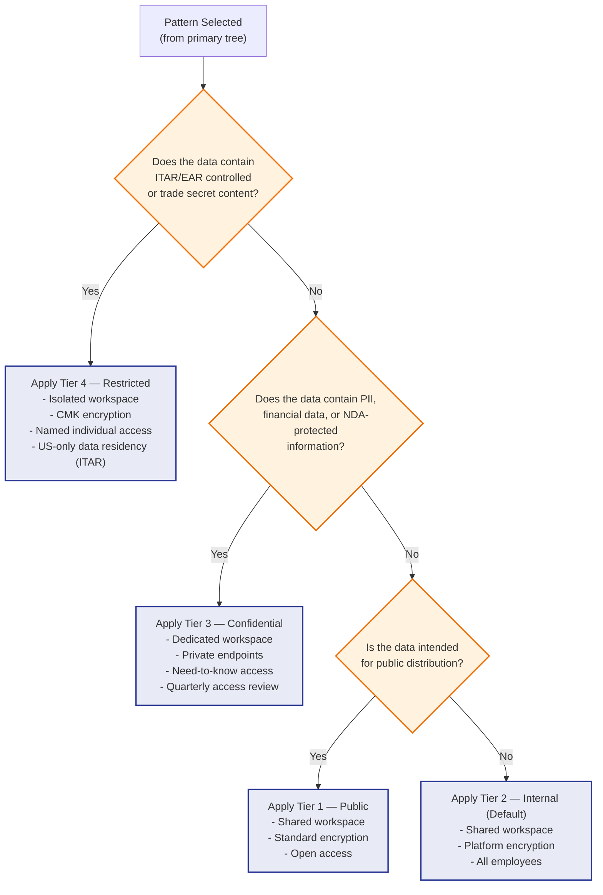

# Pattern Decision Tree

> Module: ISL-05 | Version: 1.0 | Type: Diagram

## Purpose

Provide a structured decision framework for selecting the appropriate ISL-05 integration pattern based on four key criteria: source system type, latency requirement, data volume, and security constraints. This decision tree is used during Phase 2 (Reference Architecture) when mapping client integration requirements to pre-built patterns, and during Phase 3 (Implementation) when new data sources are identified that were not part of the original architecture.

---

## Primary Decision Tree

The primary decision tree routes based on source system type as the first-level discriminator, then narrows by latency, volume, and security to reach a specific pattern and variant recommendation.

```mermaid
flowchart TD
    START["New Integration Requirement\nIdentified"] --> Q1

    Q1{"What is the\nsource system type?"}

    Q1 -->|"ERP\n(SAP, Epicor,\nOracle, D365)"| ERP_PATH
    Q1 -->|"IoT / OT\n(Sensors, SCADA,\nPLC, MES)"| IOT_PATH
    Q1 -->|"File\n(CSV, Excel,\nParquet, XML)"| FILE_PATH
    Q1 -->|"API / SaaS\n(REST, GraphQL,\nWebhook)"| API_PATH
    Q1 -->|"Event / Message\n(CDC, Queue,\nTopic)"| EVENT_PATH

    %% ERP Path
    ERP_PATH{"ERP: What is the\nlatency requirement?"}
    ERP_PATH -->|"Batch\n(Daily / Hourly)"| ERP_BATCH
    ERP_PATH -->|"Near-Real-Time\n(Minutes)"| ERP_NRT
    ERP_PATH -->|"Real-Time\n(Seconds)"| ERP_RT

    ERP_BATCH{"ERP Batch:\nDoes the table have a\nreliable timestamp column?"}
    ERP_BATCH -->|Yes| ERP_INC["Pattern 1: ERP Extract & Load\nVariant: Incremental (Timestamp)\n\nFabric: Data Factory + Gateway\nSchedule: Hourly / Daily"]
    ERP_BATCH -->|"No, but append-only\nwith sequential key"| ERP_WM["Pattern 1: ERP Extract & Load\nVariant: Watermark\n\nFabric: Data Factory + Gateway\nSchedule: Hourly / Daily"]
    ERP_BATCH -->|"No reliable\nchange tracking"| ERP_FULL["Pattern 1: ERP Extract & Load\nVariant: Full Load\n\nFabric: Data Factory + Gateway\nSchedule: Daily / Weekly"]

    ERP_NRT{"ERP NRT:\nIs CDC enabled\non the database?"}
    ERP_NRT -->|Yes| ERP_CDC["Pattern 1: ERP Extract & Load\nVariant: Incremental (CDC)\n\nFabric: Data Factory (CDC) or SLT\nLatency: Minutes"]
    ERP_NRT -->|No| ERP_NRT_ALT["Pattern 1: ERP Extract & Load\nVariant: Incremental (Timestamp)\nwith frequent schedule (15-30 min)\n\nConsider enabling CDC for future"]

    ERP_RT --> ERP_RT_REC["Pattern 5: Event-Driven\nVariant: Pub/Sub\n(ERP publishes change events)\n\nFabric: Eventstream + Event Hubs\nRequires: ERP event configuration"]

    %% IoT Path
    IOT_PATH{"IoT/OT: What is the\nlatency requirement?"}
    IOT_PATH -->|"Real-Time\n(Sub-second alerting)"| IOT_RT
    IOT_PATH -->|"Near-Real-Time\n(1-15 minutes)"| IOT_NRT
    IOT_PATH -->|"Batch\n(Hourly / Daily)"| IOT_BATCH

    IOT_RT{"IoT RT:\nIs sensor frequency\n> 10 Hz per device?"}
    IOT_RT -->|"No\n(< 10 Hz)"| IOT_STREAM["Pattern 2: IoT/OT Ingestion\nVariant: Streaming\n\nFabric: Eventstream + KQL\nAzure: IoT Hub + Event Hubs"]
    IOT_RT -->|"Yes\n(> 10 Hz)"| IOT_EDGE["Pattern 2: IoT/OT Ingestion\nVariant: Edge Aggregation\n(Pre-aggregate at edge, stream summary)\n\nFabric: Eventstream + KQL\nEdge: IoT Edge + compute module"]

    IOT_NRT{"IoT NRT:\nIs network connectivity\nreliable?"}
    IOT_NRT -->|"Yes\n(Reliable WAN/LAN)"| IOT_MICRO["Pattern 2: IoT/OT Ingestion\nVariant: Micro-Batch (5-min window)\n\nFabric: Eventstream + Lakehouse\nAzure: IoT Hub + Event Hubs"]
    IOT_NRT -->|"No\n(Intermittent)"| IOT_SF["Pattern 2: IoT/OT Ingestion\nVariant: Store & Forward\n\nEdge: Local buffer + IoT Edge\nSync: When connected"]

    IOT_BATCH --> IOT_MICRO

    %% File Path
    FILE_PATH{"File: Is there a\nstrict schema contract\nwith the sender?"}
    FILE_PATH -->|"Yes\n(Defined schema,\nSLA for delivery)"| FILE_STRICT
    FILE_PATH -->|"No\n(Ad-hoc, evolving,\nor exploratory)"| FILE_FLEX
    FILE_PATH -->|"Compliance /\nLong-term archive"| FILE_ARCHIVE

    FILE_STRICT{"File Strict:\nAre files from\nexternal vendors?"}
    FILE_STRICT -->|"Yes\n(External vendor)"| FILE_SOW["Pattern 3: File-Based Integration\nVariant: Schema-on-Write\n(Validate at landing)\n\nFabric: Data Factory + Notebooks\nLanding: SFTP / Blob"]
    FILE_STRICT -->|"No\n(Internal system)"| FILE_DZ["Pattern 3: File-Based Integration\nVariant: Drop Zone\n(Automated pickup)\n\nFabric: Data Factory (event trigger)\nLanding: OneLake Files"]

    FILE_FLEX --> FILE_SOR["Pattern 3: File-Based Integration\nVariant: Schema-on-Read\n(Validate at transformation)\n\nFabric: Notebooks (flexible parsing)\nLanding: OneLake Files"]

    FILE_ARCHIVE --> FILE_ARC["Pattern 3: File-Based Integration\nVariant: Archive & Process\n(Long-term storage + on-demand)\n\nFabric: Blob (Cool/Archive tier)\nReprocess: On-demand pipeline"]

    %% API Path
    API_PATH{"API: Does the source\nsystem push events?"}
    API_PATH -->|"Yes\n(Webhooks /\nOutbound messages)"| API_WH["Pattern 4: API Gateway\nVariant: Webhook Receiver\n\nFabric: Functions + Data Factory\nAzure: APIM + Event Hub"]
    API_PATH -->|"No\n(Pull-based only)"| API_PULL

    API_PULL{"API Pull:\nDo you need data from\nmultiple APIs combined?"}
    API_PULL -->|"Yes\n(Multi-API composition)"| API_COMP["Pattern 4: API Gateway\nVariant: API Composition\n\nFabric: Notebooks (orchestrate)\nAzure: APIM (gateway)"]
    API_PULL -->|"No\n(Single API source)"| API_SINGLE

    API_SINGLE{"API Single:\nIs real-time, on-demand\nretrieval needed?"}
    API_SINGLE -->|"Yes\n(Synchronous)"| API_RR["Pattern 4: API Gateway\nVariant: Request/Response\n\nFabric: Data Factory (Web Activity)\nAzure: APIM (cache + auth)"]
    API_SINGLE -->|"No\n(Scheduled batch)"| API_POLL["Pattern 4: API Gateway\nVariant: API Polling\n\nFabric: Data Factory (scheduled)\nAzure: APIM (rate limiting)"]

    %% Event Path
    EVENT_PATH{"Event: What is the\nprimary requirement?"}
    EVENT_PATH -->|"Fan-out to\nmultiple consumers"| EVT_PUBSUB["Pattern 5: Event-Driven\nVariant: Pub/Sub\n\nAzure: Event Hubs (partitioned)\nFabric: Eventstream"]
    EVENT_PATH -->|"Full audit trail\nand replay capability"| EVT_ES["Pattern 5: Event-Driven\nVariant: Event Sourcing\n\nAzure: Event Hubs + Delta (event store)\nFabric: Lakehouse (immutable log)"]
    EVENT_PATH -->|"Separate read/write\nmodels needed"| EVT_CQRS["Pattern 5: Event-Driven\nVariant: CQRS\n\nAzure: Event Hubs + Lakehouse + Warehouse\nFabric: Dual storage (write + read)"]
    EVENT_PATH -->|"Distributed multi-system\ntransaction coordination"| EVT_SAGA["Pattern 5: Event-Driven\nVariant: Saga / Choreography\n\nAzure: Service Bus (sessions)\nFabric: Notebooks (orchestration)"]

    %% Styling
    classDef pattern fill:#e1f5fe,stroke:#0277bd,stroke-width:2px
    classDef question fill:#fff3e0,stroke:#ef6c00,stroke-width:2px
    classDef start fill:#e8f5e9,stroke:#2e7d32,stroke-width:2px

    class START start
    class Q1,ERP_PATH,ERP_BATCH,ERP_NRT,IOT_PATH,IOT_RT,IOT_NRT,FILE_PATH,FILE_STRICT,API_PATH,API_PULL,API_SINGLE,EVENT_PATH question
    class ERP_INC,ERP_WM,ERP_FULL,ERP_CDC,ERP_NRT_ALT,ERP_RT_REC,IOT_STREAM,IOT_EDGE,IOT_MICRO,IOT_SF,FILE_SOW,FILE_DZ,FILE_SOR,FILE_ARC,API_WH,API_COMP,API_RR,API_POLL,EVT_PUBSUB,EVT_ES,EVT_CQRS,EVT_SAGA pattern
```

---

## Secondary Decision Criteria: Security Tier Overlay

After selecting the primary pattern using the decision tree above, apply the ISL-04 security classification overlay to determine additional implementation constraints.

| ISL-04 Tier | Network Requirement | Encryption | Access Control | Workspace Isolation |
|---|---|---|---|---|
| **Tier 1 — Public** | Standard internet | Platform default | All authenticated users | Shared workspace |
| **Tier 2 — Internal** | Standard (VPN recommended) | AES-256 (platform-managed) | All employees | Shared workspace |
| **Tier 3 — Confidential** | Private endpoints required | AES-256 (service-managed keys) | Need-to-know roles | Dedicated workspace |
| **Tier 4 — Restricted** | Isolated VNet; no internet egress | AES-256 (customer-managed keys) | Named individuals (PIM/JIT) | Isolated workspace; US-only for ITAR |

### Security Tier Decision

---

## Volume-Based Variant Selection

When volume is the deciding factor within a pattern, use these thresholds.

| Pattern | Volume Threshold | Below Threshold | Above Threshold |
|---|---|---|---|
| **ERP Extract** | 1M rows/table | Full Load (simple, reliable) | Incremental or CDC (efficient) |
| **IoT/OT Ingestion** | 10K msg/sec aggregate | Micro-Batch (cost-effective) | Streaming with Edge Aggregation |
| **File-Based** | 1 GB per file | Direct load (single read) | Chunked processing (parallel reads) |
| **API Gateway** | 10K records per sync | REST API (paginated) | Bulk API (batch operations) |
| **Event-Driven** | 1K events/sec | Service Bus (transactional) | Event Hubs (high throughput) |
| **Master Data** | 1M entities per domain | Fabric-native (custom notebooks) | MDM platform (Profisee, Informatica) |
| **Reverse ETL** | 10K records per sync | REST API (per-record) | Bulk API (batch writeback) |

---

## Quick-Reference: Pattern Selection Matrix

For rapid pattern identification during workshops, use this simplified matrix.

| I need to get data from... | ...into Fabric for... | Use Pattern | Primary Variant |
|---|---|---|---|
| SAP or Epicor | Daily reporting | ERP Extract & Load | Incremental (Timestamp) |
| SAP or Epicor | Real-time dashboard | Event-Driven + IoT/OT | Pub/Sub + Streaming |
| PLC / SCADA sensors | Predictive maintenance | IoT/OT Ingestion | Micro-Batch or Edge Agg |
| PLC / SCADA sensors | Real-time operator alerting | IoT/OT Ingestion | Streaming |
| Vendor CSV/Excel files | Monthly analysis | File-Based Integration | Schema-on-Write |
| Internal ad-hoc files | Data science exploration | File-Based Integration | Schema-on-Read |
| Salesforce / CRM | Customer analytics | API Gateway Integration | Webhook Receiver |
| REST API (no webhooks) | Data warehouse loading | API Gateway Integration | API Polling |
| Multiple systems (change events) | Cross-system sync | Event-Driven Architecture | Pub/Sub |
| SAP + Epicor customer records | Unified customer dimension | Master Data Sync | Consolidation or Golden Record |
| Fabric Gold layer | CRM enrichment | Reverse ETL | API Writeback |
| Fabric Gold layer | Quality alert to Teams | Reverse ETL | Alert/Notification |

---

## Cross-References

| Reference | Module | Relationship |
|---|---|---|
| Integration Landscape Overview | ISL-05 | All patterns in manufacturing context |
| Fabric Integration Architecture | ISL-05 | Fabric-specific service mapping |
| All 8 Pattern Documents | ISL-05 | Detailed specifications per pattern |
| Data Classification Tier Definitions | ISL-04 | Security tier overlay for pattern selection |
| Quality Dimension Definitions | ISL-06 | Quality requirements influence pattern variant |

## Revision History

| Version | Date | Author | Changes |
|---|---|---|---|
| 1.0 | 2025-01-15 | ISL Team | Initial release — primary decision tree, security overlay, volume thresholds |
