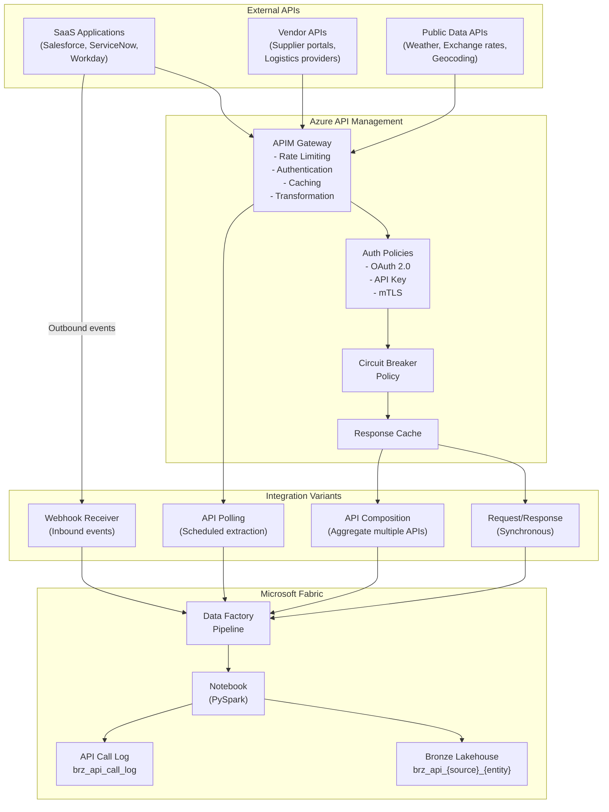

# API Gateway Integration Pattern

> Module: ISL-05 | Version: 1.0 | Adaptation Effort: 3-5 hrs | Dependencies: ISL-01, ISL-03, ISL-04, ISL-05 Medallion, ISL-06

## Purpose

Define standardized patterns for integrating external and internal APIs into the Fabric data platform through an API gateway layer. This pattern covers four integration variants, Azure API Management (APIM) configuration, resilience patterns (circuit breaker, retry), response caching, API versioning, rate limiting, and authentication methods. API-based integration is the primary method for SaaS application data exchange, microservice orchestration, and third-party data provider connectivity.

---

## Scope

### In Scope

- Four variants: Request/Response, API Composition, Webhook Receiver, API Polling
- Azure API Management (APIM) configuration standards
- Circuit breaker and retry patterns
- Response caching strategies
- API versioning alignment with ISL-01
- Rate limiting alignment with ISL-01
- Authentication patterns (OAuth 2.0, API key, mTLS)
- Mermaid architecture diagram

### Out of Scope

- API design standards (see ISL-01 API Design Standards)
- API lifecycle governance (see ISL-01 API Lifecycle Governance)
- Internal API development (see ISL-01 module)
- ERP-specific API extraction (see ERP Extract & Load pattern)
- Event-driven messaging (see Event-Driven Architecture pattern)

---

## [ADAPTATION REQUIRED] Client Context

| Parameter | Default Value | Client Value | Notes |
|---|---|---|---|
| `apim_sku` | Standard v2 | | Developer for POC; Premium for VNet integration |
| `apim_instance_name` | `apim-{client}-{env}` | | Per ISL-03 naming standards |
| `default_auth_method` | OAuth 2.0 (client credentials) | | API key for low-sensitivity; mTLS for Tier 4 |
| `default_rate_limit` | 100 requests/minute per subscription | | Adjust per API capacity and licensing |
| `circuit_breaker_threshold` | 5 consecutive failures | | Lower for latency-sensitive APIs |
| `circuit_breaker_reset_seconds` | 60 | | Half-open after timeout; full close on success |
| `retry_max_attempts` | 3 | | Per API call |
| `retry_backoff_strategy` | Exponential (1s, 2s, 4s) | | Fixed for time-sensitive; exponential for batch |
| `cache_default_ttl_seconds` | 300 (5 minutes) | | 0 for real-time; 3600 for reference data |
| `polling_interval_minutes` | 15 | | Minimum 5 minutes; API rate limit aware |
| `webhook_validation_method` | HMAC-SHA256 signature verification | | Some providers use challenge-response |
| `api_timeout_seconds` | 30 | | Increase for batch/bulk API endpoints |

---

## 1. Architecture Overview



---

## 2. Variant Decision Criteria

| Criterion | Request/Response | API Composition | Webhook Receiver | API Polling |
|---|---|---|---|---|
| **Use when** | Real-time data retrieval; transactional operations | Multiple APIs needed for single business entity | SaaS platform pushes events on data change | Scheduled extraction from APIs without push support |
| **Latency** | Synchronous (< 5 sec) | Synchronous (< 10 sec) | Event-driven (seconds to minutes) | Batch (5 min to daily) |
| **Initiator** | Fabric pipeline or application | Fabric pipeline or application | External SaaS platform | Fabric pipeline (scheduled) |
| **Data freshness** | Real-time | Real-time | Near-real-time | Depends on polling frequency |
| **Complexity** | Low | Medium-High | Medium | Low |
| **API dependency** | Single API endpoint | Multiple API endpoints | Webhook configuration on source | API with list/query/filter capability |
| **Error handling** | Retry on failure | Partial success handling required | Missed webhook redelivery | Idempotent re-poll on failure |
| **Best for** | Single-entity lookups, writes | Customer 360 assembly, enrichment | Salesforce events, ServiceNow incidents | Data warehouse loading from REST APIs |

### Decision Flowchart

1. **Does the source system push events via webhooks?** Yes -> Webhook Receiver
2. **Do you need to combine data from multiple APIs into one entity?** Yes -> API Composition
3. **Is real-time, on-demand data retrieval needed?** Yes -> Request/Response
4. **Default (batch extraction from API)** -> API Polling

---

## 3. Azure API Management (APIM) Configuration

### 3.1 APIM Product Structure

| APIM Product | Purpose | Rate Limit | Auth | APIs Included |
|---|---|---|---|---|
| `data-platform-internal` | Fabric pipelines calling external APIs | 1000 req/min | Managed Identity | All data extraction APIs |
| `data-platform-webhooks` | Inbound webhooks from SaaS | 500 req/min | HMAC signature | Webhook receiver endpoints |
| `data-platform-external` | External consumers of client data APIs | 100 req/min | OAuth 2.0 | Published data APIs |

### 3.2 APIM Policy Templates

**Inbound Policy (all APIs):**
- Validate JWT token or API key
- Apply rate limit by subscription
- Set `X-Correlation-Id` header for tracing
- Log request metadata to Application Insights

**Backend Policy:**
- Set timeout per API backend
- Circuit breaker with configurable threshold
- Retry with exponential backoff

**Outbound Policy:**
- Cache successful responses (configurable TTL)
- Transform response format if needed (XML to JSON)
- Strip sensitive headers before returning

---

## 4. Circuit Breaker and Retry Patterns

### 4.1 Circuit Breaker States

| State | Behavior | Transition |
|---|---|---|
| **Closed** | All requests pass through normally | -> Open after N consecutive failures |
| **Open** | All requests fail immediately (no backend call) | -> Half-Open after timeout period |
| **Half-Open** | Single probe request sent to backend | Success -> Closed; Failure -> Open |

### 4.2 Configuration

| Parameter | Default | Financial APIs | Reference Data APIs |
|---|---|---|---|
| Failure threshold | 5 consecutive failures | 3 consecutive failures | 10 consecutive failures |
| Reset timeout | 60 seconds | 30 seconds | 120 seconds |
| Half-open probe count | 1 request | 1 request | 3 requests |
| Monitored exceptions | 5xx responses, timeouts | 5xx, 429, timeouts | 5xx responses only |

### 4.3 Retry Strategy

| Error Type | Retry? | Strategy | Max Attempts | Backoff |
|---|---|---|---|---|
| HTTP 429 (Rate Limited) | Yes | Wait for `Retry-After` header | 5 | Per header value |
| HTTP 500 (Server Error) | Yes | Exponential backoff | 3 | 1s, 2s, 4s |
| HTTP 502/503 (Gateway/Unavailable) | Yes | Exponential backoff | 3 | 2s, 4s, 8s |
| HTTP 408 (Timeout) | Yes | Immediate retry then backoff | 3 | 0s, 2s, 4s |
| HTTP 401/403 (Auth Error) | No | Refresh token, then retry once | 1 | Immediate |
| HTTP 400 (Bad Request) | No | Log and alert; data issue | 0 | N/A |
| Network timeout | Yes | Exponential backoff | 3 | 2s, 4s, 8s |

---

## 5. Response Caching

| Cache Scenario | TTL | Cache Key | Invalidation |
|---|---|---|---|
| Reference/lookup data (country codes, currencies) | 3600 seconds (1 hour) | URL + query parameters | Manual purge on reference data change |
| Entity detail (customer, product) | 300 seconds (5 minutes) | URL + entity ID | On entity update webhook |
| List/search results | 60 seconds (1 minute) | URL + query + pagination | Time-based expiry |
| Transactional data (orders, invoices) | 0 (no cache) | N/A | N/A (always fresh) |
| Rate-limited external APIs | Match API rate limit window | URL + parameters | Time-based expiry |

### Cache Implementation

- Use APIM internal cache for responses < 1 MB
- Use Azure Redis Cache for responses > 1 MB or cross-region scenarios
- Cache headers: `Cache-Control`, `ETag`, `Last-Modified` respected when present
- Cache bypass: `Cache-Control: no-cache` header from client forces fresh fetch

---

## 6. API Versioning Alignment (ISL-01)

| Versioning Aspect | Standard | Example |
|---|---|---|
| URL-based versioning | `/api/v{major}/` | `/api/v1/customers`, `/api/v2/customers` |
| Header-based versioning | `Api-Version: {major}.{minor}` | `Api-Version: 2.1` |
| Deprecation notice | 6-month minimum deprecation window | `Sunset: Sat, 15 Mar 2026 00:00:00 GMT` |
| Default version | Latest stable version | Explicit version in pipeline configuration recommended |
| Breaking change definition | Per ISL-01: field removal, type change, required field addition | Document in API changelog |
| Pipeline configuration | Pin to specific version; do not use `latest` | `base_url = "https://api.vendor.com/v2"` |

---

## 7. Rate Limiting Alignment (ISL-01)

| Rate Limit Tier | Requests/Minute | Requests/Hour | Use Case |
|---|---|---|---|
| **Bronze** (free/basic) | 60 | 1,000 | Public data APIs, reference lookups |
| **Silver** (standard) | 300 | 10,000 | Standard SaaS API integration |
| **Gold** (premium) | 1,000 | 50,000 | High-volume data extraction |
| **Platinum** (enterprise) | 5,000 | 200,000 | Bulk/batch API operations |

**Rate Limit Handling in Pipelines:**
- Read `X-RateLimit-Remaining` and `X-RateLimit-Reset` headers
- Proactively throttle when remaining < 10% of limit
- On HTTP 429: wait for `Retry-After` duration; do not retry immediately
- Log rate limit events to `brz_api_call_log` for capacity planning

---

## 8. Authentication Patterns

### 8.1 OAuth 2.0 (Client Credentials)

| Component | Configuration |
|---|---|
| Grant type | Client Credentials (`grant_type=client_credentials`) |
| Token endpoint | Provider-specific (e.g., `https://login.microsoftonline.com/{tenant}/oauth2/v2.0/token`) |
| Client ID | Stored in Azure Key Vault |
| Client Secret | Stored in Azure Key Vault; rotate every 90 days |
| Scope | API-specific scope (e.g., `https://graph.microsoft.com/.default`) |
| Token caching | Cache token until 5 minutes before expiry |
| Use for | SaaS APIs (Salesforce, Dynamics 365, ServiceNow), Microsoft Graph |

### 8.2 API Key

| Component | Configuration |
|---|---|
| Header name | `X-API-Key` or `Authorization: ApiKey {key}` (provider-specific) |
| Key storage | Azure Key Vault |
| Key rotation | Every 180 days; support dual-key rotation |
| Use for | Simple vendor APIs, public data APIs, internal microservices |

### 8.3 Mutual TLS (mTLS)

| Component | Configuration |
|---|---|
| Client certificate | Stored in Azure Key Vault (certificate object) |
| Certificate format | PFX or PEM with private key |
| Certificate rotation | Every 365 days; 30-day overlap for rotation |
| CA validation | Validate server certificate chain |
| Use for | Financial APIs, government APIs, Tier 4 classified data APIs |

---

## 9. API Call Log

```
brz_api_call_log
├── call_id (string, UUID)
├── pipeline_run_id (string)
├── api_name (string)
├── api_version (string)
├── endpoint_url (string)
├── http_method (string)
├── request_timestamp (timestamp)
├── response_timestamp (timestamp)
├── response_status_code (int)
├── response_size_bytes (bigint)
├── duration_ms (bigint)
├── retry_count (int)
├── cache_hit (boolean)
├── rate_limit_remaining (int)
├── error_message (string, nullable)
├── correlation_id (string)
└── auth_method (string)
```

---

## Fabric / Azure Implementation Guidance

| Component | Recommended Service | Configuration |
|---|---|---|
| API Gateway | Azure API Management (Standard v2) | Products per use case; policies for auth, cache, retry |
| Pipeline orchestration | Fabric Data Factory | Web activity for API calls; ForEach for pagination |
| Webhook endpoint | Azure Functions or Logic Apps | HTTPS trigger; HMAC validation; forward to Event Hub |
| Token management | Azure Key Vault + APIM named values | Auto-refresh OAuth tokens; secret versioning |
| Monitoring | Application Insights (APIM) + Fabric Monitor | Latency, error rate, cache hit ratio, rate limit usage |
| Secret storage | Azure Key Vault | Client secrets, API keys, certificates |
| Networking | APIM VNet integration (Premium) or private endpoints | Required for Tier 3-4 API data |

---

## Manufacturing Overlay [CONDITIONAL]

| Manufacturing Scenario | API Source | Variant | Special Considerations |
|---|---|---|---|
| Salesforce CRM (customer orders) | Salesforce REST API | Webhook Receiver (Outbound Messages) | OAuth 2.0; handle Salesforce bulk API for large extracts |
| Supplier portal (inventory availability) | Vendor REST API | API Polling (hourly) | API key auth; schema varies by vendor |
| Shipping/logistics tracking | FedEx/UPS/DHL API | Request/Response (on-demand) | Rate limited; cache tracking status for 15 min |
| Quality lab system (LIMS) | LIMS REST API | API Polling (every 15 min) | Certificate results for incoming material inspection |
| MES system integration | MES REST/OData API | Request/Response + Webhook | Real-time production events; high frequency |
| Weather data (for outdoor operations) | OpenWeatherMap API | API Polling (hourly) + Cache | Public API; 60 req/min free tier; cache aggressively |

---

## Cross-References

| Reference | Module | Relationship |
|---|---|---|
| API Design Standards | ISL-01 | Versioning, naming, and design principles for all APIs |
| API Security Standards | ISL-01 | Authentication and authorization patterns |
| Rate Limiting Policy | ISL-01 | Rate limit tiers and enforcement policies |
| Medallion Architecture | ISL-05 | API data lands in Bronze per medallion standards |
| Naming Conventions | ISL-03 | API endpoint naming, Bronze table naming |
| Data Classification | ISL-04 | API data classified per response content sensitivity |
| Quality Gates | ISL-06 | API response validation at Bronze boundary |

## Compliance Alignment

| Framework | Relevance |
|---|---|
| OWASP API Security Top 10 | API gateway policies address injection, auth, rate limiting |
| OAuth 2.0 (RFC 6749) | Client credentials flow for machine-to-machine API auth |
| SOX Section 302/404 | API call audit log supports financial data traceability |
| GDPR Article 28 | API data processors must comply with processing agreements |
| ISO 27001 A.14 | Secure development and system acquisition for API integrations |

## Revision History

| Version | Date | Author | Changes |
|---|---|---|---|
| 1.0 | 2025-01-15 | ISL Team | Initial release — 4 variants, APIM configuration, resilience patterns |
