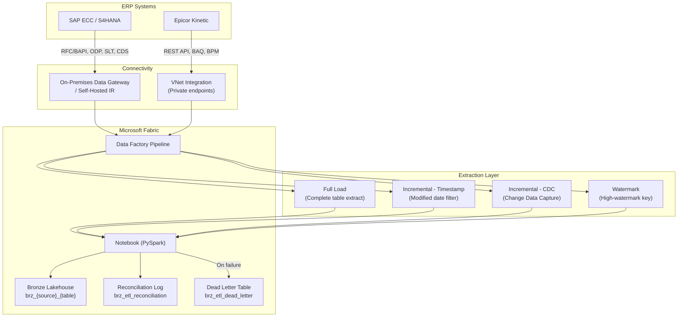

# ERP Extract & Load Pattern

> Module: ISL-05 | Version: 1.0 | Adaptation Effort: 4-8 hrs | Dependencies: ISL-03, ISL-04, ISL-05 Medallion, ISL-06

## Purpose

Define standardized patterns for extracting data from Enterprise Resource Planning (ERP) systems and loading it into the Fabric lakehouse Bronze layer. This pattern covers the four primary extraction variants, ERP-specific connector configurations for SAP and Epicor, data type mapping, schema drift handling, reconciliation, scheduling, and error recovery. ERP extraction is the highest-frequency integration pattern in manufacturing — every engagement requires it, and failures here cascade through the entire data platform.

---

## Scope

### In Scope

- Four extraction variants: Full Load, Incremental (Timestamp), Incremental (CDC), Watermark
- Decision criteria for variant selection
- SAP-specific extraction methods (RFC/BAPI, ODP, SLT, CDS Views)
- Epicor-specific extraction methods (BAQ, REST API, BPM)
- Data type mapping from ERP-native types to Delta Lake types
- Schema drift detection and handling
- Row count and checksum reconciliation
- Extraction window scheduling to avoid ERP performance impact
- Error handling, retry, and dead-letter patterns
- Mermaid architecture diagram

### Out of Scope

- Bronze-to-Silver transformation logic (see Medallion Architecture pattern)
- ERP system installation, configuration, or upgrade
- ERP-specific functional module consulting (FI/CO, MM, PP)
- Non-ERP source system extraction (see IoT, API, File patterns)
- Real-time ERP replication (sub-second latency; see Event-Driven Architecture)

---

## [ADAPTATION REQUIRED] Client Context

| Parameter | Default Value | Client Value | Notes |
|---|---|---|---|
| `erp_system` | SAP ECC 6.0 | | SAP S/4HANA, Epicor Kinetic, Oracle EBS, Dynamics 365 |
| `erp_version` | ECC 6.0 EHP 8 | | Version determines available extraction methods |
| `extraction_method` | ODP (SAP) / REST API (Epicor) | | See decision criteria in Section 2 |
| `default_load_type` | Incremental (Timestamp) | | Full Load for initial; Incremental for ongoing |
| `extraction_window_start` | 22:00 local ERP time | | Off-peak hours; confirm with ERP admin |
| `extraction_window_end` | 05:00 local ERP time | | Must complete before business day start |
| `max_parallel_extractions` | 4 | | Limited by ERP dialog/batch process capacity |
| `reconciliation_tolerance` | 0.1% row count variance | | Tighter for financial tables |
| `retry_max_attempts` | 3 | | Per extraction job |
| `retry_backoff_seconds` | 60, 300, 900 | | Exponential backoff |
| `gateway_type` | On-premises data gateway (Standard) | | Self-hosted IR for SAP; Fabric gateway for Epicor cloud |
| `schema_drift_policy` | Auto-add columns; alert on type changes | | Conservative: block on any drift |
| `cdc_enabled` | No (requires DBA approval) | | CDC requires database-level configuration |

---

## 1. Architecture Overview



---

## 2. Extraction Variant Decision Criteria

| Criterion | Full Load | Incremental (Timestamp) | Incremental (CDC) | Watermark |
|---|---|---|---|---|
| **Use when** | Initial migration; small reference tables (<100K rows); no reliable change tracking | Tables with reliable `CHANGED_ON` or `LAST_MODIFIED` column | High-volume tables (>1M rows); near-real-time sync needed | Append-only tables with sequential keys (e.g., transaction logs) |
| **Source requirement** | None (select all) | Timestamp column maintained by ERP | CDC enabled at database level (SQL Server, SAP SLT) | Monotonically increasing key or timestamp |
| **Data volume per run** | Full table (high) | Changed rows only (low-medium) | Changed rows only (low) | New rows only (low) |
| **Latency** | Batch (daily/weekly) | Batch (hourly/daily) | Near-real-time (minutes) | Batch (hourly/daily) |
| **Complexity** | Low | Low-Medium | High (requires DBA involvement) | Low |
| **Delete detection** | Inherent (full snapshot comparison) | Not supported (must supplement) | Supported (captures deletes) | Not supported |
| **ERP load impact** | High (full table scan) | Medium (indexed timestamp filter) | Low (log-based, minimal query load) | Low (key range filter) |
| **Recommended for** | `dim_*` reference tables, initial loads | Most transactional tables | OLTP tables with real-time dashboards | Event/log/audit tables |

### Decision Flowchart

1. **Is this the initial load?** Yes -> Full Load for all tables
2. **Does the table have a reliable last-modified timestamp?** Yes -> Incremental (Timestamp)
3. **Is CDC enabled on the source database?** Yes -> Incremental (CDC)
4. **Is the table append-only with a sequential key?** Yes -> Watermark
5. **None of the above?** -> Full Load with snapshot comparison for change detection

---

## 3. SAP-Specific Extraction

### 3.1 Extraction Method Comparison

| Method | SAP Version | Protocol | Best For | Limitations |
|---|---|---|---|---|
| **RFC/BAPI** | All ECC, S/4 | RFC (port 3300) | Custom table reads, small volumes | Performance limits on large tables; requires ABAP development |
| **ODP (Operational Data Provisioning)** | ECC 6.0 EHP 5+, S/4 | ODP via RFC | Standard and custom extractors; delta support | Requires ODP framework activation; extractor configuration |
| **SLT (SAP Landscape Transformation)** | ECC 6.0+, S/4 | Trigger-based CDC | Real-time replication of transactional tables | Requires SLT server; licensing; DBA involvement |
| **CDS Views** | S/4HANA only | OData / SQL | S/4HANA native; optimized for analytics | S/4HANA only; requires CDS view development |

### 3.2 SAP Data Type Mapping

| SAP Type | SAP Description | Delta Lake Type | Notes |
|---|---|---|---|
| CHAR | Character | STRING | Preserve leading spaces if semantically meaningful |
| NUMC | Numeric text | STRING | Do NOT cast to integer; preserves leading zeros (e.g., material number) |
| DATS | Date (YYYYMMDD) | STRING in Bronze; DATE in Silver | `'00000000'` maps to NULL in Silver |
| TIMS | Time (HHMMSS) | STRING in Bronze; STRING in Silver | `'000000'` maps to NULL in Silver |
| DEC / CURR | Packed decimal | DECIMAL(precision, scale) | Match SAP field length and decimals exactly |
| INT4 | Integer | INT | Direct mapping |
| QUAN | Quantity | DECIMAL(18, 3) | Always pair with unit of measure field |
| UNIT | Unit of measure | STRING | Reference to T006 unit table |
| CLNT | Client (MANDT) | STRING | Typically filtered or excluded in Silver |
| LANG | Language key | STRING | 1-character ISO language code |
| FLTP | Floating point | DOUBLE | Use DECIMAL in Silver for financial calculations |

### 3.3 SAP Common Extraction Tables

| SAP Table | Domain | Recommended Variant | Notes |
|---|---|---|---|
| VBAK / VBAP | Sales Orders | Incremental (Timestamp via ERDAT/AEDAT) | Header/item; join in Silver |
| LIKP / LIPS | Deliveries | Incremental (Timestamp via ERDAT) | Header/item |
| EKKO / EKPO | Purchase Orders | Incremental (Timestamp via AEDAT) | Header/item |
| AUFK | Production Orders | Incremental (Timestamp via AEDAT) | Filter by order type |
| AFKO / AFPO | Order Operations/Components | Incremental (Timestamp) | Linked to AUFK |
| MARA / MARC / MARD | Material Master | Full Load (reference data) | Typically <500K rows |
| KNA1 / KNB1 | Customer Master | Full Load (reference data) | General + company code data |
| LFA1 / LFB1 | Vendor Master | Full Load (reference data) | General + company code data |
| BKPF / BSEG | Financial Documents | Incremental (Timestamp via CPUDT) | High volume; consider CDC |
| MSEG / MKPF | Material Movements | Watermark (MBLNR + MJAHR) | Append-only; very high volume |
| QMEL / QMFE | Quality Notifications | Incremental (Timestamp via ERDAT) | QM module |
| AFRU | Production Confirmations | Watermark (RUESSION) | Append-only |

---

## 4. Epicor-Specific Extraction

### 4.1 Extraction Method Comparison

| Method | Epicor Version | Protocol | Best For | Limitations |
|---|---|---|---|---|
| **BAQ (Business Activity Query)** | Epicor 10+, Kinetic | REST/OData | Predefined queries with business logic | Query complexity limits; performance on large datasets |
| **REST API** | Kinetic | HTTPS REST | Direct table access; CRUD operations | Rate limiting; pagination required for large datasets |
| **BPM (Business Process Management)** | Epicor 10+, Kinetic | Event-driven | Real-time event capture on ERP transactions | Requires BPM development; impacts ERP performance |

### 4.2 Epicor Data Type Mapping

| Epicor Type | Delta Lake Type | Notes |
|---|---|---|
| nvarchar | STRING | Standard string mapping |
| int / bigint | INT / BIGINT | Direct mapping |
| decimal | DECIMAL(precision, scale) | Match Epicor field definition |
| datetime / datetime2 | TIMESTAMP | Convert to UTC in Silver |
| bit | BOOLEAN | Direct mapping |
| uniqueidentifier | STRING | Store as string; GUID format |
| varbinary | BINARY | Rare; typically document attachments |

### 4.3 Epicor Common Extraction Entities

| Epicor Entity | Domain | Recommended Variant | Notes |
|---|---|---|---|
| OrderHed / OrderDtl | Sales Orders | Incremental (Timestamp via ChangedOn) | Header/detail split |
| JobHead / JobOper / JobMtl | Jobs (Production) | Incremental (Timestamp) | Three-level hierarchy |
| PartPlant / PartBin | Inventory | Incremental (Timestamp) | Part by plant/bin |
| POHeader / PODetail | Purchase Orders | Incremental (Timestamp) | Header/detail |
| Customer | Customer Master | Full Load | Reference data |
| Vendor | Vendor Master | Full Load | Reference data |
| Part | Part Master | Full Load | Reference data |
| LaborDtl | Labor Transactions | Watermark (LaborDtlSeq) | Append-only; high volume |
| InvcHead / InvcDtl | Invoices | Incremental (Timestamp) | AR invoices |
| RcvHead / RcvDtl | Receipts | Watermark (PackSlip sequence) | Receiving transactions |

---

## 5. Schema Drift Handling

| Drift Type | Detection Method | Action | Severity |
|---|---|---|---|
| **New column added** | Compare source schema to Bronze Delta schema | Auto-add via `mergeSchema = true`; log to audit | INFO |
| **Column removed** | Column in Delta but not in source payload | Continue load; column becomes NULL for new rows; alert | WARNING |
| **Data type change** | Type mismatch on existing column | Block load; alert data engineer; manual resolution | ERROR |
| **Column renamed** | Heuristic: new column + missing column same type | Block load; manual confirmation required | ERROR |
| **Precision change** | Numeric precision/scale change | Widen precision (safe); narrow = block | WARN/ERROR |

**Implementation:**

```python
# Schema drift detection in PySpark
source_schema = source_df.schema
target_schema = spark.read.format("delta").load(bronze_path).schema

new_columns = [f for f in source_schema if f.name not in [t.name for t in target_schema]]
removed_columns = [f for f in target_schema if f.name not in [s.name for s in source_schema]
                   and not f.name.startswith("_")]  # Exclude metadata columns
type_changes = [f for f in source_schema
                if f.name in [t.name for t in target_schema]
                and f.dataType != next(t.dataType for t in target_schema if t.name == f.name)]
```

---

## 6. Reconciliation

### 6.1 Row Count Reconciliation

| Check | Source | Target | Tolerance | Action on Failure |
|---|---|---|---|---|
| Full load count | `SELECT COUNT(*) FROM {table}` on ERP | `df.count()` on Bronze after load | 0 (exact match) | Fail pipeline; retry; alert |
| Incremental count | Records extracted (pipeline metric) | Records written (Delta metrics) | 0 (exact match) | Fail pipeline; retry; alert |
| Running total | Source cumulative count | Bronze cumulative count (periodic) | 0.1% (configurable) | Alert; schedule reconciliation job |

### 6.2 Checksum Reconciliation

For financial and audit-critical tables, supplement row counts with checksum validation:

```sql
-- Source side (SAP example)
SELECT SUM(CAST(NETWR AS DECIMAL(18,2))) AS checksum_amount,
       COUNT(*) AS row_count
FROM VBAK
WHERE ERDAT >= '{watermark_date}'

-- Target side (Bronze)
SELECT SUM(CAST(NETWR AS DECIMAL(18,2))) AS checksum_amount,
       COUNT(*) AS row_count
FROM brz_sap_vbak
WHERE _batch_id = '{current_batch_id}'
```

### 6.3 Reconciliation Log Table

```
brz_etl_reconciliation
├── reconciliation_id (string, UUID)
├── pipeline_run_id (string)
├── source_system (string)
├── source_table (string)
├── target_table (string)
├── load_type (string: full, incremental_ts, incremental_cdc, watermark)
├── source_row_count (bigint)
├── target_row_count (bigint)
├── row_count_match (boolean)
├── source_checksum (decimal)
├── target_checksum (decimal)
├── checksum_match (boolean)
├── reconciliation_status (string: pass, fail, warn)
├── reconciliation_timestamp (timestamp)
└── notes (string)
```

---

## 7. Extraction Window Scheduling

| Time Window | Activity | Rationale |
|---|---|---|
| 22:00 - 05:00 (local ERP time) | **Primary extraction window** | Off-peak; minimal user impact; batch jobs may run concurrently |
| 05:00 - 07:00 | **Reference data refresh** | Small tables (master data) safe to extract during early morning |
| 07:00 - 18:00 | **No large extractions** | Peak ERP usage; extraction queries compete with users |
| 18:00 - 22:00 | **Incremental catch-up** (if needed) | Post-business-hours; light user load |
| Any time | **CDC replication** (if enabled) | CDC is log-based; minimal query impact on ERP |

**Parallel Extraction Limits:**

| ERP System | Max Parallel Jobs | Rationale |
|---|---|---|
| SAP ECC (RFC) | 4 concurrent RFC connections | Dialog process limit; confirm with Basis team |
| SAP S/4 (ODP) | 6 concurrent ODP extractions | ODP framework manages parallelism |
| SAP SLT | Unlimited (SLT-managed) | SLT replicates continuously; no job limit |
| Epicor REST API | 8 concurrent API calls | API rate limit; confirm with Epicor admin |
| Epicor BAQ | 4 concurrent BAQ executions | BAQ engine thread limit |

---

## 8. Error Handling and Retry

| Error Category | Example | Retry Strategy | Escalation |
|---|---|---|---|
| **Transient network** | Gateway timeout, connection reset | Retry 3x with exponential backoff (60s, 300s, 900s) | Alert after 3rd failure |
| **ERP unavailable** | SAP down for maintenance | Skip extraction; retry at next window | Alert; check maintenance calendar |
| **Authentication failure** | Expired service account password | No retry; immediate alert | Credential rotation required |
| **Data volume anomaly** | 10x expected row count | Pause; alert for investigation | May indicate accidental full load or data duplication |
| **Schema drift (ERROR)** | Data type change | No retry; block pipeline | Manual resolution by data engineer |
| **Timeout** | Query exceeds extraction window | Retry with reduced scope (partition by date range) | Split table into smaller extraction segments |
| **Quota/rate limit** | Epicor API 429 response | Retry after `Retry-After` header value | Reduce parallelism |

### Dead Letter Pattern

Records that cannot be loaded after all retry attempts are written to a dead letter table:

```
brz_etl_dead_letter
├── dead_letter_id (string, UUID)
├── pipeline_run_id (string)
├── source_system (string)
├── source_table (string)
├── error_message (string)
├── error_category (string)
├── record_payload (string, JSON)
├── retry_count (int)
├── first_failure_timestamp (timestamp)
├── last_failure_timestamp (timestamp)
└── resolved (boolean)
```

---

## Fabric / Azure Implementation Guidance

| Component | Recommended Service | Configuration |
|---|---|---|
| SAP connectivity | On-premises data gateway + SAP connector | SAP .NET Connector 3.0; RFC connection parameters |
| Epicor connectivity | Fabric Data Factory REST connector | OAuth 2.0 or API key authentication |
| Pipeline orchestration | Fabric Data Factory | Parameterized pipelines per source table; master orchestrator |
| Data landing | Fabric Lakehouse (Delta) | `mergeSchema = true` for schema evolution |
| Scheduling | Fabric pipeline triggers | Tumbling window for incremental; schedule for full load |
| Monitoring | Fabric Monitor + custom alerting | Row count, duration, error rate metrics |
| Secrets | Azure Key Vault | ERP credentials, API keys stored in Key Vault; referenced by linked service |
| Gateway | On-premises data gateway (Standard mode) | Clustered for high availability; sized for parallel extractions |

---

## Manufacturing Overlay [CONDITIONAL]

| Manufacturing Scenario | ERP Source | Recommended Variant | Special Considerations |
|---|---|---|---|
| Production order tracking | SAP AUFK/AFKO or Epicor JobHead | Incremental (Timestamp) | High change frequency; extract every 2 hours during production shifts |
| Material movement | SAP MSEG or Epicor PartTran | Watermark | Append-only; very high volume (100K+ rows/day) |
| Quality management | SAP QMEL or Epicor InspectDtl | Incremental (Timestamp) | Link to production orders in Silver |
| BOM explosion | SAP STPO/STKO or Epicor JobMtl | Full Load (reference) | Recursive structure; flatten in Silver |
| Cost rollup | SAP CKML or Epicor PartCost | Incremental (Timestamp) | Financial sensitivity; checksum reconciliation required |
| Shop floor confirmations | SAP AFRU or Epicor LaborDtl | Watermark | High volume; real-time dashboards may need CDC |
| Dual-ERP synchronization | SAP + Epicor | Both systems extracted independently | Cross-reference mapping in Silver per Master Data Sync pattern |

---

## Cross-References

| Reference | Module | Relationship |
|---|---|---|
| Medallion Architecture | ISL-05 | ERP data lands in Bronze per medallion standards |
| Naming Conventions | ISL-03 | Bronze table naming: `brz_{erp}_{table}` |
| Data Classification | ISL-04 | ERP financial data classified Tier 3; ITAR data Tier 4 |
| Quality Gates | ISL-06 | Reconciliation and completeness checks at Bronze boundary |
| Master Data Synchronization | ISL-05 | Master data from ERP feeds MDM pattern |
| API Governance | ISL-01 | Epicor REST API calls follow ISL-01 standards |

## Compliance Alignment

| Framework | Relevance |
|---|---|
| SOX Section 302/404 | Financial ERP data extraction requires reconciliation audit trail |
| GDPR Article 30 | Records of processing activities must document ERP data flows |
| FDA 21 CFR Part 11 | Production data extraction must maintain electronic records integrity |
| ITAR 22 CFR | ITAR-classified ERP data must be extracted to US-only infrastructure |
| ISO 27001 A.8.1 | Asset management controls apply to ERP data as information assets |

## Revision History

| Version | Date | Author | Changes |
|---|---|---|---|
| 1.0 | 2025-01-15 | ISL Team | Initial release — 4 variants, SAP and Epicor extraction methods |
