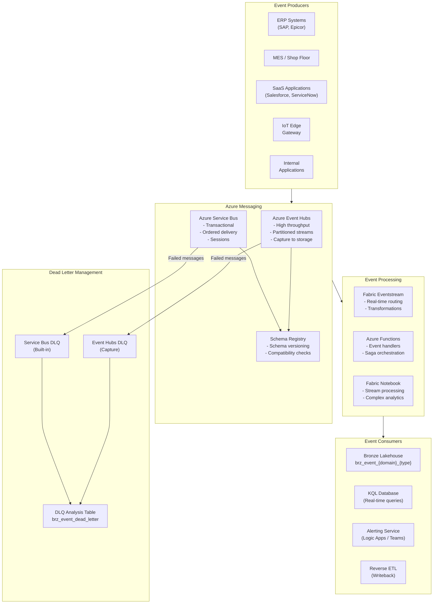

# Event-Driven Architecture Pattern

> Module: ISL-05 | Version: 1.0 | Adaptation Effort: 4-6 hrs | Dependencies: ISL-01, ISL-03, ISL-04, ISL-05 Medallion, ISL-06

## Purpose

Define standardized patterns for event-driven data integration, covering event production, routing, processing, and consumption across enterprise systems. Event-driven architecture (EDA) enables loosely coupled, real-time data flows that are essential for operational alerting, cross-system synchronization, and streaming analytics. This pattern covers four variants, CloudEvents specification alignment, delivery guarantees, partitioning strategies, dead-letter queue management, Azure messaging service selection, event schema registry, and idempotency patterns.

---

## Scope

### In Scope

- Four variants: Pub/Sub, Event Sourcing, CQRS, Saga/Choreography
- CloudEvents specification alignment for event schema
- Delivery guarantees (exactly-once, at-least-once, at-most-once)
- Partitioning and ordering strategies
- Dead-letter queue (DLQ) management
- Azure Event Hubs, Service Bus, Fabric Eventstreams comparison and selection
- Event schema registry and versioning
- Idempotency patterns for consumers
- Mermaid architecture diagram

### Out of Scope

- IoT device-to-cloud messaging (see IoT/OT Ingestion pattern)
- API request/response integration (see API Gateway Integration pattern)
- Stream processing application development (Spark Structured Streaming)
- Event-driven microservice application architecture (beyond data platform scope)

---

## [ADAPTATION REQUIRED] Client Context

| Parameter | Default Value | Client Value | Notes |
|---|---|---|---|
| `primary_messaging_service` | Azure Event Hubs | | Service Bus for ordered/transactional; Event Hubs for high-throughput |
| `event_schema_format` | CloudEvents v1.0 (JSON) | | Avro for high-volume; JSON for interoperability |
| `delivery_guarantee` | At-least-once | | Exactly-once requires idempotent consumers |
| `event_hub_partitions` | 8 | | Scale with consumer throughput needs |
| `service_bus_sessions` | Disabled | | Enable for ordered processing by entity |
| `dlq_retention_days` | 14 | | Longer for compliance-sensitive events |
| `schema_registry_provider` | Azure Schema Registry (Event Hubs) | | Confluent Schema Registry for Kafka |
| `max_event_size_kb` | 256 | | Event Hubs: 256 KB standard, 1 MB premium |
| `consumer_group_naming` | `cg-{team}-{purpose}` | | Per ISL-03 naming conventions |
| `event_retention_days` | 7 (Event Hubs) / Unlimited (Service Bus) | | Event Hubs max 90 days (premium) |
| `idempotency_key_field` | `id` (CloudEvents) | | Business-meaningful dedup key |
| `saga_timeout_minutes` | 60 | | Transaction coordination timeout |

---

## 1. Architecture Overview



---

## 2. Variant Decision Criteria

| Criterion | Pub/Sub | Event Sourcing | CQRS | Saga/Choreography |
|---|---|---|---|---|
| **Use when** | Multiple consumers need same events; decoupled systems | Full audit trail needed; event replay required | High-read workloads with complex queries; separate read/write models | Distributed transactions across multiple systems |
| **Event persistence** | Temporary (retention-based) | Permanent (immutable event log) | Permanent (event store) + materialized views | Temporary (coordination events) |
| **Complexity** | Low | Medium-High | High | High |
| **Ordering requirement** | Per-partition | Global (per aggregate) | Per-aggregate | Per-saga instance |
| **Replay capability** | Limited (within retention) | Full (from event store) | Full (rebuild from events) | Limited (compensating transactions) |
| **Best for** | Cross-system notifications, fan-out | Audit-heavy domains, financial systems | Reporting + operational split | Order fulfillment, multi-system workflows |
| **Azure service** | Event Hubs | Event Hubs + Delta Lake (event store) | Event Hubs + SQL + Lakehouse | Service Bus (sessions) |

### Decision Flowchart

1. **Do multiple downstream systems need the same data change event?** Yes -> Pub/Sub
2. **Is a complete, immutable event history required for audit or replay?** Yes -> Event Sourcing
3. **Are read and write workloads dramatically different in scale or model?** Yes -> CQRS
4. **Does a business process span multiple systems requiring coordination?** Yes -> Saga/Choreography
5. **Default** -> Pub/Sub (simplest; most common)

---

## 3. CloudEvents Specification Alignment

### 3.1 Standard Event Envelope

All events produced and consumed within the data platform must conform to the CloudEvents v1.0 specification:

```json
{
  "specversion": "1.0",
  "id": "a1b2c3d4-e5f6-7890-abcd-ef1234567890",
  "source": "/erp/sap/sales-orders",
  "type": "com.client.erp.salesorder.created",
  "datacontenttype": "application/json",
  "time": "2025-06-15T14:32:01.456Z",
  "subject": "SO-2025-001234",
  "data": {
    "order_id": "SO-2025-001234",
    "customer_id": "CUST-5678",
    "order_total": 12500.00,
    "currency": "USD",
    "line_count": 5
  }
}
```

### 3.2 CloudEvents Required Attributes

| Attribute | Type | Required | Description |
|---|---|---|---|
| `specversion` | STRING | Yes | CloudEvents spec version (always `"1.0"`) |
| `id` | STRING | Yes | Unique event identifier (UUID v4) |
| `source` | URI | Yes | Event origin (e.g., `/{system}/{module}/{entity}`) |
| `type` | STRING | Yes | Event type in reverse-DNS notation (e.g., `com.client.erp.order.created`) |
| `datacontenttype` | STRING | Yes | Media type of `data` field (`application/json` or `application/avro`) |
| `time` | TIMESTAMP | Yes | Event timestamp in ISO 8601 UTC |
| `subject` | STRING | Recommended | Entity identifier within the source (e.g., order ID) |
| `data` | OBJECT | Yes | Event payload (business data) |

### 3.3 Event Type Taxonomy

```
com.{organization}.{system}.{entity}.{action}
```

| Component | Values | Example |
|---|---|---|
| `organization` | Client abbreviation | `com.acmemfg` |
| `system` | Source system | `erp`, `mes`, `crm`, `iot` |
| `entity` | Business entity | `salesorder`, `productionorder`, `customer`, `telemetry` |
| `action` | Event action | `created`, `updated`, `deleted`, `completed`, `failed` |

**Examples:**
- `com.acmemfg.erp.salesorder.created`
- `com.acmemfg.mes.productionorder.completed`
- `com.acmemfg.iot.sensor.threshold_exceeded`

---

## 4. Delivery Guarantees

| Guarantee | Description | Implementation | Trade-Off |
|---|---|---|---|
| **At-most-once** | Event delivered zero or one time; no retry on failure | Fire-and-forget; no acknowledgment | Possible data loss; simplest; lowest latency |
| **At-least-once** | Event delivered one or more times; retry until acknowledged | Consumer acknowledges after processing; producer retries on timeout | Possible duplicates; requires idempotent consumers |
| **Exactly-once** | Event delivered exactly one time; no loss, no duplicates | Transactional outbox pattern + idempotent consumer with dedup | Most complex; highest latency; highest reliability |

### Recommended Default: At-Least-Once + Idempotent Consumer

At-least-once delivery with idempotent consumers provides the best balance of reliability and complexity. The consumer is responsible for deduplication using the CloudEvents `id` field.

---

## 5. Partitioning and Ordering

### 5.1 Event Hubs Partitioning

| Strategy | Partition Key | Ordering Guarantee | Use When |
|---|---|---|---|
| Entity-based | Business entity ID (e.g., `order_id`) | Ordered per entity | Entity-level event sequences (order lifecycle) |
| Source-based | Source system ID | Ordered per source | All events from one source processed in order |
| Round-robin | None (default) | No ordering | Maximum throughput; ordering not required |
| Time-based | Timestamp bucket | Approximate time ordering | Time-series data; temporal queries |

### 5.2 Service Bus Sessions (Ordered Delivery)

| Configuration | Value | Notes |
|---|---|---|
| Session enabled | True | Required for ordered delivery |
| Session ID | Business entity ID | Groups related messages for ordered processing |
| Lock duration | 60 seconds | Time to process before message returns to queue |
| Max delivery count | 10 | Moves to DLQ after max attempts |

### 5.3 Ordering Rules

- **Within a partition/session:** Messages are strictly ordered (FIFO)
- **Across partitions:** No ordering guarantee; consumers must handle out-of-order
- **Event Hubs:** Partition key hashing determines partition; same key = same partition
- **Service Bus:** Session ID determines grouping; concurrent sessions process in parallel

---

## 6. Dead-Letter Queue Management

### 6.1 DLQ Routing Criteria

| Condition | Service | DLQ Action |
|---|---|---|
| Max delivery attempts exceeded | Service Bus | Automatic move to built-in DLQ |
| Consumer processing timeout | Service Bus | Automatic after lock expiration + max delivery |
| Message TTL expired | Service Bus | Automatic move to DLQ |
| Schema validation failure | Event Hubs (via Eventstream) | Route to DLQ Event Hub or table |
| Consumer exception (unhandled) | Both | Consumer sends to DLQ explicitly |
| Poison message (causes repeated crashes) | Both | Circuit breaker routes to DLQ after threshold |

### 6.2 DLQ Analysis Table

```
brz_event_dead_letter
├── dead_letter_id (string, UUID)
├── original_event_id (string, CloudEvents id)
├── event_source (string, CloudEvents source)
├── event_type (string, CloudEvents type)
├── event_time (timestamp, CloudEvents time)
├── partition_id (string)
├── offset (string)
├── error_category (string: schema, processing, timeout, poison)
├── error_detail (string)
├── raw_payload (string, original event JSON)
├── dead_letter_timestamp (timestamp)
├── retry_count (int)
├── resolved (boolean)
├── resolved_timestamp (timestamp)
└── resolved_by (string)
```

### 6.3 DLQ Monitoring and Alerting

| Metric | Alert Threshold | Action |
|---|---|---|
| DLQ message count | > 0 (any message) | Notify data engineering team |
| DLQ message count | > 100 in 1 hour | Escalate to on-call engineer |
| DLQ message age | > 24 hours unresolved | Escalate to data steward |
| DLQ growth rate | > 10x normal rate | Investigate consumer failure; potential outage |

---

## 7. Azure Messaging Service Selection

| Criterion | Azure Event Hubs | Azure Service Bus | Fabric Eventstream |
|---|---|---|---|
| **Primary use** | High-throughput event streaming | Transactional messaging, ordered delivery | Real-time data integration into Fabric |
| **Throughput** | Millions of events/second | Thousands of messages/second | Hundreds of thousands/second |
| **Ordering** | Per-partition | Per-session (FIFO) | Per-partition (inherited from Event Hubs) |
| **Delivery guarantee** | At-least-once | At-least-once (with sessions) | At-least-once |
| **Message retention** | 1-90 days (configurable) | Unlimited (until consumed) | N/A (pass-through routing) |
| **Dead-letter** | Via capture/routing | Built-in DLQ per queue/subscription | Route to separate destination |
| **Schema registry** | Azure Schema Registry (built-in) | None (use external) | Inherited from Event Hubs |
| **Best for** | IoT telemetry, log streaming, analytics events | Order processing, saga coordination, reliable messaging | Routing events to Fabric lakehouse and KQL |

---

## 8. Event Schema Registry

### 8.1 Schema Lifecycle

| Stage | Action | Tooling |
|---|---|---|
| Define | Create Avro or JSON schema for event type | Azure Schema Registry; schema definitions in git |
| Register | Upload schema to registry with version | Azure CLI or Schema Registry SDK |
| Validate | Producers validate events against schema before publishing | Client-side validation in producer application |
| Evolve | New schema version with compatibility check | Forward/backward compatibility rules |
| Deprecate | Mark old schema versions as deprecated | Schema registry metadata |

### 8.2 Compatibility Modes

| Mode | Allowed Changes | Use When |
|---|---|---|
| **Backward** | New schema can read data written by old schema (add optional fields) | Default; consumers upgraded first |
| **Forward** | Old schema can read data written by new schema (remove optional fields) | Producers upgraded first |
| **Full** | Both backward and forward compatible | Strict; independent producer/consumer upgrades |
| **None** | Any change allowed | Development only; never in production |

---

## 9. Idempotency Patterns

### 9.1 Consumer-Side Deduplication

```python
# Idempotent consumer using CloudEvents id
processed_events = set()  # In production, use Delta table or Redis

def process_event(event):
    event_id = event["id"]
    if event_id in processed_events:
        log.info(f"Duplicate event {event_id} — skipping")
        return
    # Process the event
    handle_business_logic(event)
    # Record as processed
    processed_events.add(event_id)
```

### 9.2 Deduplication Strategies

| Strategy | Storage | TTL | Complexity | Best For |
|---|---|---|---|---|
| In-memory set | Application memory | Session lifetime | Low | Low-volume, single-consumer |
| Delta table lookup | Fabric Lakehouse | Configurable | Medium | Batch/micro-batch consumers |
| Redis set | Azure Redis Cache | Configurable (e.g., 24 hours) | Medium | Real-time, high-volume consumers |
| Database upsert | SQL / Warehouse | N/A (upsert is inherently idempotent) | Low | Database-targeted consumers |

---

## Fabric / Azure Implementation Guidance

| Component | Recommended Service | Configuration |
|---|---|---|
| High-throughput event streaming | Azure Event Hubs (Standard or Premium) | 8-32 partitions; auto-inflate; capture enabled |
| Transactional messaging | Azure Service Bus (Standard or Premium) | Sessions for ordered delivery; DLQ enabled |
| Real-time routing into Fabric | Fabric Eventstream | Source: Event Hubs; Destinations: KQL + Lakehouse |
| Event processing | Fabric Notebooks (Spark Structured Streaming) or Azure Functions | Notebook for analytics; Functions for low-latency |
| Schema management | Azure Schema Registry (Event Hubs namespace) | Avro schemas; backward compatibility |
| Monitoring | Azure Monitor + Application Insights | Message throughput, consumer lag, DLQ depth |
| Event storage (Bronze) | Fabric Lakehouse (Delta tables) | `brz_event_{domain}_{type}` |

---

## Manufacturing Overlay [CONDITIONAL]

| Manufacturing Scenario | Event Type | Variant | Service | Special Considerations |
|---|---|---|---|---|
| Production order status changes | `erp.productionorder.status_changed` | Pub/Sub | Event Hubs | Multiple consumers: dashboard, MES, cost rollup |
| Quality hold notification | `quality.inspection.hold_created` | Pub/Sub | Service Bus | Ordered delivery; must not be lost; DLQ monitoring |
| Machine alarm events | `iot.machine.alarm_triggered` | Pub/Sub (Streaming) | Event Hubs + Eventstream | Sub-second alerting to operator dashboard |
| Order fulfillment workflow | `erp.salesorder.created` -> pick -> pack -> ship | Saga/Choreography | Service Bus (sessions) | Multi-step process across ERP, WMS, shipping |
| BOM change propagation | `erp.bom.component_changed` | Pub/Sub | Event Hubs | Fan-out to cost rollup, planning, quality |
| Shift handover events | `mes.shift.completed` | Pub/Sub | Event Hubs | Triggers end-of-shift reporting pipeline |
| Material receipt confirmation | `erp.receipt.confirmed` | Event Sourcing | Event Hubs + Delta | Full audit trail for incoming inspection |

---

## Cross-References

| Reference | Module | Relationship |
|---|---|---|
| API Governance | ISL-01 | Webhook and event API design standards |
| Naming Conventions | ISL-03 | Event type taxonomy, consumer group naming |
| Data Classification | ISL-04 | Event payload classification determines encryption and access |
| Medallion Architecture | ISL-05 | Events land in Bronze; processed through Silver/Gold |
| IoT/OT Ingestion | ISL-05 | IoT telemetry events use shared Event Hubs infrastructure |
| Quality Gates | ISL-06 | Event schema validation as a quality dimension |

## Compliance Alignment

| Framework | Relevance |
|---|---|
| CloudEvents v1.0 (CNCF) | Event envelope specification alignment |
| SOX Section 302/404 | Event audit trail supports financial transaction traceability |
| GDPR Article 17 | Event stores with personal data must support deletion/anonymization |
| ISO 27001 A.13 | Secure message transmission policies for event-driven communication |
| NIST SP 800-53 AU-3 | Audit record content requirements for event logging |

## Revision History

| Version | Date | Author | Changes |
|---|---|---|---|
| 1.0 | 2025-01-15 | ISL Team | Initial release — 4 variants, CloudEvents, delivery guarantees, idempotency |
