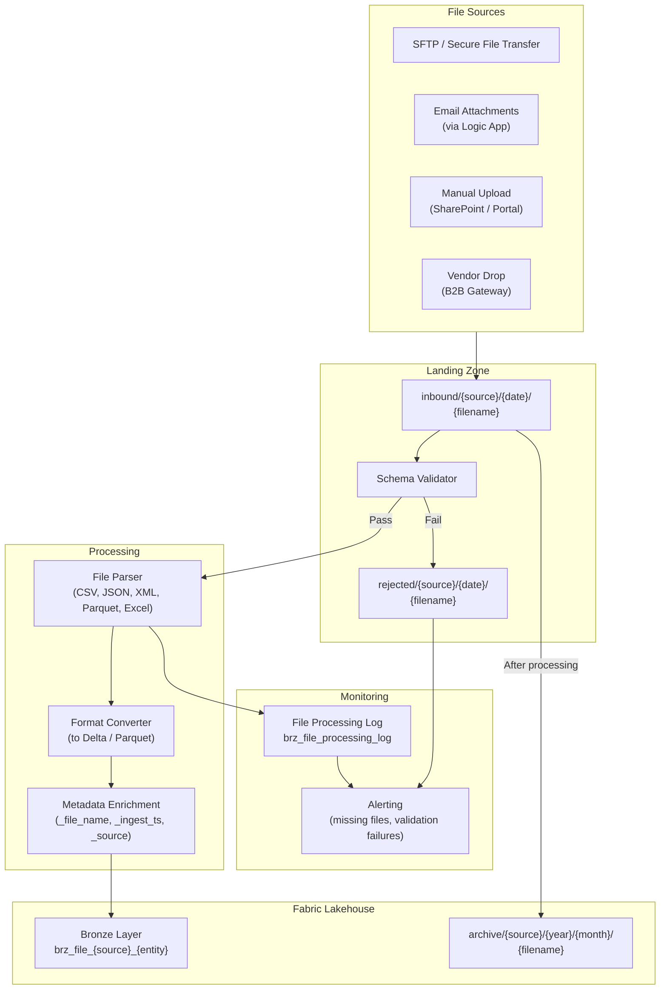

# File-Based Integration Pattern

> Module: ISL-05 | Version: 1.0 | Adaptation Effort: 2-4 hrs | Dependencies: ISL-03, ISL-04, ISL-05 Medallion, ISL-06

## Purpose

Define standardized patterns for ingesting, validating, processing, and managing file-based data exchanges. File-based integration remains the most common method for vendor data exchange, legacy system exports, regulatory submissions, and manual data uploads in manufacturing environments. This pattern covers four variants, file lifecycle management, schema validation, format handling, encryption, and large file strategies.

---

## Scope

### In Scope

- Four variants: Drop Zone, Schema-on-Read, Schema-on-Write, Archive & Process
- File naming conventions aligned to ISL-03
- Schema validation and rejection handling
- File lifecycle management (landing, processing, archive, purge)
- Supported file formats (CSV, Parquet, JSON, XML, Excel)
- Encryption at rest and in transit
- Large file handling (splitting, compression, streaming reads)
- Vendor data exchange patterns and SFTPs
- Mermaid architecture diagram

### Out of Scope

- ERP-native extraction (see ERP Extract & Load pattern)
- API-based data exchange (see API Gateway Integration pattern)
- Streaming data ingestion (see IoT/OT Ingestion pattern)
- File content transformation logic (see Medallion Architecture)
- Physical media transfer (tape, USB) procedures

---

## [ADAPTATION REQUIRED] Client Context

| Parameter | Default Value | Client Value | Notes |
|---|---|---|---|
| `landing_zone_path` | `onelake://{workspace}/lh_landing/Files/inbound/` | | Adjust per Fabric workspace structure |
| `archive_zone_path` | `onelake://{workspace}/lh_landing/Files/archive/` | | Separate storage account for long-term |
| `rejected_zone_path` | `onelake://{workspace}/lh_landing/Files/rejected/` | | Quarantine for failed validations |
| `supported_formats` | CSV, Parquet, JSON, XML, Excel (.xlsx) | | Remove formats not used by client |
| `default_encoding` | UTF-8 | | Some legacy systems use Latin-1 or Windows-1252 |
| `default_delimiter` | Comma (`,`) | | Pipe, tab, or semicolon for European vendors |
| `max_file_size_mb` | 1024 (1 GB) | | Files above this trigger chunked processing |
| `file_retention_landing_days` | 7 | | Days before processed files are moved to archive |
| `file_retention_archive_days` | 365 | | Days before archived files are purged |
| `sftp_provider` | Azure Blob SFTP | | External SFTP, Azure Blob SFTP, or Azure Files |
| `encryption_requirement` | AES-256 at rest; TLS 1.2+ in transit | | Tier 4 data may require client-managed keys |
| `vendor_file_sla_hours` | 24 | | Maximum hours after expected delivery to trigger alert |
| `schema_validation_mode` | Schema-on-Write (strict) | | Schema-on-Read for exploratory; Schema-on-Write for production |

---

## 1. Architecture Overview



---

## 2. Variant Decision Criteria

| Criterion | Drop Zone | Schema-on-Read | Schema-on-Write | Archive & Process |
|---|---|---|---|---|
| **Use when** | Vendor file feeds with stable schema; automated pickup | Diverse formats, evolving schemas; exploratory/ad-hoc | Regulated data, quality-critical feeds | Compliance archives; historical reprocessing |
| **Validation timing** | Post-pickup (basic) | At transformation (Silver) | At landing (immediate) | At reprocessing time |
| **Rejection handling** | Move to rejected folder | Log warning; process best-effort | Reject entire file; notify sender | Flag for manual review |
| **Schema requirement** | Implicit (inferred) | None at landing | Explicit schema definition required | Schema versioned with file |
| **Complexity** | Low | Low | Medium-High | Medium |
| **Best for** | Stable vendor feeds | Data science exploration | Financial/regulatory files | Audit trail, reprocessing |

---

## 3. File Naming Conventions (ISL-03 Aligned)

### 3.1 Inbound File Naming

```
{source}_{entity}_{date}_{sequence}.{extension}
```

| Component | Format | Example |
|---|---|---|
| `source` | Lowercase vendor/system code | `acme`, `sap`, `epicor` |
| `entity` | Lowercase entity name | `price_list`, `invoice`, `shipment` |
| `date` | `YYYYMMDD` | `20250615` |
| `sequence` | Zero-padded 3-digit sequence | `001`, `002` |
| `extension` | Lowercase file extension | `.csv`, `.json`, `.parquet`, `.xml`, `.xlsx` |

**Example:** `acme_price_list_20250615_001.csv`

### 3.2 Directory Structure

```
Files/
├── inbound/
│   ├── {source}/
│   │   ├── {YYYY-MM-DD}/
│   │   │   ├── {source}_{entity}_{date}_{seq}.{ext}
│   │   │   └── {source}_{entity}_{date}_{seq}.{ext}.manifest
├── processing/
│   ├── {source}/
│   │   └── (files currently being processed)
├── archive/
│   ├── {source}/
│   │   ├── {YYYY}/
│   │   │   ├── {MM}/
│   │   │   │   └── {original_filename}
├── rejected/
│   ├── {source}/
│   │   ├── {YYYY-MM-DD}/
│   │   │   ├── {original_filename}
│   │   │   └── {original_filename}.rejection_reason.json
```

---

## 4. Schema Validation and Rejection Handling

### 4.1 Validation Rules

| Rule | Check | Action on Failure |
|---|---|---|
| **File name format** | Matches `{source}_{entity}_{date}_{seq}.{ext}` pattern | Reject; move to rejected folder |
| **File not empty** | File size > 0 bytes | Reject; alert |
| **Header row present** | First row matches expected column names (CSV/Excel) | Reject; alert |
| **Column count** | Number of columns matches schema definition | Reject if strict; warn if flexible |
| **Required columns present** | All required columns exist in header | Reject |
| **Data type parseable** | Sample rows parse to expected types | Reject (strict) or quarantine rows (flexible) |
| **Row count within bounds** | Row count between min/max expected | Alert if outside bounds; process anyway |
| **Encoding valid** | File decodes without errors in expected encoding | Reject if unparseable |
| **Duplicate file detection** | File hash not already processed | Skip; log duplicate |

### 4.2 Rejection Log

```
brz_file_processing_log
├── log_id (string, UUID)
├── file_name (string)
├── file_path (string)
├── source_system (string)
├── file_size_bytes (bigint)
├── file_hash_sha256 (string)
├── processing_status (string: received, validating, processing, loaded, rejected, archived)
├── validation_result (string: pass, fail, warn)
├── rejection_reasons (string, JSON array)
├── row_count_source (bigint)
├── row_count_loaded (bigint)
├── processing_start_ts (timestamp)
├── processing_end_ts (timestamp)
├── pipeline_run_id (string)
└── archive_path (string)
```

---

## 5. Supported File Formats

| Format | Extension | Parser | Strengths | Limitations |
|---|---|---|---|---|
| **CSV** | `.csv` | PySpark `read.csv` | Universal; human-readable | No schema enforcement; delimiter/encoding issues |
| **Parquet** | `.parquet` | PySpark `read.parquet` | Columnar; schema-embedded; compressed | Not human-readable; requires tooling |
| **JSON** | `.json`, `.jsonl` | PySpark `read.json` | Self-describing; nested structures | Verbose; large file sizes; schema inference variability |
| **XML** | `.xml` | `spark-xml` library | Legacy vendor standard; nested structures | Complex parsing; XSD validation required |
| **Excel** | `.xlsx` | `openpyxl` or `pandas` | Business-user-friendly | Limited row capacity (1M); formula handling; multiple sheets |

### 5.1 Format-Specific Handling

**CSV:**
- Always specify `header=true`, `encoding`, `delimiter`, `quote`, `escape` explicitly
- Handle multi-line fields with `multiLine=true`
- Set `nullValue` to match source convention (`""`, `NULL`, `N/A`)

**Excel:**
- Specify sheet name or index explicitly
- Skip header rows if present (e.g., title rows above column headers)
- Convert to CSV or Parquet before loading to Bronze for consistency

**XML:**
- Define row tag explicitly (e.g., `<Invoice>`, `<LineItem>`)
- Flatten nested structures in Silver, not Bronze
- Validate against XSD if provided by vendor

---

## 6. File Lifecycle Management

| Stage | Location | Duration | Action |
|---|---|---|---|
| **Landing** | `inbound/{source}/{date}/` | Until processed (max 7 days) | File arrives via SFTP, upload, or drop |
| **Processing** | `processing/{source}/` | During pipeline execution | File moved here during processing to prevent re-pickup |
| **Loaded** | Bronze Lakehouse (Delta table) | Per Bronze retention (90 days default) | Data converted to Delta; source file no longer needed |
| **Archive** | `archive/{source}/{year}/{month}/` | 365 days (configurable) | Original file preserved for audit/reprocessing |
| **Purge** | Deleted | After archive retention expires | Secure deletion; logged to processing log |

**Lifecycle State Machine:**

```
Received → Validating → Processing → Loaded → Archived → Purged
                ↓
            Rejected → Remediated → Resubmitted
```

---

## 7. Encryption and Security

| Concern | Requirement | Implementation |
|---|---|---|
| **At rest (Tier 2)** | AES-256, platform-managed keys | Default OneLake encryption |
| **At rest (Tier 3-4)** | AES-256, customer-managed keys | Azure Key Vault CMK; dedicated storage account |
| **In transit (SFTP)** | SFTP over SSH (AES-256-CTR or ChaCha20) | Azure Blob SFTP or dedicated SFTP server |
| **In transit (HTTPS)** | TLS 1.2 minimum | Enforce TLS 1.2+ on all endpoints |
| **PGP-encrypted files** | Decrypt at landing before processing | PGP keys stored in Key Vault; decrypt in pipeline |
| **Password-protected Excel** | Decrypt with provided password | Password stored in Key Vault; decrypt via openpyxl |
| **Vendor file signing** | Verify digital signature before processing | Vendor public key in Key Vault; verify SHA256 signature |

---

## 8. Large File Handling

| File Size | Strategy | Implementation |
|---|---|---|
| **< 100 MB** | Direct load | Single PySpark read operation |
| **100 MB - 1 GB** | Parallel read with partitioning | PySpark with repartition; `maxRecordsPerFile` |
| **1 GB - 10 GB** | Chunked processing | Split into chunks before processing; process in parallel |
| **> 10 GB** | Streaming read | PySpark structured streaming from file source |

**Compression:**
- Accept compressed files (`.gz`, `.zip`, `.bz2`) at landing
- Decompress during processing; load decompressed data to Bronze
- Archive original compressed file
- For outbound files, compress as `.gz` (gzip) by default

---

## Fabric / Azure Implementation Guidance

| Component | Recommended Service | Configuration |
|---|---|---|
| SFTP endpoint | Azure Blob Storage SFTP | Hierarchical namespace enabled; local user authentication |
| Landing zone | OneLake Files section | Lakehouse Files area (not Tables) for raw files |
| File processing | Fabric Notebooks (PySpark) | Auto-detect format; validate schema; write to Delta |
| Orchestration | Fabric Data Factory | File arrival trigger or tumbling window schedule |
| File detection | Storage event trigger | Blob created event triggers pipeline |
| Archive storage | Azure Blob Storage (Cool tier) | Lifecycle management policy for automatic tiering |
| Monitoring | Fabric Monitor + Logic Apps | Missing file alerts; processing failure notifications |
| Secrets | Azure Key Vault | SFTP credentials, PGP keys, encryption passwords |

---

## Manufacturing Overlay [CONDITIONAL]

| Manufacturing Scenario | Source | Format | Frequency | Special Handling |
|---|---|---|---|---|
| Vendor price list updates | Supplier SFTP | CSV or Excel | Monthly/Quarterly | Schema-on-Write; validate price columns are numeric |
| EDI purchase orders (850) | B2B gateway | EDI → XML/CSV | Real-time/Daily | EDI translator to CSV; validate against PO schema |
| Quality certificates (CoC) | Vendor email/portal | PDF + CSV data | Per shipment | PDF archived; CSV data validated and loaded |
| PPAP (Production Part Approval) | Vendor portal | Excel + attachments | Per new part | Complex Excel; multiple sheets; manual review may be needed |
| Shipping ASN (856) | Vendor EDI | EDI → CSV | Per shipment | Cross-reference with PO; validate quantities |
| Regulatory compliance files | Internal/external | XML, CSV | Quarterly/Annual | Schema-on-Write; strict validation; archive indefinitely |

---

## Cross-References

| Reference | Module | Relationship |
|---|---|---|
| Medallion Architecture | ISL-05 | File data lands in Bronze per medallion standards |
| Naming Conventions | ISL-03 | File names and Bronze table names follow ISL-03 |
| Data Classification | ISL-04 | File encryption and access per classification tier |
| Quality Gates | ISL-06 | Schema validation implements ISL-06 validity dimension |
| API Gateway Integration | ISL-05 | Some vendor data may arrive via API instead of file |

## Compliance Alignment

| Framework | Relevance |
|---|---|
| SOX Section 302/404 | Financial file exchanges require audit trail and reconciliation |
| GDPR Article 32 | Encryption of files containing personal data in transit and at rest |
| FDA 21 CFR Part 11 | Electronic records from file-based vendor data must maintain integrity |
| ISO 27001 A.13.2 | Information transfer policies apply to file-based exchanges |
| PCI-DSS Req. 3-4 | Files containing cardholder data require encryption and access controls |

## Revision History

| Version | Date | Author | Changes |
|---|---|---|---|
| 1.0 | 2025-01-15 | ISL Team | Initial release — 4 variants, lifecycle management, format handling |
