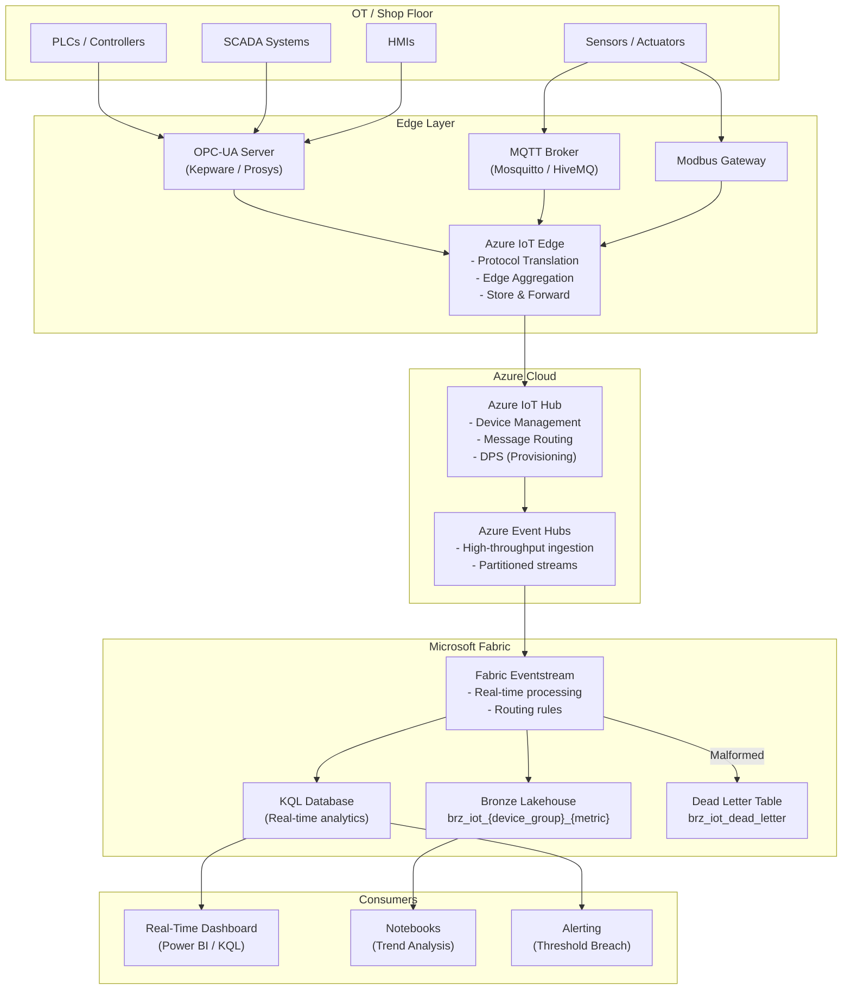

# IoT/OT Ingestion Pattern

> Module: ISL-05 | Version: 1.0 | Adaptation Effort: 4-6 hrs | Dependencies: ISL-03, ISL-04, ISL-05 Medallion, ISL-06

## Purpose

Define standardized patterns for ingesting data from Internet of Things (IoT) devices, Operational Technology (OT) systems, SCADA platforms, and industrial sensors into the Fabric lakehouse. This pattern covers four ingestion variants, telemetry schema standardization, Azure IoT Hub and Event Hubs architecture, Fabric Eventstream integration, dead-letter handling, backpressure management, edge-to-cloud security, time-series optimization, and OT protocol support. IoT/OT ingestion is the highest-volume, lowest-latency integration pattern in manufacturing and requires specialized handling for data velocity, device management, and industrial protocol translation.

---

## Scope

### In Scope

- Four ingestion variants: Streaming, Micro-Batch, Edge Aggregation, Store & Forward
- Telemetry schema standardization (canonical message format)
- Azure IoT Hub and Event Hubs architecture
- Fabric Eventstream integration and configuration
- Dead-letter handling for malformed messages
- Backpressure and throttling strategies
- Edge-to-cloud security (device authentication, message signing)
- Time-series data optimization (partitioning, Z-order, retention)
- OT protocol support (OPC-UA, MQTT, Modbus)
- ISL-04 classification for IoT data
- Mermaid architecture diagram

### Out of Scope

- IoT device provisioning and firmware management
- OT network architecture and segmentation (Purdue model)
- Edge computing application development
- Predictive maintenance model development (data science)
- SCADA system configuration and programming

---

## [ADAPTATION REQUIRED] Client Context

| Parameter | Default Value | Client Value | Notes |
|---|---|---|---|
| `iot_hub_sku` | S1 Standard | | S1 for up to 400K messages/day per unit; S2/S3 for higher volume |
| `event_hub_partitions` | 8 | | Increase for higher throughput; max 32 for standard tier |
| `ingestion_variant` | Micro-Batch (5-minute window) | | Streaming for sub-second; Micro-Batch for cost optimization |
| `telemetry_rate_per_device` | 1 message/second | | High-frequency sensors may exceed 100 msg/sec |
| `total_device_count` | 500 | | Drives IoT Hub sizing and partition count |
| `message_avg_size_bytes` | 512 | | Impacts throughput calculations and storage estimates |
| `edge_gateway` | Azure IoT Edge | | Kepware, Siemens MindSphere, or custom edge gateway |
| `ot_protocols` | OPC-UA, MQTT | | Add Modbus, EtherNet/IP, PROFINET as needed |
| `data_retention_hot_days` | 30 | | Hot tier for real-time dashboards |
| `data_retention_warm_days` | 365 | | Warm tier for trend analysis |
| `backpressure_threshold_pct` | 80 | | Event Hub partition utilization trigger for backpressure |
| `dead_letter_retention_days` | 30 | | Retention for malformed messages |
| `device_authentication` | X.509 certificates | | Symmetric key for POC; X.509 for production |
| `manufacturing_overlay` | Yes | | Set No for non-manufacturing IoT (smart buildings, fleet) |

---

## 1. Architecture Overview



---

## 2. Ingestion Variant Decision Criteria

| Criterion | Streaming | Micro-Batch | Edge Aggregation | Store & Forward |
|---|---|---|---|---|
| **Use when** | Sub-second latency needed; real-time alerting | Near-real-time analytics (1-15 min); cost optimization | High-frequency sensors; bandwidth constraints | Intermittent connectivity; remote facilities |
| **Latency** | < 1 second | 1-15 minutes | 1-15 minutes (aggregated) | Minutes to hours (eventual) |
| **Data volume** | Medium (processed per-event) | High (batched for efficiency) | Reduced (pre-aggregated at edge) | Variable (buffered locally) |
| **Edge compute** | Minimal | Minimal | Required (aggregation logic) | Required (local buffer) |
| **Network dependency** | Continuous, reliable | Intermittent acceptable | Intermittent acceptable | Designed for disconnected |
| **Cost** | Highest (always-on processing) | Medium | Lower (reduced cloud ingestion) | Lowest (batch upload) |
| **Complexity** | Medium | Low | High | Medium |
| **Best for** | Safety alerts, quality control | Production monitoring dashboards | Vibration sensors (10 kHz+), power meters | Remote sites, offshore, mobile equipment |

### Decision Flowchart

1. **Is sub-second alerting required?** Yes -> Streaming
2. **Is the facility connected with reliable bandwidth?** No -> Store & Forward
3. **Is raw sensor frequency > 10 Hz per device?** Yes -> Edge Aggregation
4. **Default** -> Micro-Batch (5-minute window)

---

## 3. Telemetry Schema Standardization

### 3.1 Canonical Message Format

All IoT/OT messages must conform to this canonical schema before landing in Bronze. Protocol translation at the edge gateway maps device-specific formats to this standard.

```json
{
  "device_id": "PRESS-LINE-04-TEMP-001",
  "device_group": "press_line_04",
  "plant_code": "PLT-CHI-01",
  "timestamp_utc": "2025-06-15T14:32:01.456Z",
  "metric_name": "temperature_celsius",
  "metric_value": 185.4,
  "metric_unit": "C",
  "data_quality": "GOOD",
  "metadata": {
    "firmware_version": "3.2.1",
    "protocol": "OPC-UA",
    "node_id": "ns=2;s=Temperature.PV"
  }
}
```

### 3.2 Canonical Schema Definition

| Field | Type | Required | Description |
|---|---|---|---|
| `device_id` | STRING | Yes | Unique device identifier; hierarchical naming recommended |
| `device_group` | STRING | Yes | Logical grouping (production line, area, cell) |
| `plant_code` | STRING | Yes | Plant/facility identifier per ISL-03 |
| `timestamp_utc` | TIMESTAMP | Yes | Event timestamp in UTC (ISO 8601) |
| `metric_name` | STRING | Yes | Standardized metric name (lowercase, underscored) |
| `metric_value` | DOUBLE | Yes | Numeric metric value |
| `metric_unit` | STRING | Yes | Unit of measure (SI preferred: C, Pa, kg, m, s) |
| `data_quality` | STRING | Yes | OPC-UA quality code: GOOD, BAD, UNCERTAIN |
| `metadata` | MAP<STRING, STRING> | No | Additional context (firmware, protocol, node ID) |

### 3.3 Standard Metric Names

| Metric Name | Unit | Domain | Example Device |
|---|---|---|---|
| `temperature_celsius` | C | Thermal | Thermocouple, RTD, IR sensor |
| `pressure_bar` | bar | Hydraulic/Pneumatic | Pressure transducer |
| `vibration_mm_per_sec` | mm/s | Predictive maintenance | Accelerometer |
| `power_kwh` | kWh | Energy | Power meter |
| `flow_rate_lpm` | L/min | Fluid handling | Flow meter |
| `cycle_count` | count | Production | Proximity sensor, encoder |
| `humidity_pct` | % | Environmental | Humidity sensor |
| `weight_kg` | kg | Material handling | Load cell, scale |
| `speed_rpm` | RPM | Rotating equipment | Tachometer, encoder |
| `position_mm` | mm | Linear motion | LVDT, laser sensor |

---

## 4. Azure IoT Hub / Event Hubs Architecture

### 4.1 IoT Hub Configuration

| Setting | Recommended Value | Rationale |
|---|---|---|
| SKU | S1 Standard (scale units based on device count) | S1 supports 400K msg/day per unit; scale for volume |
| Partitions | 8 (default) to 32 (high volume) | Determines max parallel consumers |
| Message retention | 7 days | Buffer for reprocessing; Fabric ingestion lag tolerance |
| Device provisioning | DPS (Device Provisioning Service) | Zero-touch provisioning; supports X.509 enrollment groups |
| Message routing | Route all telemetry to Event Hub endpoint | Decouple device management from data ingestion |
| Built-in endpoint | Enable for Fabric Eventstream | Consumer group: `fabric-eventstream` |

### 4.2 Event Hubs Configuration (Standalone or IoT Hub Backend)

| Setting | Recommended Value | Rationale |
|---|---|---|
| Namespace SKU | Standard | Premium for > 100 MB/s throughput |
| Partitions | 8-32 | Match to IoT Hub or throughput needs |
| Consumer groups | Separate per downstream consumer | `fabric-eventstream`, `kql-database`, `archival` |
| Capture | Enable capture to OneLake (Avro/Parquet) | Backup landing for all raw messages |
| Retention | 7 days (message retention) | Buffer for replay and reprocessing |
| Throughput units | Auto-inflate enabled; max 20 TU | Auto-scale for burst traffic |

---

## 5. Fabric Eventstream Integration

| Component | Configuration | Notes |
|---|---|---|
| Source | Azure Event Hubs (custom endpoint) or IoT Hub | Connect via connection string or managed identity |
| Processing | No-code transformations for filtering, routing | Filter by `device_group` or `metric_name` |
| Destination — KQL | KQL Database for real-time queries | Sub-second latency; retention 30 days |
| Destination — Lakehouse | Bronze Lakehouse for historical storage | Micro-batch writes; 5-minute window default |
| Dead-letter destination | Separate Lakehouse or Event Hub | Route unparseable messages |
| Schema | Apply Avro schema for deserialization | Schema registry recommended for versioning |

---

## 6. Dead-Letter Handling

### 6.1 Dead-Letter Criteria

| Condition | Action | Resolution |
|---|---|---|
| Message cannot be deserialized (invalid JSON/Avro) | Route to dead-letter topic | Investigate device firmware; fix payload format |
| Required field missing (device_id, timestamp, metric_value) | Route to dead-letter table | Update edge gateway mapping; reprocess if correctable |
| Timestamp in the future (> 5 minutes ahead) | Route to dead-letter table | Investigate device clock drift; NTP sync |
| Timestamp too old (> 24 hours behind) | Route to dead-letter table | Investigate store & forward backlog; process if valid |
| Metric value outside physical bounds | Log warning; process with `data_quality = UNCERTAIN` | Review sensor calibration |
| Unknown device_id | Route to dead-letter table | Register device in IoT Hub; reprocess |

### 6.2 Dead-Letter Table Schema

```
brz_iot_dead_letter
├── dead_letter_id (string, UUID)
├── event_hub_partition (int)
├── event_hub_offset (string)
├── event_hub_enqueued_time (timestamp)
├── raw_payload (string, original message body)
├── error_type (string: deserialization, validation, schema, device_unknown)
├── error_detail (string)
├── device_id (string, if parseable)
├── received_timestamp (timestamp)
└── resolved (boolean)
```

---

## 7. Backpressure and Throttling

| Scenario | Detection | Response |
|---|---|---|
| Event Hub partition utilization > 80% | Monitor `IncomingMessages` vs. `ThrottledRequests` | Scale throughput units; increase partitions; activate edge aggregation |
| Fabric Eventstream processing lag > 5 minutes | Monitor consumer group lag | Scale Eventstream capacity; reduce processing complexity |
| IoT Hub daily message quota approaching limit | Monitor `d2c.telemetry.ingress.allProtocol` | Increase IoT Hub units; activate edge aggregation |
| Device sending faster than expected | Monitor per-device message rate | Throttle at edge gateway; adjust device sampling rate |
| Burst traffic (shift change, batch start) | Historical pattern detection | Pre-scale Event Hub TU; configure auto-inflate |

### Throttling Hierarchy

1. **Edge throttle** — Reduce sampling rate at edge gateway (first line of defense)
2. **IoT Hub throttle** — Per-device message limit via IoT Hub device twin
3. **Event Hub auto-inflate** — Auto-scale throughput units for burst absorption
4. **Fabric Eventstream scaling** — Increase capacity units for processing throughput
5. **Alert and investigate** — If throttling persists, assess architecture capacity

---

## 8. Edge-to-Cloud Security

| Security Layer | Mechanism | Implementation |
|---|---|---|
| **Device identity** | X.509 certificates (production) or symmetric keys (POC) | DPS enrollment groups with X.509 CA chain |
| **Device authentication** | Mutual TLS (mTLS) to IoT Hub | IoT Hub verifies device certificate; device verifies IoT Hub |
| **Message signing** | HMAC-SHA256 message signature | Edge gateway signs; cloud validates before processing |
| **Transport encryption** | TLS 1.2 (MQTT over TLS, AMQP over TLS) | Mandatory for all device-to-cloud communication |
| **Network isolation** | Private endpoints for IoT Hub and Event Hubs | VNet integration; no public endpoint exposure |
| **Edge gateway hardening** | Minimal attack surface; automatic certificate rotation | Azure IoT Edge security daemon; TPM integration |
| **OT network segmentation** | DMZ between IT and OT networks | Firewall rules allowing only outbound MQTT/AMQP to edge gateway |

### Device Certificate Lifecycle

| Stage | Action | Frequency |
|---|---|---|
| Provisioning | Issue device certificate via DPS enrollment group | At device deployment |
| Rotation | Rotate certificate before expiry | Annually (365-day validity) |
| Revocation | Add to CRL in IoT Hub | On device decommission or compromise |
| Monitoring | Alert on certificate expiry within 30 days | Daily check via Logic App |

---

## 9. Time-Series Data Optimization

### 9.1 Partitioning Strategy

| Layer | Partition Column(s) | Rationale |
|---|---|---|
| Bronze | `_ingest_date` (date) | Align with ingestion pipeline runs; efficient for reprocessing |
| Silver | `metric_date` (date) + `device_group` | Optimized for time-range + device-group queries |
| Gold | `metric_date` (date) | Align with reporting period queries |

### 9.2 Z-Ordering

| Layer | Z-Order Column(s) | Rationale |
|---|---|---|
| Silver | `device_id`, `metric_name` | Most common filter pattern: specific device + metric over time |
| Gold | `plant_code`, `device_group` | Aggregated queries filter by plant and production line |

### 9.3 Retention and Compaction

| Layer | Retention | Compaction | VACUUM |
|---|---|---|---|
| Bronze | 90 days | Auto-compact enabled | `VACUUM RETAIN 720 HOURS` (30 days) |
| Silver | 365 days | `OPTIMIZE` daily | `VACUUM RETAIN 720 HOURS` (30 days) |
| Gold (aggregated) | Indefinite | `OPTIMIZE` weekly | `VACUUM RETAIN 168 HOURS` (7 days) |
| KQL Database | 30 days (hot) | Managed by KQL engine | Automatic |

---

## 10. OT Protocol Support

| Protocol | Transport | Use Case | Edge Gateway | Translation to Canonical |
|---|---|---|---|---|
| **OPC-UA** | TCP (port 4840) | PLCs, SCADA, HMIs; industrial standard | Kepware, Prosys, Azure IoT Edge OPC-UA module | OPC-UA node → metric_name; OPC-UA value → metric_value |
| **MQTT** | TCP (port 1883/8883) | Lightweight sensors, modern IoT devices | Mosquitto, HiveMQ, Azure IoT Edge MQTT bridge | MQTT topic → device_group/metric_name; payload → metric_value |
| **Modbus** | TCP (port 502) / Serial | Legacy PLCs, energy meters, basic sensors | Kepware, custom Modbus-to-MQTT bridge | Register address → metric_name; register value → metric_value |
| **EtherNet/IP** | TCP (port 44818) | Allen-Bradley / Rockwell PLCs | Kepware | Tag name → metric_name |
| **PROFINET** | Ethernet (Layer 2) | Siemens PLCs | Siemens MindConnect, Kepware | Data block → metric_name |

---

## 11. ISL-04 Classification for IoT Data

| Data Category | Default Tier | Upgrade Condition | Handling |
|---|---|---|---|
| Raw sensor telemetry | Tier 2 — Internal | Correlated with trade secret process → Tier 4 | Standard encryption |
| Device metadata (firmware, location) | Tier 2 — Internal | OT network topology revealed → Tier 3 | Internal access only |
| Aggregated production metrics | Tier 2 — Internal | Per-product-line granularity → Tier 3 | Need-to-know for Tier 3 |
| Process parameter setpoints | Tier 4 — Restricted | Always Tier 4 (trade secret) | CMK encryption; named access |
| SCADA control commands | Tier 4 — Restricted | Always Tier 4 (safety-critical) | Isolated workspace; audit logging |
| Predictive maintenance model inputs | Tier 3 — Confidential | Model reveals process IP → Tier 4 | Restricted to maintenance team |

---

## Fabric / Azure Implementation Guidance

| Component | Recommended Service | Configuration |
|---|---|---|
| Device management | Azure IoT Hub | DPS for provisioning; device twins for configuration |
| High-throughput ingestion | Azure Event Hubs | Standard tier; auto-inflate; capture to OneLake |
| Real-time processing | Fabric Eventstream | Source: Event Hubs; Destinations: KQL + Lakehouse |
| Real-time analytics | Fabric KQL Database | 30-day retention; materialized views for dashboards |
| Historical storage | Fabric Lakehouse (Bronze) | Delta tables; partitioned by date |
| Edge gateway | Azure IoT Edge | OPC-UA, MQTT modules; store & forward enabled |
| Monitoring | Azure Monitor + Fabric Monitor | Device connectivity, message throughput, processing lag |
| Security | Azure Key Vault + DPS | Device certificates, connection strings |

---

## Manufacturing Overlay [CONDITIONAL]

| Manufacturing Scenario | Variant | Protocol | Frequency | Special Handling |
|---|---|---|---|---|
| CNC machine monitoring | Micro-Batch | OPC-UA | 1 msg/sec per axis | Multiple metrics per message; flatten in Silver |
| Press line temperature | Streaming | OPC-UA | 10 msg/sec | Safety alerting on threshold breach; KQL real-time |
| Vibration monitoring (predictive) | Edge Aggregation | MQTT | 10 kHz raw → 1 Hz FFT | FFT computed at edge; only frequency spectrum sent to cloud |
| Energy metering | Micro-Batch | Modbus | 1 msg/15 sec | Accumulate kWh; reset detection logic |
| Environmental monitoring | Micro-Batch | MQTT | 1 msg/min | Temperature, humidity for compliance (FDA, ISO) |
| Conveyor/AGV tracking | Streaming | MQTT | 5 msg/sec | Position data; geofencing alerts in KQL |
| Batch reactor parameters | Store & Forward | OPC-UA | 1 msg/sec | Batch context (recipe, lot) must accompany telemetry |
| Quality vision inspection | Streaming | Custom REST | Per-part (1-10 sec cycle) | Image reference + pass/fail; images stored separately |

---

## Cross-References

| Reference | Module | Relationship |
|---|---|---|
| Medallion Architecture | ISL-05 | IoT data lands in Bronze, aggregates in Silver/Gold per medallion |
| Naming Conventions | ISL-03 | Device naming, metric naming, table naming standards |
| Data Classification | ISL-04 | IoT data classification tiers; escalation rules |
| Quality Dimensions | ISL-06 | Completeness and timeliness critical for telemetry |
| Event-Driven Architecture | ISL-05 | Streaming variant leverages event-driven infrastructure |
| API Governance | ISL-01 | REST-based IoT devices follow API standards |

## Compliance Alignment

| Framework | Relevance |
|---|---|
| IEC 62443 | Industrial cybersecurity standards for OT network and device security |
| NIST SP 800-82 | Guide to ICS security; applies to SCADA/OT data handling |
| FDA 21 CFR Part 11 | Environmental monitoring data for pharmaceutical/food manufacturing |
| ISO 27001 A.13 | Network security controls for IoT communication channels |
| GDPR | IoT data containing employee location or biometric data |

## Revision History

| Version | Date | Author | Changes |
|---|---|---|---|
| 1.0 | 2025-01-15 | ISL Team | Initial release — 4 variants, telemetry schema, OT protocol support |
