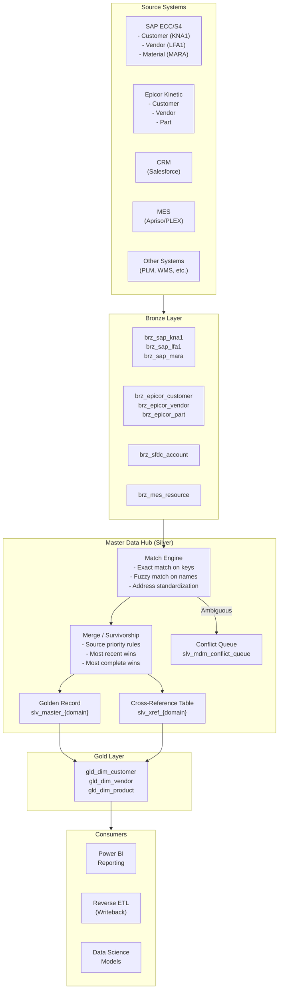

# Master Data Synchronization Pattern

> Module: ISL-05 | Version: 1.0 | Adaptation Effort: 4-6 hrs | Dependencies: ISL-03, ISL-04, ISL-05 Medallion, ISL-06

## Purpose

Define standardized patterns for synchronizing master data across multiple systems to establish a consistent, trustworthy view of core business entities. In manufacturing environments, master data — customers, vendors, materials, products, plants, employees — is often fragmented across dual-ERP systems (SAP + Epicor), CRMs, MES platforms, and custom applications. This pattern covers four synchronization variants, match/merge rules, survivorship logic, cross-reference key mapping, conflict resolution, and dual-ERP golden record strategies.

---

## Scope

### In Scope

- Four variants: Golden Record (Hub), Coexistence, Registry, Consolidation
- Match/merge rules and survivorship logic
- Cross-reference key mapping
- Conflict resolution hierarchy
- Synchronization frequency and SLA definitions
- Dual-ERP scenario (SAP + Epicor golden record)
- MDM platform patterns (SAP MDG, Profisee, Informatica MDM)
- Mermaid architecture diagram

### Out of Scope

- MDM platform installation, licensing, and administration
- Data quality rules for master data (see ISL-06 Quality Rule Library)
- Customer consent management and privacy (see ISL-04)
- Reference data management (country codes, currencies, UOM) — distinct from master data
- Transactional data synchronization (see ERP Extract & Load, Event-Driven patterns)

---

## [ADAPTATION REQUIRED] Client Context

| Parameter | Default Value | Client Value | Notes |
|---|---|---|---|
| `mdm_variant` | Consolidation (analytics-only) | | Golden Record for operational; Registry for federated |
| `master_data_domains` | Customer, Vendor, Material/Product, Plant | | Add Employee, GL Account, Cost Center as needed |
| `primary_erp` | SAP | | System of record for tiebreaker in survivorship |
| `secondary_erp` | Epicor | | Or none if single-ERP environment |
| `mdm_platform` | Fabric Lakehouse (custom) | | Profisee, Informatica MDM, SAP MDG if licensed |
| `match_strategy` | Exact + Fuzzy (Jaro-Winkler >= 0.85) | | Exact-only for high-confidence; fuzzy for broader coverage |
| `survivorship_default` | Most recent update wins | | Source priority, most complete, or custom per attribute |
| `sync_frequency` | Daily (batch) | | Near-real-time for operational MDM; daily for analytics |
| `conflict_resolution_authority` | Data Steward (domain) | | Governance council for cross-domain conflicts |
| `xref_table_prefix` | `slv_xref_` | | Cross-reference table naming per ISL-03 |
| `golden_record_prefix` | `slv_master_` | | Golden record table naming per ISL-03 |

---

## 1. Architecture Overview



---

## 2. Variant Decision Criteria

| Criterion | Golden Record (Hub) | Coexistence | Registry | Consolidation |
|---|---|---|---|---|
| **Use when** | Clear system of record; centralized governance possible | No single system of record; gradual consolidation | Minimal data movement desired; federated ownership | Analytics-only use case; no operational writeback |
| **Data movement** | All systems sync to/from central hub | Bi-directional sync between systems | No movement; virtual golden record via pointers | One-way; sources to analytics hub |
| **Governance model** | Centralized | Distributed with coordination | Federated | Centralized (analytics team) |
| **Operational impact** | High (hub becomes critical path) | Medium (sync complexity) | Low (no data movement) | None (read-only) |
| **Implementation complexity** | High | Very High | Medium | Low |
| **Writeback to sources** | Yes (hub pushes golden record) | Yes (bi-directional) | No (lookup references only) | No |
| **Best for** | New platform greenfield; strong governance | Dual-ERP transition; M&A integration | Mature federated architecture | Analytics/reporting alignment |
| **Fabric implementation** | Lakehouse as hub; Reverse ETL for writeback | Event-driven sync + Lakehouse | Lakehouse with xref tables; query-time resolution | Lakehouse Silver/Gold layers |

---

## 3. Match/Merge Rules

### 3.1 Match Strategies

| Strategy | Algorithm | Threshold | Use Case |
|---|---|---|---|
| **Exact key match** | Equality on business key | 100% match | SAP customer ID = Epicor customer ID (if shared) |
| **Deterministic match** | Multiple fields exact match | All fields match | Name + Address + Phone exact match |
| **Probabilistic match** | Jaro-Winkler, Levenshtein, Soundex | Composite score >= 0.85 | Name similarity + address proximity |
| **Rule-based match** | Custom business rules | Per-rule threshold | Tax ID match (100%); DUNS number match (100%) |
| **Hybrid** | Deterministic first, then probabilistic | Tiered thresholds | Exact match first; fuzzy for remaining unmatched |

### 3.2 Match Field Weights (Customer Domain Example)

| Field | Weight | Algorithm | Notes |
|---|---|---|---|
| Tax ID (EIN/VAT) | 40% | Exact (normalized) | Strongest identifier; deduplicate first |
| Company name | 25% | Jaro-Winkler (>= 0.85) | Normalize: remove LLC, Inc, Corp; uppercase |
| Address (street) | 15% | Address standardization + Jaro-Winkler | USPS/postal standardization before compare |
| City + State/Province | 10% | Exact (standardized) | Standardize abbreviations |
| Phone number | 5% | Exact (digits only, normalized) | Remove formatting; compare last 10 digits |
| Email domain | 5% | Exact | Company email domain match |

### 3.3 Match Result Categories

| Category | Score Range | Action |
|---|---|---|
| **Auto-match** | >= 0.95 composite score | Automatically merge; no human review |
| **Probable match** | 0.85 - 0.94 | Route to data steward for confirmation |
| **Possible match** | 0.70 - 0.84 | Route to conflict queue for investigation |
| **No match** | < 0.70 | Create new golden record; no merge |

---

## 4. Survivorship Logic

### 4.1 Survivorship Rules by Attribute

| Attribute | Survivorship Rule | Rationale |
|---|---|---|
| Entity name (legal) | Source priority: ERP > CRM > MES | ERP has legally validated name |
| Address (billing) | Most recently updated | Addresses change; freshest is most accurate |
| Address (shipping) | Source priority: WMS > ERP | WMS has operational shipping address |
| Phone number | Most complete (longest valid number) | Completeness indicates better data capture |
| Email | Most recently updated | Email addresses change frequently |
| Tax ID | First non-null (any source) | Tax ID rarely changes; any valid value is correct |
| Credit limit | Source priority: Finance system | Finance is authoritative for credit |
| Industry code (NAICS/SIC) | Source priority: CRM > ERP | CRM typically has richer customer profiling |
| Payment terms | Source priority: ERP (primary) | ERP manages financial terms |

### 4.2 Survivorship Strategy Types

| Strategy | Description | Use When |
|---|---|---|
| **Source priority** | Defined hierarchy of source systems; highest priority wins | Clear system-of-record per attribute |
| **Most recent** | Latest timestamp wins | Frequently changing attributes |
| **Most complete** | Value with fewest nulls/longest length wins | Attributes where data capture varies |
| **Aggregate** | Combine values from multiple sources | Tags, categories, classifications |
| **Manual** | Data steward selects correct value | Ambiguous conflicts; regulatory data |

---

## 5. Cross-Reference Key Mapping

### 5.1 Cross-Reference Table Schema

```
slv_xref_{domain}
├── xref_id (bigint, auto-increment)
├── golden_record_id (string) — master entity identifier
├── source_system (string) — source system code (sap, epicor, sfdc)
├── source_entity (string) — source entity/table name
├── source_key (string) — source system primary key
├── source_key_type (string) — key type (customer_id, vendor_id, etc.)
├── match_confidence (decimal) — match score that created this mapping
├── match_method (string) — exact, deterministic, probabilistic, manual
├── created_timestamp (timestamp)
├── created_by (string) — system or user that created mapping
├── is_active (boolean) — FALSE for superseded mappings
└── notes (string) — manual override justification
```

### 5.2 Cross-Reference Example (Customer Domain)

| golden_record_id | source_system | source_key | source_key_type | match_confidence |
|---|---|---|---|---|
| GR-CUST-001 | sap | 0000100234 | KUNNR | 1.00 (exact) |
| GR-CUST-001 | epicor | CUST-234 | CustID | 0.92 (fuzzy name match) |
| GR-CUST-001 | sfdc | 001A000001XyZ | AccountId | 0.97 (tax ID + name) |
| GR-CUST-002 | sap | 0000100567 | KUNNR | 1.00 (exact) |
| GR-CUST-002 | epicor | CUST-567 | CustID | 1.00 (exact key match) |

---

## 6. Conflict Resolution Hierarchy

| Conflict Type | Resolution Method | Escalation |
|---|---|---|
| **Attribute conflict (non-critical)** | Apply survivorship rules automatically | Log conflict; no escalation |
| **Attribute conflict (critical: legal name, tax ID)** | Route to data steward queue | Data steward resolves within 48 hours |
| **Match ambiguity** | Route to conflict queue for human review | Data steward confirms match or rejects |
| **Merge disagreement** | Escalate to domain data owner | Data owner decision within 5 business days |
| **Cross-domain conflict** | Escalate to data governance council | Council decision within 10 business days |
| **Regulatory conflict (ITAR, PII tier)** | Escalate to compliance officer | Compliance review before resolution |

### Conflict Queue Table

```
slv_mdm_conflict_queue
├── conflict_id (string, UUID)
├── domain (string) — customer, vendor, material
├── golden_record_id (string, nullable)
├── source_system_a (string)
├── source_key_a (string)
├── source_system_b (string)
├── source_key_b (string)
├── conflict_type (string: attribute, match_ambiguity, merge, regulatory)
├── conflicting_field (string)
├── value_a (string)
├── value_b (string)
├── match_score (decimal, nullable)
├── status (string: open, assigned, resolved, escalated)
├── assigned_to (string)
├── resolution (string: accept_a, accept_b, manual_value, reject_match, split)
├── resolution_value (string, nullable)
├── created_timestamp (timestamp)
├── resolved_timestamp (timestamp)
└── resolved_by (string)
```

---

## 7. Synchronization Frequency and SLA

| Domain | Sync Frequency | SLA (Data Freshness) | Rationale |
|---|---|---|---|
| Customer | Daily (batch) | Golden record reflects changes within 24 hours | Customer changes are infrequent; daily is sufficient |
| Vendor | Daily (batch) | Golden record reflects changes within 24 hours | Vendor master changes infrequently |
| Material / Product | Daily (batch) + event-driven for new items | New materials available within 4 hours | New product launch requires faster sync |
| Plant / Location | Weekly (batch) | Golden record reflects changes within 7 days | Plant data changes very rarely |
| Employee | Daily (batch) | HR changes reflected within 24 hours | Privacy-sensitive; batch preferred for audit |
| GL Account / Cost Center | Weekly (batch) | Changes reflected within 7 days | Financial master data; low change frequency |

---

## 8. Dual-ERP Scenario (SAP + Epicor)

### 8.1 Common Dual-ERP Patterns

| Scenario | Description | Golden Record Strategy |
|---|---|---|
| **Acquisition** | Acquired company uses Epicor; parent uses SAP | SAP as primary; map Epicor entities to SAP master |
| **Division split** | Different divisions use different ERPs | Fabric as neutral hub; no ERP is primary |
| **Migration in-progress** | Migrating from Epicor to SAP; both active | SAP as target; Epicor data feeds SAP migration |
| **Permanent coexistence** | Different ERPs for different product lines | Fabric as consolidation hub for analytics |

### 8.2 Dual-ERP Key Mapping

| Entity | SAP Key | Epicor Key | Golden Record Key | Mapping Strategy |
|---|---|---|---|---|
| Customer | KUNNR (10-char numeric) | CustID (alphanumeric) | `GR-CUST-{sequence}` | Tax ID match + name fuzzy match |
| Vendor | LIFNR (10-char numeric) | VendorID (alphanumeric) | `GR-VEND-{sequence}` | Tax ID match + name fuzzy match |
| Material | MATNR (18-char) | PartNum (alphanumeric) | `GR-MAT-{sequence}` | UPC/EAN match or manual mapping |
| Plant | WERKS (4-char) | Plant (alphanumeric) | `GR-PLANT-{sequence}` | Manual mapping (small set) |
| BOM | STLNR (numeric) | JobMtl sequence | N/A (no cross-ERP BOM) | Map components via material golden record |

### 8.3 Dual-ERP Survivorship Default

| Attribute Category | SAP Primary | Epicor Primary | Notes |
|---|---|---|---|
| Financial (credit limit, payment terms) | Yes | No | SAP as financial system of record |
| Logistics (shipping address, lead time) | Per division | Per division | Plant-specific survivorship |
| Commercial (sales territory, pricing) | Depends | Depends | CRM may be authoritative for both |
| Engineering (material spec, drawing) | No | No | PLM is authoritative if present |

---

## 9. MDM Platform Patterns

### 9.1 SAP MDG (Master Data Governance)

| Aspect | Configuration |
|---|---|
| Deployment | On-premise or S/4HANA Cloud |
| Integration with Fabric | Extract MDG golden records to Bronze via ODP |
| Best for | SAP-centric environments with SAP as system of record |
| Limitation | SAP-only; does not natively manage non-SAP sources |

### 9.2 Profisee

| Aspect | Configuration |
|---|---|
| Deployment | Azure PaaS (Profisee Platform) |
| Integration with Fabric | REST API for golden record extract; Azure SQL backend |
| Best for | Multi-source MDM; strong match/merge engine; .NET ecosystem |
| Limitation | Licensing cost; requires dedicated MDM administration |

### 9.3 Informatica MDM

| Aspect | Configuration |
|---|---|
| Deployment | Cloud (IDMC) or on-premise |
| Integration with Fabric | REST API or Informatica Cloud connectors |
| Best for | Enterprise-scale MDM; complex data stewardship workflows |
| Limitation | Licensing cost; complexity; steep learning curve |

### 9.4 Fabric-Native (Custom)

| Aspect | Configuration |
|---|---|
| Deployment | Fabric Notebooks + Lakehouse |
| Integration with Fabric | Native (already in Fabric) |
| Best for | Consolidation variant; analytics-only MDM; budget-constrained |
| Limitation | No UI for data stewards; match/merge logic must be custom-developed |

---

## Fabric / Azure Implementation Guidance

| Component | Recommended Service | Configuration |
|---|---|---|
| Match/merge engine | Fabric Notebooks (PySpark) | `jellyfish` library for string similarity; custom match rules |
| Golden record storage | Fabric Lakehouse (Silver layer) | `slv_master_{domain}` tables with SCD Type 2 |
| Cross-reference tables | Fabric Lakehouse (Silver layer) | `slv_xref_{domain}` tables |
| Conflict queue | Fabric Lakehouse + Power App | Data stewards review conflicts via Power App interface |
| Gold dimensions | Fabric Lakehouse/Warehouse (Gold layer) | `gld_dim_{domain}` star schema dimensions |
| Orchestration | Fabric Data Factory | Daily pipeline: extract → match → merge → publish |
| Monitoring | Fabric Monitor + Power BI | Match rate, conflict volume, golden record coverage |

---

## Manufacturing Overlay [CONDITIONAL]

| Manufacturing Scenario | Domain | Complexity | Special Considerations |
|---|---|---|---|
| Customer master across SAP + Epicor | Customer | High | Tax ID primary match; address standardization critical |
| Vendor master with supplier quality scores | Vendor | Medium | Quality scores from QMS must accompany vendor master |
| Material master harmonization | Material | Very High | Different material numbering; UPC/EAN or manual mapping |
| Plant/location hierarchy | Plant | Low | Small dataset; manual mapping sufficient |
| BOM cross-reference | Material (nested) | Very High | Map components via material golden record; recursive structure |
| Work center / machine registry | Equipment | Medium | MES device IDs must map to ERP work centers |
| Customer ship-to hierarchy | Customer (nested) | High | Sold-to/ship-to/bill-to structure differs between ERPs |

---

## Cross-References

| Reference | Module | Relationship |
|---|---|---|
| Medallion Architecture | ISL-05 | Golden records reside in Silver; dimensions in Gold |
| ERP Extract & Load | ISL-05 | ERP master data extraction feeds MDM process |
| Reverse ETL | ISL-05 | Golden record writeback to source systems |
| Naming Conventions | ISL-03 | Golden record and xref table naming |
| Data Classification | ISL-04 | Master data classification (customer PII = Tier 3) |
| Quality Dimensions | ISL-06 | Uniqueness and consistency critical for master data |
| Event-Driven Architecture | ISL-05 | Real-time master data change events |

## Compliance Alignment

| Framework | Relevance |
|---|---|
| GDPR Article 17 | Right to erasure requires golden record deletion cascade |
| GDPR Article 16 | Right to rectification requires golden record update capability |
| SOX Section 302/404 | Financial master data accuracy supports internal controls |
| DAMA DMBOK Ch. 10 | Master data management knowledge area alignment |
| ISO 8000-110 | Master data quality; exchange of characteristic data |

## Revision History

| Version | Date | Author | Changes |
|---|---|---|---|
| 1.0 | 2025-01-15 | ISL Team | Initial release — 4 variants, match/merge, dual-ERP, survivorship logic |
