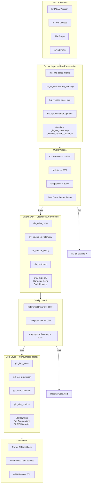

# Medallion Architecture Pattern

> Module: ISL-05 | Version: 1.0 | Adaptation Effort: 3-5 hrs | Dependencies: ISL-03, ISL-04, ISL-06

## Purpose

Define the Bronze/Silver/Gold medallion architecture as the foundational data layer pattern for all Fabric lakehouse implementations. This pattern establishes the canonical layer definitions, transition rules, quality gates, naming conventions, access controls, and data modeling standards that all other ISL-05 integration patterns target. Every data flow — whether sourced from ERP, IoT, API, file, or event stream — lands in Bronze and progresses through Silver to Gold following the rules defined in this document.

The medallion architecture provides three critical guarantees: (1) raw data is always preserved for auditability and reprocessing, (2) data quality improves monotonically as data moves through layers, and (3) consumption-ready data is optimized for business use cases without exposing consumers to ingestion complexity.

---

## Scope

### In Scope

- Formal definitions of Bronze, Silver, and Gold layers with purpose, boundaries, and responsibilities
- Layer transition rules specifying which transformations occur at each boundary
- Quality gate definitions at each layer boundary aligned to ISL-06 quality dimensions
- Data retention policies per layer with archival and purge rules
- Access control model per layer aligned to ISL-04 classification tiers
- Naming conventions per layer aligned to ISL-03 standards
- Slowly Changing Dimension (SCD) Type 1 and Type 2 handling in Silver
- Star schema modeling standards in Gold
- Anti-patterns and failure modes with real-world examples
- Mermaid architecture diagram

### Out of Scope

- Source-specific extraction logic (see ERP Extract & Load, IoT/OT Ingestion, File-Based Integration patterns)
- Reverse ETL writeback from Gold to operational systems (see Reverse ETL pattern)
- Specific data quality rule implementations (see ISL-06 Quality Rule Library)
- Fabric workspace provisioning and capacity management
- Semantic model / Power BI dataset design beyond Gold layer boundaries

---

## [ADAPTATION REQUIRED] Client Context

| Parameter | Default Value | Client Value | Notes |
|---|---|---|---|
| `layer_count` | 3 (Bronze, Silver, Gold) | | Some clients add a "Platinum" or "Curated" layer above Gold |
| `bronze_prefix` | `brz_` | | Per ISL-03; some clients use `raw_` or `landing_` |
| `silver_prefix` | `slv_` | | Per ISL-03; some clients use `cleansed_` or `conformed_` |
| `gold_prefix` | `gld_` | | Per ISL-03; some clients use `curated_` or `serving_` |
| `bronze_retention_days` | 90 | | Regulatory minimum may require longer retention |
| `silver_retention_days` | 365 | | Align with reporting cycle requirements |
| `gold_retention_days` | Indefinite (current + 2 prior versions) | | Business-defined retention |
| `scd_default_type` | Type 2 (full history) | | Type 1 for low-audit domains; Type 2 for regulated |
| `gold_model_style` | Star schema (Kimball) | | Some clients prefer Data Vault 2.0 in Silver |
| `quality_gate_enforcement` | Hard (block promotion on failure) | | Soft = log warning and promote; Hard = block |
| `bronze_format` | Delta (Parquet-backed) | | Delta is required for Fabric; Parquet for external consumers |
| `time_travel_retention_days` | 30 | | Delta table history retention for VACUUM operations |
| `manufacturing_overlay` | Yes | | Set No if client has no manufacturing operations |

---

## 1. Layer Definitions

### 1.1 Bronze Layer — Raw Preservation

**Purpose:** Capture and preserve an exact replica of source system data with zero transformation. Bronze is the system of record for what was received, when, and from where.

**Principles:**
- **Append-only ingestion** — never update or delete rows in Bronze; use soft deletes via metadata columns
- **Source fidelity** — data types match source system exactly; no casting, trimming, or null handling
- **Full audit trail** — every row includes ingestion metadata: `_ingest_timestamp`, `_source_system`, `_batch_id`, `_pipeline_run_id`
- **Schema-on-read** — schema evolution is handled by Delta schema merge; no validation at landing
- **Idempotent loads** — re-running a pipeline for the same batch produces the same result (deduplication by `_batch_id`)

**What belongs in Bronze:**
- Raw ERP table extracts (full or incremental)
- IoT telemetry messages as received (JSON, Avro, or columnar)
- File-based data in original format converted to Delta
- API response payloads stored as structured Delta tables
- Event stream messages captured via Eventstream

**What does NOT belong in Bronze:**
- Joined or enriched data
- Filtered or deduplicated data (except idempotent batch dedup)
- Derived or calculated columns
- Renamed columns (except system metadata prefixed with `_`)

**Standard Metadata Columns (added at ingestion):**

| Column | Data Type | Description |
|---|---|---|
| `_ingest_timestamp` | timestamp | UTC timestamp of ingestion |
| `_source_system` | string | Source system identifier (e.g., `sap_ecc`, `epicor_kinetic`) |
| `_source_table` | string | Source table or entity name |
| `_batch_id` | string | Unique batch identifier for the load |
| `_pipeline_run_id` | string | Fabric pipeline run ID |
| `_file_name` | string | Source file name (file-based loads only) |
| `_is_deleted` | boolean | Soft delete flag (CDC deletes) |

### 1.2 Silver Layer — Cleansed and Conformed

**Purpose:** Transform raw Bronze data into a cleansed, validated, conformed, and business-entity-aligned representation. Silver is where data becomes trustworthy and where business logic begins.

**Principles:**
- **Cleansed** — null handling, trimming, type casting, deduplication applied
- **Conformed** — naming conventions standardized per ISL-03; reference data codes mapped to enterprise values
- **Validated** — ISL-06 quality rules enforced; records failing validation quarantined
- **Business-entity-aligned** — tables represent business entities (Customer, Product, Order) not source tables
- **Historized** — SCD Type 1 or Type 2 applied per entity requirements
- **Cross-reference mapped** — surrogate keys generated; source system keys preserved in `_src_key` columns

**Transformations performed at Bronze-to-Silver boundary:**

| Transformation | Description | Example |
|---|---|---|
| Data type standardization | Cast source types to enterprise types | VARCHAR date → DATE; BCD → DECIMAL(18,4) |
| Null handling | Apply default values or quarantine rules | NULL `country_code` → `'UNKNOWN'` or quarantine |
| Deduplication | Remove exact and business-key duplicates | Deduplicate by `order_id` + `line_item` |
| Code mapping | Map source codes to enterprise reference values | SAP status `'10'` → `'Open'` |
| Column renaming | Apply ISL-03 naming standards | `KUNNR` → `customer_number` |
| Column pruning | Remove source-only technical columns | SAP `MANDT` (client), change pointers |
| SCD processing | Apply Type 1 or Type 2 logic | Customer address change → new SCD2 row |
| Quality validation | Apply ISL-06 rules; quarantine failures | Completeness, validity, uniqueness checks |
| Surrogate key generation | Generate integer or hash-based surrogate keys | `customer_sk = SHA2(source_system + customer_id)` |

### 1.3 Gold Layer — Consumption-Ready

**Purpose:** Deliver aggregated, business-specific, consumption-optimized data products aligned to specific use cases, departments, or analytical domains.

**Principles:**
- **Star schema modeled** — fact and dimension tables following Kimball methodology
- **Pre-aggregated** — common aggregations materialized to avoid repeated computation
- **Domain-organized** — tables grouped by business domain (Sales, Production, Finance)
- **Semantic-model-ready** — column names, data types, and relationships designed for Power BI Direct Lake
- **Performance-optimized** — Z-ordered on common filter columns; partitioned by date
- **Access-controlled** — row-level and object-level security applied per ISL-04

**What belongs in Gold:**
- Fact tables with foreign keys to conformed dimensions
- Conformed dimension tables (shared across fact tables)
- Pre-aggregated summary tables for known reporting use cases
- Bridge tables for many-to-many relationships
- Date and time utility dimensions

---

## 2. Quality Gates Between Layers

### 2.1 Bronze-to-Silver Quality Gate

| Quality Dimension (ISL-06) | Rule | Threshold | Action on Failure |
|---|---|---|---|
| Completeness | Required fields non-null | >= 95% per batch | Quarantine failing rows to `slv_quarantine_{entity}` |
| Validity | Data types parseable; enums in allowed set | >= 98% per batch | Quarantine failing rows |
| Uniqueness | No duplicate business keys in batch | 100% (zero duplicates) | Deduplicate; log duplicates to audit table |
| Accuracy | Row count reconciliation with source | +/- 0.1% | Alert; block promotion if delta > 1% |
| Schema drift | New columns detected in source | Any new column | Log alert; add column to Silver schema via merge |

### 2.2 Silver-to-Gold Quality Gate

| Quality Dimension (ISL-06) | Rule | Threshold | Action on Failure |
|---|---|---|---|
| Referential integrity | All FK values exist in dimension tables | 100% | Block promotion; log orphaned keys |
| Completeness | All dimension attributes populated | >= 99% | Substitute with default dimension row (`sk = -1`) |
| Consistency | Cross-domain values agree | >= 99% | Alert data steward; flag inconsistent records |
| Timeliness | Data available within SLA window | Per domain SLA | Alert; continue promotion with freshness warning |
| Aggregation accuracy | Fact table totals match Silver source | Exact match | Block promotion; reprocess |

### 2.3 Quarantine Pattern

Records failing quality gates are not discarded. They are routed to quarantine tables for investigation and remediation:

```
slv_quarantine_{entity_name}
├── All original columns from Bronze source
├── _quarantine_timestamp (timestamp)
├── _quarantine_reason (string) — quality rule that failed
├── _quarantine_dimension (string) — ISL-06 dimension (completeness, validity, etc.)
├── _quarantine_batch_id (string)
└── _quarantine_resolved (boolean) — set to TRUE when remediated and reprocessed
```

---

## 3. Layer Transition Rules



---

## 4. Data Retention Per Layer

| Layer | Default Retention | Archival Strategy | Purge Policy |
|---|---|---|---|
| Bronze | 90 days (hot) + 365 days (cool/archive) | Move to archive storage tier after 90 days | Purge after 365 days unless regulatory hold |
| Silver | 365 days (hot) | Retain current + 2 prior full-refresh snapshots | Purge superseded snapshots after 365 days |
| Gold | Indefinite (current + 2 prior versions) | Delta time travel for version history | VACUUM after `time_travel_retention_days` |
| Quarantine | 90 days | None — quarantine is transient | Purge resolved records after 30 days; unresolved after 90 |

**Delta VACUUM Policy:**
- Bronze: `VACUUM brz_{table} RETAIN 720 HOURS` (30 days)
- Silver: `VACUUM slv_{table} RETAIN 720 HOURS` (30 days)
- Gold: `VACUUM gld_{table} RETAIN 168 HOURS` (7 days)

---

## 5. Access Control Per Layer (ISL-04 Alignment)

| Layer | Default ISL-04 Tier | Access Model | Typical Roles |
|---|---|---|---|
| Bronze | Tier 2 — Internal (minimum); inherits source tier | Workspace-level; data engineers only | Data Engineers, Platform Admins |
| Silver | Tier 2 or Tier 3 (per entity classification) | Workspace + table-level; engineers and analysts | Data Engineers, Analytics Engineers, Data Stewards |
| Gold | Per domain classification (Tier 2–4) | Row-level and object-level security | Business Analysts, Report Consumers, Data Scientists |
| Quarantine | Same as Silver source entity | Restricted to data quality team | Data Stewards, Data Quality Analysts |

**Key Rules:**
- **No direct Bronze consumption by business users** — Bronze is an engineering layer only
- **Silver access requires justification** — analysts needing Silver must demonstrate Gold does not meet their need
- **Gold RLS is mandatory** for any entity classified Tier 3 or above
- **Cross-layer shortcuts** (OneLake shortcuts from Gold to Bronze) are prohibited for Tier 3+ data

---

## 6. Naming Conventions Per Layer (ISL-03 Alignment)

| Artifact | Bronze | Silver | Gold |
|---|---|---|---|
| Table prefix | `brz_` | `slv_` | `gld_` |
| Table naming | `brz_{source}_{source_table}` | `slv_{business_entity}` | `gld_fact_{subject}` / `gld_dim_{entity}` |
| Column naming | Source column names preserved | ISL-03 snake_case (e.g., `customer_name`) | ISL-03 snake_case, business-friendly |
| Lakehouse | `lh_{domain}_bronze_{env}` | `lh_{domain}_silver_{env}` | `lh_{domain}_gold_{env}` |
| Pipeline | `pl_brz_{source}_{entity}_{load_type}` | `pl_slv_{entity}_transform` | `pl_gld_{subject}_build` |
| Notebook | `nb_brz_{source}_{entity}_ingest` | `nb_slv_{entity}_cleanse` | `nb_gld_{subject}_aggregate` |

**Examples:**
- Bronze: `brz_sap_vbak` (SAP sales order header, original table name)
- Silver: `slv_sales_order` (business entity, conformed name)
- Gold: `gld_fact_sales`, `gld_dim_customer`, `gld_dim_date`

---

## 7. SCD Handling in Silver

### 7.1 SCD Type 1 — Overwrite

**Use when:** History of attribute changes is not needed; only the current value matters.

| Column | Before Update | After Update |
|---|---|---|
| `customer_sk` | 1001 | 1001 |
| `customer_name` | Acme Corp | Acme Corporation |
| `city` | Chicago | Chicago |
| `_last_modified` | 2025-01-15 | 2025-06-01 |

**Implementation:** `MERGE INTO slv_customer USING ... WHEN MATCHED THEN UPDATE SET ...`

**Apply to:** Non-regulated attributes, rapidly changing values (e.g., inventory quantity), operational metrics.

### 7.2 SCD Type 2 — Full History

**Use when:** Full change history is required for audit, regulatory compliance, or point-in-time analysis.

| Column | Row 1 (Original) | Row 2 (New Version) |
|---|---|---|
| `customer_sk` | 1001 | 1002 |
| `customer_id` | `CUST-100` | `CUST-100` |
| `customer_name` | Acme Corp | Acme Corporation |
| `_effective_from` | 2025-01-15 | 2025-06-01 |
| `_effective_to` | 2025-05-31 | 9999-12-31 |
| `_is_current` | FALSE | TRUE |

**Implementation:** MERGE with insert new row + expire old row pattern. Use `_is_current = TRUE` for current-state queries.

**Apply to:** Customer master data, product attributes, cost centers, regulatory-sensitive entities, any entity where point-in-time reporting is required.

**Standard SCD Type 2 Columns:**

| Column | Type | Description |
|---|---|---|
| `_effective_from` | date | Date this version became active |
| `_effective_to` | date | Date this version was superseded (9999-12-31 = current) |
| `_is_current` | boolean | TRUE for the active version |
| `_version_number` | integer | Sequential version counter per business key |

---

## 8. Star Schema in Gold

### 8.1 Design Principles

- One fact table per business process (sales, production, inventory movement)
- Conformed dimensions shared across fact tables (customer, product, date, plant)
- Surrogate integer keys on all dimensions for join performance
- Degenerate dimensions (order number, invoice number) stored directly on fact tables
- Junk dimensions for low-cardinality flags and indicators
- Date dimension with fiscal calendar alignment to client fiscal year
- Default dimension row (`sk = -1`) for late-arriving or missing dimension references

### 8.2 Standard Fact Table Template

```sql
gld_fact_{subject}
├── {subject}_sk          -- Surrogate key (bigint, auto-increment)
├── date_sk               -- FK to gld_dim_date
├── customer_sk           -- FK to gld_dim_customer
├── product_sk            -- FK to gld_dim_product
├── plant_sk              -- FK to gld_dim_plant
├── {degenerate_dims}     -- Order number, line item, etc.
├── {measures}            -- quantity, amount, weight, duration
├── _load_timestamp       -- ETL load timestamp
└── _source_batch_id      -- Traceability to Silver batch
```

### 8.3 Standard Dimension Table Template

```sql
gld_dim_{entity}
├── {entity}_sk           -- Surrogate key (bigint)
├── {entity}_id           -- Business/natural key (string)
├── {descriptive_attrs}   -- Name, description, category, etc.
├── _effective_from        -- SCD2 effective start (if historized)
├── _effective_to          -- SCD2 effective end (if historized)
├── _is_current            -- Current version flag
└── _load_timestamp        -- ETL load timestamp
```

---

## 9. Anti-Patterns

| Anti-Pattern | Description | Impact | Correct Approach |
|---|---|---|---|
| **Skipping Silver** | Loading directly from Bronze to Gold without cleansing | Dirty data in reporting; no entity conformance; duplicate handling deferred to consumers | Always cleanse and conform in Silver before Gold aggregation |
| **Gold without validation** | Building Gold tables without quality gate checks | Incorrect aggregations propagate to reports; trust erosion | Enforce Silver-to-Gold quality gate per Section 2.2 |
| **Direct Bronze consumption** | Business users querying Bronze tables for reporting | Exposure to raw, unvalidated data; schema instability; naming confusion | Restrict Bronze access to engineers; route all consumers to Gold |
| **Transformations in Bronze** | Applying business logic during ingestion | Violates raw preservation principle; cannot reprocess from true source | Keep Bronze append-only with zero transformation |
| **Monolithic Silver** | Single Silver table combining all source systems without alignment | Creates wide, sparse tables; merge conflicts; unclear ownership | One Silver table per business entity; use cross-reference tables for multi-source |
| **Gold as a copy of Silver** | Creating Gold tables that are 1:1 copies of Silver without modeling | No performance optimization; no business alignment; defeats the purpose of Gold | Model Gold as star schema with aggregations and domain-specific views |
| **Circular dependencies** | Gold table depending on another Gold table | Hidden complexity; fragile pipeline chains; debugging difficulty | Gold depends only on Silver; aggregate-of-aggregate patterns use separate summary tables |
| **Ignoring quarantine** | Quarantined records never reviewed or remediated | Growing data loss; quality gate effectiveness unknown | Assign data steward ownership; SLA for quarantine review (48 hours) |

---

## Fabric / Azure Implementation Guidance

| Component | Recommended Service | Configuration |
|---|---|---|
| Bronze storage | Fabric Lakehouse (Delta tables) | Append-only; schema merge enabled; partition by `_ingest_date` |
| Silver storage | Fabric Lakehouse (Delta tables) | MERGE operations; SCD logic in Notebooks; partition by business date |
| Gold storage | Fabric Lakehouse or Warehouse | Star schema; Z-order on common filter columns; Direct Lake mode |
| Quality gates | Fabric Notebooks (PySpark) | ISL-06 rule library executed between layers |
| Orchestration | Fabric Data Factory pipelines | Sequential: Bronze → QG1 → Silver → QG2 → Gold |
| Monitoring | Fabric Monitor + custom logging | Pipeline duration, row counts, quality scores per run |
| Semantic model | Power BI Direct Lake | Point to Gold lakehouse; inherit RLS from Gold layer |
| Quarantine | Fabric Lakehouse (dedicated) | Separate lakehouse: `lh_{domain}_quarantine_{env}` |

---

## Manufacturing Overlay [CONDITIONAL]

| Manufacturing Scenario | Bronze | Silver | Gold |
|---|---|---|---|
| SAP production orders | `brz_sap_aufk` (raw SAP table) | `slv_production_order` (conformed, SCD2) | `gld_fact_production`, `gld_dim_work_center` |
| Epicor job entries | `brz_epicor_labor_dtl` | `slv_labor_entry` (mapped codes, validated) | `gld_fact_labor_utilization` |
| IoT temperature readings | `brz_iot_temp_sensor_001` | `slv_equipment_telemetry` (standardized schema) | `gld_fact_equipment_metrics` (hourly aggregations) |
| Vendor price lists (CSV) | `brz_file_vendor_prices_acme` | `slv_vendor_pricing` (validated, deduped) | `gld_dim_material_cost` |
| Quality inspection results | `brz_sap_qmel` | `slv_quality_notification` (mapped status codes) | `gld_fact_quality_nonconformance` |
| BOM structures | `brz_sap_stpo` | `slv_bom_component` (exploded, validated) | `gld_dim_product_structure` |

**Key Manufacturing Considerations:**
- IoT telemetry may generate very high Bronze volumes; use time-based partitioning (`_ingest_date`) and aggressive VACUUM
- BOM explosion in Silver can generate large row counts; validate component-level completeness
- Production order SCD2 is critical for point-in-time cost analysis
- Dual-ERP environments (SAP + Epicor) require cross-reference mapping in Silver before Gold integration

---

## Cross-References

| Reference | Module | Relationship |
|---|---|---|
| Naming Conventions | ISL-03 | Layer prefixes (`brz_`, `slv_`, `gld_`), table and pipeline naming |
| Data Classification | ISL-04 | Per-layer access control tiers; workspace isolation rules |
| Quality Dimension Definitions | ISL-06 | Quality gate thresholds and dimension formulas |
| Quality Rule Library | ISL-06 | Specific rules enforced at each layer transition |
| Quality SLA Framework | ISL-06 | SLA thresholds per tier per layer |
| ERP Extract & Load | ISL-05 | Source-specific extraction into Bronze |
| IoT/OT Ingestion | ISL-05 | Streaming and micro-batch ingestion into Bronze |
| File-Based Integration | ISL-05 | File landing and processing into Bronze |
| Reverse ETL | ISL-05 | Writeback from Gold to operational systems |

## Compliance Alignment

| Framework | Relevance |
|---|---|
| SOX Section 302/404 | Bronze audit trail + SCD2 history supports financial controls traceability |
| GDPR Article 17 | Right to erasure requires soft-delete propagation through all three layers |
| FDA 21 CFR Part 11 | Bronze immutability supports electronic records integrity requirements |
| ISO 8000 | Quality gates between layers align with data quality management standards |
| DAMA DMBOK | Medallion layers map to DAMA data architecture layering principles |

## Revision History

| Version | Date | Author | Changes |
|---|---|---|---|
| 1.0 | 2025-01-15 | ISL Team | Initial release — Bronze/Silver/Gold definitions, quality gates, SCD patterns |
