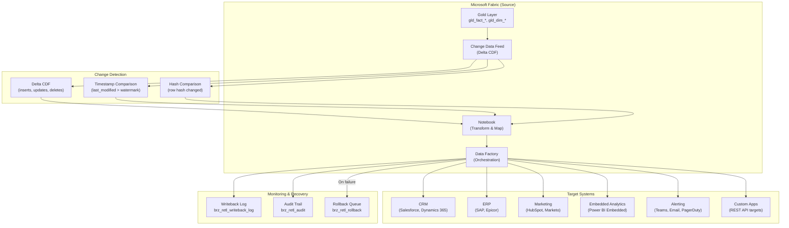

# Reverse ETL Pattern

> Module: ISL-05 | Version: 1.0 | Adaptation Effort: 2-4 hrs | Dependencies: ISL-01, ISL-03, ISL-04, ISL-05 Medallion, ISL-06

## Purpose

Define standardized patterns for pushing data from the Fabric lakehouse (Gold layer) back to operational systems, SaaS applications, and business tools. Reverse ETL closes the loop between analytics and operations by activating lakehouse data in the systems where business users work. This pattern covers four variants, write conflict resolution, idempotency for writeback, rate limiting for target system protection, rollback and recovery procedures, and common target system configurations.

---

## Scope

### In Scope

- Four variants: API Writeback, Embedded Analytics, Data Activation, Alert/Notification
- Write conflict resolution between lakehouse and operational systems
- Idempotency for writeback operations
- Rate limiting and throttling for target system protection
- Rollback and recovery procedures
- Common target systems (CRM, ERP, marketing platforms)
- Mermaid architecture diagram

### Out of Scope

- Forward ETL (source-to-lakehouse; see other ISL-05 patterns)
- Real-time bidirectional synchronization (see Master Data Synchronization)
- Power BI report embedding (presentation layer, not data activation)
- Data lake-to-data lake replication (OneLake shortcuts)
- Third-party Reverse ETL tool administration (Census, Hightouch)

---

## [ADAPTATION REQUIRED] Client Context

| Parameter | Default Value | Client Value | Notes |
|---|---|---|---|
| `reverse_etl_tool` | Fabric Data Factory (native) | | Census, Hightouch, or custom Notebook for complex scenarios |
| `default_sync_frequency` | Daily (batch) | | Hourly for operational; real-time for alerts |
| `write_conflict_strategy` | Lakehouse wins (overwrite) | | Timestamp-based merge for bi-directional; manual for critical |
| `idempotency_method` | Upsert by business key | | Insert-only for append targets; upsert for stateful |
| `rate_limit_pct_of_target` | 50% of target system API rate limit | | Conservative to avoid impacting operational users |
| `rollback_strategy` | Compensating write (undo) | | Snapshot restore for bulk operations |
| `max_batch_size` | 1000 records per API call | | Depends on target API bulk limits |
| `alert_channel` | Microsoft Teams (webhook) | | Email, PagerDuty, ServiceNow for escalation |
| `target_systems` | Salesforce, SAP (via API) | | Add/remove based on client landscape |
| `retry_max_attempts` | 3 | | Per writeback batch |
| `change_detection_method` | Delta table change data feed (CDF) | | Timestamp comparison for non-Delta targets |

---

## 1. Architecture Overview



---

## 2. Variant Decision Criteria

| Criterion | API Writeback | Embedded Analytics | Data Activation | Alert/Notification |
|---|---|---|---|---|
| **Use when** | Operational systems need enriched/computed data from lakehouse | Applications need pre-computed metrics or reports | Marketing/CX platforms need audience segments | Threshold breaches or anomalies require immediate notification |
| **Data flow** | Lakehouse Gold -> API -> Target system database | Lakehouse Gold -> Embedded report/metric | Lakehouse Gold -> Segment/audience platform | Lakehouse Gold -> Notification channel |
| **Frequency** | Batch (hourly/daily) or near-real-time | On-demand (query) or scheduled refresh | Batch (daily) or triggered | Event-driven (real-time) |
| **Target** | CRM, ERP, custom applications | Power BI Embedded, custom dashboards | HubSpot, Marketo, Google Ads, Facebook | Teams, Email, PagerDuty, ServiceNow |
| **Complexity** | Medium-High | Low-Medium | Medium | Low |
| **Write conflict risk** | High (operational system may also update) | None (read-only) | Low (typically append/overwrite) | None (notification only) |
| **Rollback needed** | Yes | No | Typically no (overwrite is safe) | No |
| **Best for** | CRM enrichment, ERP updates, master data sync | In-app reporting, operational dashboards | Campaign targeting, personalization | Quality alerts, SLA breaches, anomaly detection |

### Decision Flowchart

1. **Does the target system need computed data written to its database?** Yes -> API Writeback
2. **Does an application need to display analytics without storing data?** Yes -> Embedded Analytics
3. **Does a marketing/CX platform need audience or segment data?** Yes -> Data Activation
4. **Does a person or system need to be notified of a condition?** Yes -> Alert/Notification
5. **Default** -> API Writeback (most common)

---

## 3. Write Conflict Resolution

### 3.1 Conflict Scenarios

| Scenario | Description | Risk Level |
|---|---|---|
| **Last-write-wins race** | Lakehouse writes customer address; CRM user updates same address 5 minutes later | Medium |
| **Bidirectional update** | Both lakehouse and CRM update different fields on same record simultaneously | High |
| **Stale overwrite** | Lakehouse pushes yesterday's data over today's manual update in target | High |
| **Delete conflict** | Lakehouse deletes record that target system has new transactions against | Critical |
| **Concurrent batch** | Multiple Reverse ETL jobs write to same target table concurrently | Medium |

### 3.2 Resolution Strategies

| Strategy | Description | Use When | Implementation |
|---|---|---|---|
| **Lakehouse wins** | Lakehouse value always overwrites target | Lakehouse is authoritative for these fields | Upsert with overwrite; no conflict check |
| **Target wins** | Never overwrite if target value has changed since last sync | Target is authoritative; lakehouse provides only new records | Check target `last_modified`; skip if newer than lakehouse |
| **Timestamp merge** | Most recent timestamp wins per field | Both systems are valid editors; chronological truth | Compare field-level timestamps; merge per-field |
| **Field-level ownership** | Lakehouse owns fields A, B; target owns fields C, D | Clear field-level system-of-record | Update only lakehouse-owned fields; never touch target-owned |
| **Manual resolution** | Queue for human review | Critical data (financial, regulatory) | Write to conflict queue; data steward resolves |

### 3.3 Recommended Default: Field-Level Ownership

Define which fields the lakehouse is authoritative for, and only update those fields during writeback. Never overwrite fields owned by the target system.

| Example: CRM Customer Record | Lakehouse Owned | CRM Owned |
|---|---|---|
| Annual revenue (computed) | Yes | No |
| Customer segment (ML model) | Yes | No |
| Churn risk score | Yes | No |
| Primary contact name | No | Yes |
| Last interaction date | No | Yes |
| Sales rep assignment | No | Yes |

---

## 4. Idempotency for Writeback

### 4.1 Idempotency Requirements

Every writeback operation must produce the same result whether executed once or multiple times. This is critical because:
- Pipeline retries may re-execute successful writes
- Duplicate change events may trigger duplicate writebacks
- Recovery from partial failures requires safe re-execution

### 4.2 Idempotency Patterns

| Pattern | Mechanism | Use When |
|---|---|---|
| **Upsert (MERGE)** | Insert if new; update if exists (by business key) | Default for all stateful targets |
| **Idempotency key** | Include unique operation ID; target rejects duplicates | API targets with duplicate detection |
| **Conditional update** | Update only if target record version matches expected | Optimistic locking; prevent stale overwrites |
| **Tombstone + recreate** | Delete then insert (within transaction) | Targets without native upsert support |
| **Append with dedup** | Append to target; dedup on read or via target-side process | Log/event targets (append-only) |

### 4.3 Change Detection Methods

| Method | Mechanism | Pros | Cons |
|---|---|---|---|
| **Delta CDF** | Delta Lake Change Data Feed captures inserts/updates/deletes | Native; efficient; captures deletes | Requires Delta tables with CDF enabled |
| **Timestamp watermark** | Compare `_last_modified` > previous sync watermark | Simple; works with any table | Misses deletes; clock skew risk |
| **Hash comparison** | Hash row contents; compare to previous hash snapshot | Detects any change including silent updates | Compute-intensive; requires hash storage |
| **Full diff** | Compare full current state to previous snapshot | Detects all changes including deletes | Most expensive; only for small tables |

---

## 5. Rate Limiting and Throttling

### 5.1 Target System Protection

| Principle | Rule |
|---|---|
| Never exceed 50% of target API rate limit | Leaves headroom for operational users and other integrations |
| Implement exponential backoff on HTTP 429 | Respect `Retry-After` header from target |
| Batch operations where supported | Reduce API call count (e.g., Salesforce Bulk API, Dynamics batch) |
| Schedule writes during off-peak | Avoid target system peak usage hours |
| Monitor target system health | Pause writeback if target response time degrades > 2x baseline |

### 5.2 Target-Specific Rate Limits

| Target System | API Rate Limit | Recommended Writeback Rate | Bulk API Available |
|---|---|---|---|
| Salesforce | 100K API calls/24hr (Enterprise) | 50K calls/24hr | Yes (Bulk API 2.0: 150M records/24hr) |
| Dynamics 365 | 6000 requests/5min per user | 3000 requests/5min | Yes (Batch: 1000 operations/request) |
| SAP (RFC) | Varies by system load | 4 concurrent RFC calls | No (use BAPIs for batch) |
| Epicor (REST) | Configurable (default 100 req/min) | 50 req/min | Yes (REST batch endpoint) |
| HubSpot | 100 calls/10sec (API key) | 50 calls/10sec | Yes (Batch: 100 records/call) |
| Microsoft Teams | 50 messages/sec per app | 25 messages/sec | No |

---

## 6. Rollback and Recovery

### 6.1 Rollback Strategies

| Strategy | Mechanism | Use When | Complexity |
|---|---|---|---|
| **Compensating write** | Write the inverse operation (restore previous values) | Field-level updates; small batch | Low-Medium |
| **Snapshot restore** | Restore target from pre-writeback snapshot | Bulk operations; target supports snapshots | Medium |
| **Soft rollback** | Flag records as rolled back; manual cleanup | Complex target with no undo support | Low |
| **No rollback** | Accept the write; fix forward | Low-risk data; cost of rollback exceeds cost of error | None |

### 6.2 Pre-Writeback Snapshot

Before any writeback operation, capture the current state of affected records in the target:

```
brz_retl_pre_snapshot
├── snapshot_id (string, UUID)
├── pipeline_run_id (string)
├── target_system (string)
├── target_entity (string)
├── record_key (string) — business key of target record
├── pre_write_values (string, JSON) — all field values before write
├── snapshot_timestamp (timestamp)
└── rollback_executed (boolean)
```

### 6.3 Writeback Log

```
brz_retl_writeback_log
├── writeback_id (string, UUID)
├── pipeline_run_id (string)
├── target_system (string)
├── target_entity (string)
├── operation (string: insert, update, upsert, delete)
├── record_key (string)
├── fields_written (string, JSON array)
├── write_status (string: success, failed, retrying, rolled_back)
├── http_status_code (int, nullable)
├── error_message (string, nullable)
├── write_timestamp (timestamp)
├── duration_ms (bigint)
├── retry_count (int)
├── idempotency_key (string)
└── batch_id (string)
```

---

## 7. Common Target System Configurations

### 7.1 Salesforce

| Aspect | Configuration |
|---|---|
| API | Bulk API 2.0 for large volumes; REST API for real-time |
| Authentication | OAuth 2.0 (connected app; client credentials) |
| Idempotency | External ID field for upsert operations |
| Rate limit | Bulk API: 150M records/24hr; REST: 100K calls/24hr |
| Typical use cases | Account enrichment, lead scoring, opportunity updates |

### 7.2 SAP

| Aspect | Configuration |
|---|---|
| API | RFC/BAPI for master data; IDoc for transactional documents |
| Authentication | SAP service user with specific authorization objects |
| Idempotency | BAPI commit with duplicate check; IDoc dedup by message ID |
| Rate limit | System-dependent; 4 concurrent RFC calls recommended |
| Typical use cases | Master data updates, cost updates, planning data |

### 7.3 Epicor

| Aspect | Configuration |
|---|---|
| API | REST API (Kinetic); BAQ update for batch operations |
| Authentication | API key or OAuth 2.0 (Kinetic Cloud) |
| Idempotency | REST upsert by primary key; BAQ update with WHERE clause |
| Rate limit | Configurable; default 100 req/min |
| Typical use cases | Part cost updates, customer enrichment, planning data |

### 7.4 Microsoft Teams (Notifications)

| Aspect | Configuration |
|---|---|
| API | Incoming Webhook (simple) or Graph API (rich) |
| Authentication | Webhook URL (simple) or OAuth 2.0 (Graph) |
| Idempotency | Not applicable (notifications are fire-and-forget) |
| Rate limit | 50 messages/sec per app; 4 messages/sec per webhook |
| Typical use cases | Quality alerts, SLA breaches, pipeline failures |

---

## Fabric / Azure Implementation Guidance

| Component | Recommended Service | Configuration |
|---|---|---|
| Change detection | Delta Change Data Feed (CDF) | Enable CDF on Gold tables: `delta.enableChangeDataFeed = true` |
| Transformation | Fabric Notebooks | Map lakehouse schema to target API schema |
| Orchestration | Fabric Data Factory | Web activity for API calls; ForEach for batch processing |
| Target connectivity | Fabric Data Factory connectors or REST | Native connectors for Salesforce, Dynamics; REST for others |
| Monitoring | Fabric Monitor + writeback log | Success/failure rates, latency, record counts |
| Secrets | Azure Key Vault | Target system credentials, API keys, OAuth secrets |
| Alerting | Logic Apps or Power Automate | Trigger on writeback failures; notify via Teams/email |

---

## Manufacturing Overlay [CONDITIONAL]

| Manufacturing Scenario | Target | Variant | Special Considerations |
|---|---|---|---|
| Production cost updates | SAP (BAPI_MATERIAL_SAVEDATA) | API Writeback (daily) | Financial data; rollback required; SOX audit trail |
| Customer churn risk scores | Salesforce (Account custom field) | API Writeback (daily) | Bulk API; field-level ownership (score only) |
| Quality alert notifications | Microsoft Teams channel | Alert/Notification (real-time) | Trigger on `gld_fact_quality` threshold breach |
| Demand forecast to ERP | SAP (MD61 planned independent requirements) | API Writeback (weekly) | Planning data; overwrite entire forecast horizon |
| OEE dashboard embedding | MES operator screens | Embedded Analytics | Power BI Embedded; real-time refresh |
| Supplier risk scores | Procurement portal | Data Activation (daily) | Custom REST API; vendor self-service portal |
| Inventory reorder alerts | Email to materials planner | Alert/Notification | Trigger on safety stock threshold breach |

---

## Cross-References

| Reference | Module | Relationship |
|---|---|---|
| Medallion Architecture | ISL-05 | Reverse ETL sources from Gold layer |
| API Governance | ISL-01 | Writeback API calls follow ISL-01 standards |
| Master Data Synchronization | ISL-05 | Golden record writeback is a Reverse ETL use case |
| Naming Conventions | ISL-03 | Writeback log and audit table naming |
| Data Classification | ISL-04 | Writeback data classified per target sensitivity |
| Quality Gates | ISL-06 | Validate data quality before writeback (no dirty data to target) |
| Event-Driven Architecture | ISL-05 | Alert/Notification variant uses event infrastructure |

## Compliance Alignment

| Framework | Relevance |
|---|---|
| SOX Section 302/404 | Financial writeback to ERP requires audit trail and rollback capability |
| GDPR Article 17 | Right to erasure must propagate through Reverse ETL to all target systems |
| GDPR Article 22 | Automated decision-making (ML scores) written back must be explainable |
| ISO 27001 A.12 | Operational security for automated data transfers to production systems |
| FDA 21 CFR Part 11 | Writeback to quality systems must maintain electronic records integrity |

## Revision History

| Version | Date | Author | Changes |
|---|---|---|---|
| 1.0 | 2025-01-15 | ISL Team | Initial release — 4 variants, conflict resolution, idempotency, rollback |
