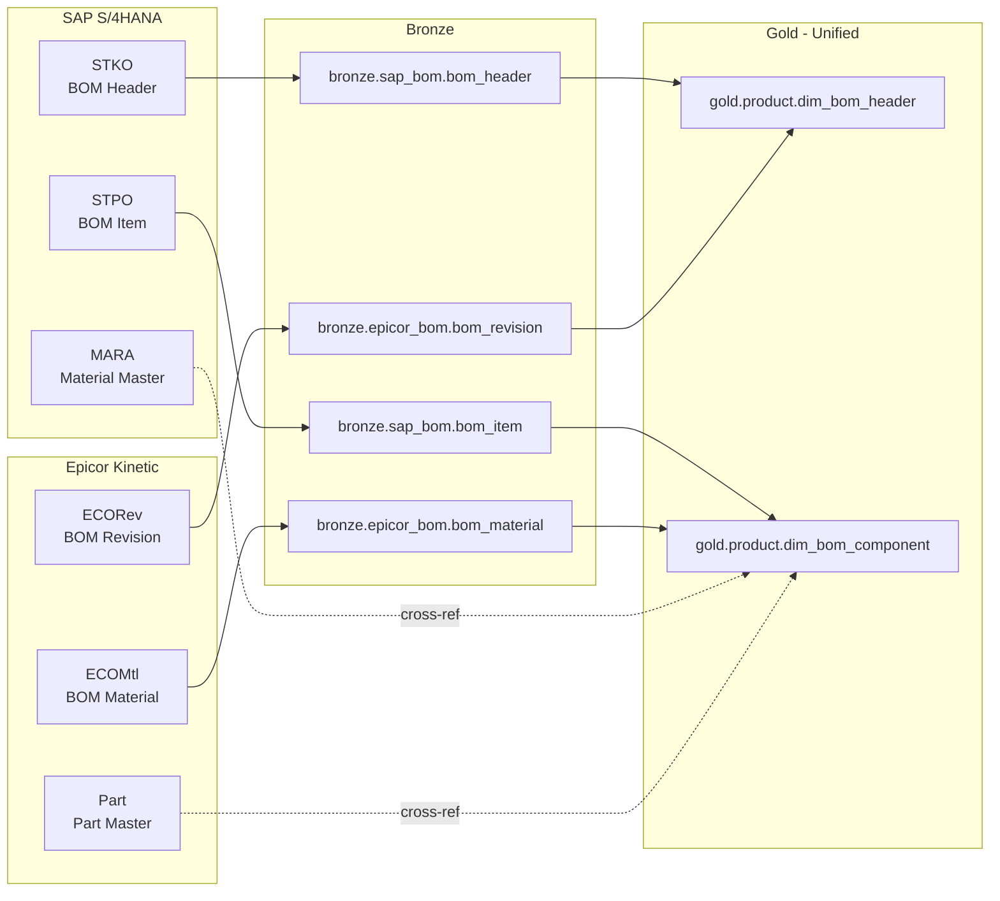

# Manufacturing Metadata Model — Completed Example

> Module: ISL-02 | Version: 1.0 | Type: Example

## Purpose

This document provides a fully completed example of the ISL-02 Metadata & Data Lineage Framework applied to a discrete manufacturing environment. It demonstrates the technical metadata schema, business glossary terms, lineage documentation, and catalog governance for a manufacturer operating dual-ERP systems (SAP S/4HANA and Epicor Kinetic) with IoT sensor infrastructure, MES integration, welding process monitoring, and quality inspection systems.

**Client Profile:**
- Industry: Discrete manufacturing (aerospace and defense components)
- ERP: SAP S/4HANA (primary, 3 plants) and Epicor Kinetic (acquired division, 2 plants)
- MES: Ignition by Inductive Automation
- IoT: Azure IoT Hub with 2,500 sensors across 5 plants
- Welding: 180 robotic weld cells with PLC-connected controllers
- Quality: Coordinate Measuring Machines (CMM), X-ray NDT, visual inspection
- ITAR: Required for defense product lines (40% of revenue)
- Data Platform: Microsoft Fabric (production workspaces)
- Metadata Catalog: Microsoft Purview

## Dual-ERP Technical Metadata Model

### SAP S/4HANA — Material Master Metadata

**Asset: bronze.sap_master.material_master**

| Attribute | Value |
|-----------|-------|
| asset_id | 3f2504e0-4f89-11d3-9a0c-0305e82c3301 |
| asset_type | TABLE |
| fully_qualified_name | fabric-prod-lakehouse.bronze.sap_master.material_master |
| database_name | bronze_lakehouse |
| schema_name | sap_master |
| object_name | material_master |
| display_name | SAP Material Master (Bronze) |
| description | Raw extract of SAP material master records from tables MARA, MARC, MAKT, and MARM. Contains all active materials across plants 1000, 2000, and 3000. Extracted daily via RFC BAPI_MATERIAL_GETLIST. |
| row_count | 287,450 |
| size_bytes | 524,288,000 |
| column_count | 68 |
| created_date | 2024-06-15T08:30:00Z |
| modified_date | 2025-03-15T06:14:38Z |
| last_data_refresh | 2025-03-15T06:14:38Z |
| freshness_status | FRESH |
| data_owner | materials-management@acme-mfg.com |
| data_steward | sap-data-steward@acme-mfg.com |
| classification_tier | TIER_2_INTERNAL |
| contains_pii | false |
| contains_phi | false |
| itar_controlled | true (subset — ITAR flag per material) |
| quality_score | 91.2 |
| source_system | SAP S/4HANA |
| ingestion_pattern | BATCH_DAILY |
| lakehouse_zone | BRONZE |
| glossary_terms | [GT-00001, GT-00015, GT-00089] |
| tags | [sap, material-master, master-data, bronze, manufacturing] |
| certification_status | CERTIFIED |
| refresh_schedule | 0 6 * * * (daily at 6 AM UTC) |

**Key Columns:**

| Column Name | Data Type | PII | Description | SAP Source | Glossary Term |
|-------------|-----------|-----|-------------|-----------|---------------|
| material_number | VARCHAR(40) | No | Unique material identifier | MARA-MATNR | GT-00001 (Material Number) |
| material_description | NVARCHAR(255) | No | Material short text | MAKT-MAKTX | GT-00002 (Material Description) |
| material_type | VARCHAR(4) | No | Material type code | MARA-MTART | GT-00003 (Material Type) |
| material_group | VARCHAR(9) | No | Material grouping | MARA-MATKL | GT-00004 (Material Group) |
| plant_code | VARCHAR(4) | No | Manufacturing plant | MARC-WERKS | GT-00015 (Plant) |
| base_unit_of_measure | VARCHAR(3) | No | Base UoM | MARA-MEINS | GT-00020 (Unit of Measure) |
| gross_weight | DECIMAL(13,3) | No | Gross weight in base UoM | MARA-BRGEW | -- |
| net_weight | DECIMAL(13,3) | No | Net weight in base UoM | MARA-NTGEW | -- |
| weight_unit | VARCHAR(3) | No | Weight unit | MARA-GEWEI | -- |
| itar_controlled_flag | CHAR(1) | No | ITAR control indicator | MARC-ZZITAR (custom) | GT-00150 (ITAR Classification) |
| mrp_type | VARCHAR(2) | No | MRP planning type | MARC-DISMM | GT-00030 (MRP Type) |
| safety_stock_qty | DECIMAL(13,3) | No | Safety stock level | MARC-EISBE | GT-00031 (Safety Stock) |
| reorder_point | DECIMAL(13,3) | No | Reorder point | MARC-MINBE | GT-00032 (Reorder Point) |
| lot_size_type | VARCHAR(2) | No | Lot sizing procedure | MARC-DISLS | -- |
| created_date_sap | DATE | No | SAP creation date | MARA-ERSDA | -- |
| last_change_date | DATE | No | Last change in SAP | MARA-LAEDA | -- |
| _extracted_at | DATETIME | No | ISL extraction timestamp | System-generated | -- |
| _source_system | VARCHAR(20) | No | Source system identifier | System-generated | -- |

### Epicor Kinetic — Part Master Metadata

**Asset: bronze.epicor_master.part_master**

| Attribute | Value |
|-----------|-------|
| asset_id | 7a3b5c9d-e1f2-4a5b-8c9d-0e1f2a3b4c5d |
| asset_type | TABLE |
| fully_qualified_name | fabric-prod-lakehouse.bronze.epicor_master.part_master |
| database_name | bronze_lakehouse |
| schema_name | epicor_master |
| object_name | part_master |
| display_name | Epicor Part Master (Bronze) |
| description | Raw extract of Epicor Kinetic part master records from Part, PartPlant, and PartRev tables. Contains all active parts for sites EPC-04 and EPC-05. Extracted daily via Epicor REST API. |
| row_count | 143,200 |
| size_bytes | 268,435,456 |
| column_count | 52 |
| last_data_refresh | 2025-03-15T06:45:22Z |
| freshness_status | FRESH |
| data_owner | materials-management@acme-mfg.com |
| data_steward | epicor-data-steward@acme-mfg.com |
| classification_tier | TIER_2_INTERNAL |
| quality_score | 88.7 |
| source_system | Epicor Kinetic |
| ingestion_pattern | BATCH_DAILY |
| lakehouse_zone | BRONZE |
| tags | [epicor, part-master, master-data, bronze, manufacturing] |
| certification_status | CERTIFIED |

### Unified Material Dimension (Gold Zone)

**Asset: gold.master.dim_material**

| Attribute | Value |
|-----------|-------|
| asset_id | b4c5d6e7-f8a9-0b1c-2d3e-4f5a6b7c8d9e |
| asset_type | TABLE |
| fully_qualified_name | fabric-prod-lakehouse.gold.master.dim_material |
| display_name | Material Dimension (Unified) |
| description | Unified material/part dimension combining SAP material master and Epicor part master records. SCD Type 2 history maintained. Cross-referenced via material_xref mapping table. Source of truth for all downstream reporting. |
| row_count | 412,850 (including history) |
| size_bytes | 1,073,741,824 |
| column_count | 38 |
| last_data_refresh | 2025-03-15T08:30:00Z |
| quality_score | 96.8 |
| source_system | Fabric Notebook (merge of SAP + Epicor) |
| lakehouse_zone | GOLD |
| certification_status | CERTIFIED |
| glossary_terms | [GT-00001, GT-00002, GT-00003, GT-00015, GT-00150] |
| upstream_assets | [silver.master.stg_material_sap, silver.master.stg_material_epicor, silver.master.material_xref] |
| downstream_assets | [sm_production_efficiency, sm_inventory_analysis, sm_quality_metrics] |

## IoT Sensor Registry Metadata

### Sensor Registry

**Asset: bronze.iot.sensor_registry**

| Attribute | Value |
|-----------|-------|
| asset_id | c5d6e7f8-a9b0-1c2d-3e4f-5a6b7c8d9e0f |
| asset_type | TABLE |
| display_name | IoT Sensor Registry |
| description | Registry of all 2,500 IoT sensors across 5 manufacturing plants. Contains device metadata, calibration records, and location mapping. Synced daily from Azure IoT Hub device twins. |
| row_count | 2,500 |
| source_system | Azure IoT Hub |
| quality_score | 94.1 |
| certification_status | CERTIFIED |

**Sensor Registry Columns:**

| Column Name | Data Type | Description | Example Value |
|-------------|-----------|-------------|---------------|
| device_id | VARCHAR(50) | IoT Hub device ID | SENSOR-P1-L3-TEMP-001 |
| device_type | VARCHAR(30) | Sensor measurement type | temperature |
| plant_code | VARCHAR(10) | Plant location | P100 |
| line_code | VARCHAR(10) | Production line | L3 |
| station_code | VARCHAR(10) | Work station | WS-05 |
| equipment_id | VARCHAR(30) | Parent equipment | CNC-P1-L3-001 |
| manufacturer | VARCHAR(50) | Sensor manufacturer | Omega Engineering |
| model_number | VARCHAR(30) | Sensor model | TJ36-CAXL-14U-6 |
| measurement_unit | VARCHAR(20) | Engineering unit | celsius |
| measurement_range_min | DECIMAL(10,2) | Minimum measurable value | -200.00 |
| measurement_range_max | DECIMAL(10,2) | Maximum measurable value | 1250.00 |
| accuracy_class | VARCHAR(20) | Accuracy specification | Class A (IEC 60751) |
| sampling_rate_hz | INTEGER | Data collection frequency | 10 |
| calibration_date | DATE | Last calibration | 2025-02-01 |
| calibration_due_date | DATE | Next calibration due | 2025-08-01 |
| calibration_certificate | VARCHAR(50) | Certificate reference | CAL-2025-P1-0234 |
| installation_date | DATE | Date installed | 2023-09-15 |
| firmware_version | VARCHAR(20) | Current firmware | v3.2.1 |
| communication_protocol | VARCHAR(20) | Data protocol | MQTT |
| status | VARCHAR(20) | Operational status | active |

### Sensor Telemetry Metadata

**Asset: bronze.iot.sensor_telemetry**

| Attribute | Value |
|-----------|-------|
| asset_id | d6e7f8a9-b0c1-2d3e-4f5a-6b7c8d9e0f1a |
| asset_type | TABLE |
| display_name | Sensor Telemetry Raw Data |
| description | Raw sensor telemetry readings from 2,500 IoT sensors. Approximately 2,500 messages/second aggregate throughput. Partitioned by date and sensor_type. Ingested via Fabric Eventstream from IoT Hub. |
| row_count | 8,640,000,000 (rolling 30 days) |
| size_bytes | 2,199,023,255,552 (2 TB rolling) |
| ingestion_pattern | STREAMING |
| lakehouse_zone | BRONZE |
| refresh_schedule | Continuous (streaming) |
| partition_columns | [ingestion_date, sensor_type] |
| retention_days | 90 |

## BOM Lineage Tracking

### Cross-System BOM Lineage

**SAP BOM Source -> Unified BOM:**

| SAP Table | SAP Field | Transformation | Target Column | Target Table |
|-----------|-----------|---------------|---------------|-------------|
| STKO | STLNR | Direct map | bom_id | gold.product.dim_bom_header |
| STKO | STLAN | Map code to description | bom_usage | gold.product.dim_bom_header |
| STKO | DATEFROM | Convert SAP date to ISO | effective_from | gold.product.dim_bom_header |
| STPO | POSNR | Direct map | component_position | gold.product.dim_bom_component |
| STPO | IDNRK | Cross-ref to unified material_key | material_key | gold.product.dim_bom_component |
| STPO | MENGE | Convert to base UoM | component_quantity | gold.product.dim_bom_component |
| STPO | MEINS | Map SAP UoM to standard | component_uom | gold.product.dim_bom_component |

**Epicor MOM Source -> Unified BOM:**

| Epicor Table | Epicor Field | Transformation | Target Column | Target Table |
|-------------|-------------|---------------|---------------|-------------|
| ECORev | GroupSeq | Map to BOM ID convention | bom_id | gold.product.dim_bom_header |
| ECORev | RevisionNum | Direct map | revision | gold.product.dim_bom_header |
| ECORev | EffectiveDate | Direct map (already ISO) | effective_from | gold.product.dim_bom_header |
| ECOMtl | MtlSeq | Direct map | component_position | gold.product.dim_bom_component |
| ECOMtl | MtlPartNum | Cross-ref to unified material_key | material_key | gold.product.dim_bom_component |
| ECOMtl | QtyPer | Direct map | component_quantity | gold.product.dim_bom_component |
| ECOMtl | UOMCode | Map Epicor UoM to standard | component_uom | gold.product.dim_bom_component |

### BOM Lineage Diagram

## Welding Process Metadata

### Weld Run Metadata

**Asset: silver.welding.fact_weld_run**

| Attribute | Value |
|-----------|-------|
| asset_id | e7f8a9b0-c1d2-3e4f-5a6b-7c8d9e0f1a2b |
| asset_type | TABLE |
| display_name | Weld Run Fact Table |
| description | Aggregated weld run data from 180 robotic weld cells. Each record represents one complete weld run with aggregated parameters (wire feed speed, arc voltage, travel speed, heat input). Joined with work order and BOM data for traceability. |
| row_count | 45,200,000 |
| size_bytes | 12,884,901,888 |
| source_system | IoT Hub (PLC/OPC-UA) + MES (Ignition) |
| lakehouse_zone | SILVER |
| quality_score | 92.3 |

**Weld Run Columns:**

| Column Name | Data Type | Description | Source |
|-------------|-----------|-------------|--------|
| weld_run_id | BIGINT | Unique weld run identifier | System-generated (sequence) |
| weld_cell_id | VARCHAR(30) | Weld cell equipment ID | IoT Hub: device twin tag |
| work_order_number | VARCHAR(20) | Associated production order | MES: Ignition tag |
| part_number | VARCHAR(40) | Part being welded | MES: Ignition tag |
| weld_joint_id | VARCHAR(20) | Joint/seam identifier from drawing | MES: operator entry |
| weld_procedure_spec | VARCHAR(20) | WPS reference number | MES: routing lookup |
| wire_feed_speed_avg | DECIMAL(8,2) | Average wire feed speed (in/min) | IoT: PLC OPC-UA tag, aggregated |
| wire_feed_speed_min | DECIMAL(8,2) | Minimum wire feed speed | IoT: PLC OPC-UA tag, aggregated |
| wire_feed_speed_max | DECIMAL(8,2) | Maximum wire feed speed | IoT: PLC OPC-UA tag, aggregated |
| arc_voltage_avg | DECIMAL(8,2) | Average arc voltage (V) | IoT: PLC OPC-UA tag, aggregated |
| arc_voltage_min | DECIMAL(8,2) | Minimum arc voltage | IoT: PLC OPC-UA tag, aggregated |
| arc_voltage_max | DECIMAL(8,2) | Maximum arc voltage | IoT: PLC OPC-UA tag, aggregated |
| travel_speed_avg | DECIMAL(8,2) | Average travel speed (in/min) | IoT: PLC OPC-UA tag, aggregated |
| heat_input_kj_per_in | DECIMAL(8,3) | Calculated heat input (kJ/in) | Derived: (V * A * 60) / (travel_speed * 1000) |
| weld_start_time | DATETIME | Weld arc-on start time | IoT: PLC timestamp |
| weld_end_time | DATETIME | Weld arc-off end time | IoT: PLC timestamp |
| weld_duration_seconds | INTEGER | Total arc-on time | Derived: end_time - start_time |
| shield_gas_flow_rate | DECIMAL(6,2) | Shielding gas flow (CFH) | IoT: PLC OPC-UA tag |
| interpass_temperature | DECIMAL(6,1) | Interpass temp (fahrenheit) | IoT: pyrometer sensor |
| operator_id | VARCHAR(20) | Welder badge number | MES: operator login |
| qc_result | VARCHAR(20) | Quality inspection result | QC System: visual + NDT |
| qc_inspector_id | VARCHAR(20) | Inspector badge number | QC System |
| plant_code | VARCHAR(10) | Plant location | MES configuration |
| production_line | VARCHAR(10) | Production line | MES configuration |
| _loaded_at | DATETIME | Record load timestamp | System-generated |

## Quality Inspection Metadata

### Quality Inspection Fact Table

**Asset: gold.quality.fact_inspection**

| Attribute | Value |
|-----------|-------|
| asset_id | f8a9b0c1-d2e3-4f5a-6b7c-8d9e0f1a2b3c |
| asset_type | TABLE |
| display_name | Quality Inspection Results (Gold) |
| description | Unified quality inspection results across all inspection types (incoming, in-process, final, CMM, NDT). Combines data from SAP QM, Epicor Quality, MES inspections, and standalone CMM/NDT equipment. Supports regulatory traceability for AS9100 and ITAR. |
| row_count | 12,450,000 |
| quality_score | 97.1 |
| lakehouse_zone | GOLD |
| certification_status | CERTIFIED |
| glossary_terms | [GT-00100, GT-00101, GT-00102, GT-00105, GT-00110] |

**Inspection Columns (Key Subset):**

| Column | Data Type | Description | Sources |
|--------|-----------|-------------|---------|
| inspection_id | BIGINT | Unified inspection ID | System-generated |
| inspection_type | VARCHAR(30) | Type: incoming, in_process, final, cmm, ndt, visual | All QC systems |
| work_order_number | VARCHAR(20) | Associated work order | SAP: AUFNR; Epicor: JobNum |
| material_number | VARCHAR(40) | Material/part inspected | Unified dim_material key |
| lot_number | VARCHAR(30) | Production lot/batch | SAP: CHARG; Epicor: LotNum |
| serial_number | VARCHAR(40) | Serial number (if applicable) | SAP: SERNR; Epicor: SerialNum |
| inspection_result | VARCHAR(20) | pass, fail, conditional_accept | All QC systems (harmonized) |
| defect_code | VARCHAR(20) | Defect category code | Unified defect code taxonomy |
| disposition | VARCHAR(30) | accept, reject, rework, scrap, mrb | All QC systems (harmonized) |
| inspector_id | VARCHAR(20) | Inspector identifier | All QC systems |
| inspection_date | DATETIME | Inspection timestamp | All QC systems |
| source_system | VARCHAR(20) | Originating QC system | System tag |

## MES Integration Metadata

### Ignition MES Data Assets

| Asset Name | Display Name | Description | Row Count | Zone |
|-----------|-------------|-------------|-----------|------|
| bronze.mes.production_run | Production Run Raw | Raw production run records from Ignition MES transaction groups | 3,200,000 | Bronze |
| bronze.mes.downtime_event | Downtime Event Raw | Equipment downtime events with reason codes | 890,000 | Bronze |
| bronze.mes.operator_login | Operator Login Raw | Operator badge-in/badge-out records by work station | 1,500,000 | Bronze |
| bronze.mes.cycle_count | Cycle Count Raw | Per-cycle production counts by station | 125,000,000 | Bronze |
| silver.production.fact_production_run | Production Run Fact | Cleaned and enriched production run records with work order and material joins | 3,180,000 | Silver |
| silver.production.fact_downtime | Downtime Fact | Enriched downtime events with equipment hierarchy and OEE classification | 885,000 | Silver |
| gold.production.fact_oee | OEE Fact | Calculated OEE (Availability x Performance x Quality) by equipment, shift, day | 2,400,000 | Gold |

## Supply Chain Metadata

### Supply Chain Data Assets

| Asset Name | Source System | Description | Key Columns |
|-----------|-------------|-------------|-------------|
| gold.supply_chain.fact_purchase_order | SAP (ME21N) + Epicor (POEntry) | Unified purchase order fact table | po_number, vendor_id, material_number, quantity, unit_price, delivery_date |
| gold.supply_chain.fact_goods_receipt | SAP (MIGO) + Epicor (Receipt) | Unified goods receipt records | receipt_number, po_number, material_number, received_qty, received_date |
| gold.supply_chain.dim_vendor | SAP (LFA1) + Epicor (Vendor) | Unified vendor dimension | vendor_id, vendor_name, country, payment_terms, quality_rating |
| gold.supply_chain.fact_shipment | SAP (VL01N) + Epicor (CustShip) | Customer shipment fact | shipment_id, customer_id, ship_date, carrier, tracking_number |
| gold.supply_chain.dim_customer | SAP (KNA1) + Epicor (Customer) | Unified customer dimension | customer_id, customer_name, ship_to_address, credit_limit |

## Business Glossary Terms (Manufacturing)

### Key Manufacturing Terms

| Term ID | Term Name | Definition | Domain | SAP Equivalent | Epicor Equivalent |
|---------|-----------|------------|--------|---------------|-------------------|
| GT-00001 | Material Number | Unique identifier assigned to a raw material, component, or finished product within the enterprise inventory system | Operations | MATNR | PartNum |
| GT-00015 | Plant | A physical manufacturing or distribution facility owned or operated by the organization | Operations | WERKS (Plant) | Site (SiteID) |
| GT-00030 | MRP Type | The materials requirements planning method used to determine replenishment quantities and timing | Supply Chain | DISMM | -- |
| GT-00089 | Bill of Materials | A hierarchical list specifying the components, sub-assemblies, and quantities required to manufacture one unit of a finished product | Operations | STLNR (BOM Number) | MOM (Method of Mfg) |
| GT-00100 | Quality Inspection | A formal evaluation of a product or material against defined specifications to determine conformance | Quality | PRUEFLOS (Inspection Lot) | InspPlan |
| GT-00110 | OEE | Overall Equipment Effectiveness: a metric calculated as Availability x Performance x Quality, measuring manufacturing productivity | Operations | -- (custom) | -- (custom) |
| GT-00120 | Weld Procedure Specification | A documented welding procedure providing direction to the welder for making production welds per code requirements | Quality | -- | -- |
| GT-00150 | ITAR Classification | A designation indicating that a material, product, or data asset is subject to International Traffic in Arms Regulations export controls | Compliance | ZZITAR (custom field) | UD_ITARFlag (custom) |

## Cross-References

| Document | Usage in This Example |
|----------|----------------------|
| ISL-02: Technical Metadata Schema | All asset metadata follows ISL-02 attribute schema |
| ISL-02: Business Glossary Standards | Manufacturing glossary terms follow ISL-02 template |
| ISL-02: Data Lineage Requirements | BOM and welding lineage documented per ISL-02 |
| ISL-02: Data Catalog Governance | All assets curated and certified per ISL-02 |
| ISL-03: Naming Conventions | Table, column, and tag naming follows ISL-03 |
| ISL-04: Data Classification | ITAR and sensitivity tiers applied per ISL-04 |
| ISL-05: Integration Patterns | Extraction patterns (RFC, REST, OPC-UA) per ISL-05 |
| ISL-06: Data Quality Framework | Quality scores computed per ISL-06 |

## Revision History

| Version | Date | Author | Changes |
|---------|------|--------|---------|
| 1.0 | 2025-03-15 | ISL Working Group | Initial example — Acme Aerospace Manufacturing |
