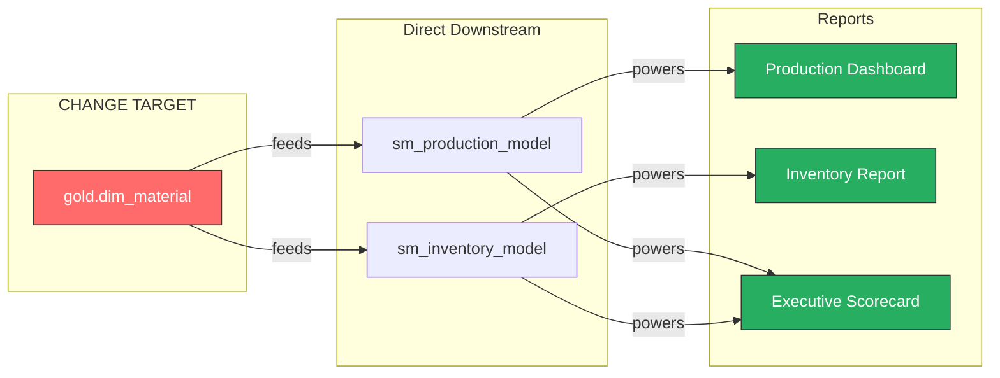
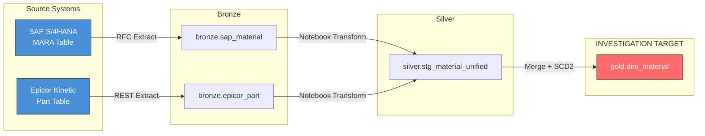
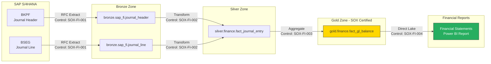
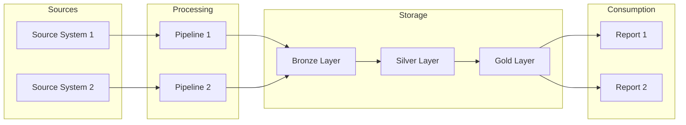
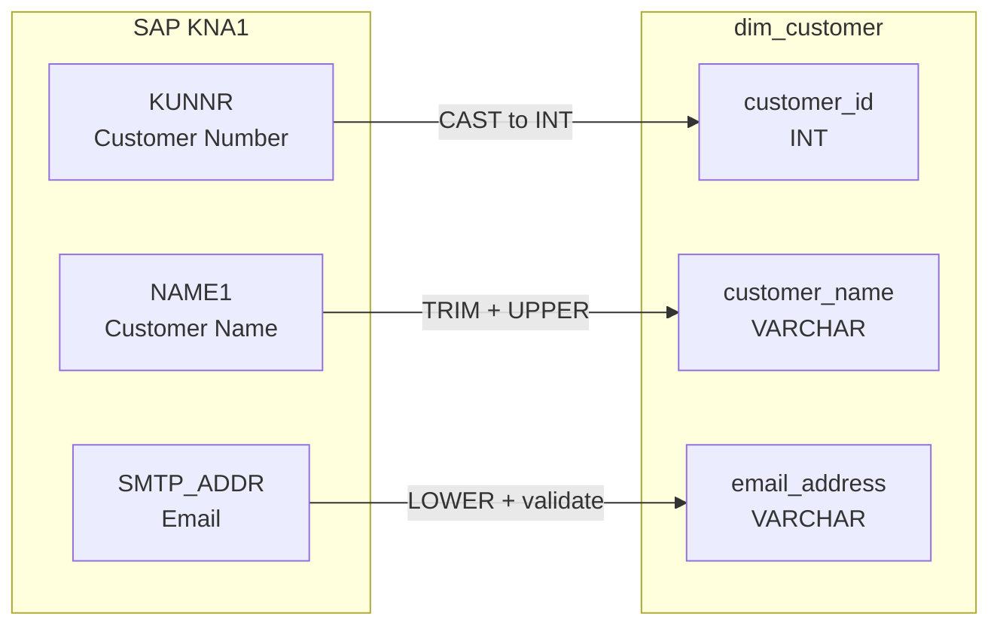
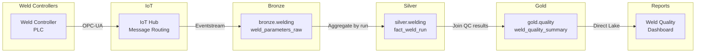

# Lineage Visualization Standards

> Module: ISL-02 | Version: 1.0 | Adaptation Effort: 2-4 hrs | Dependencies: ISL-02, ISL-04

## Purpose

This document defines the standards for visualizing data lineage within the enterprise data estate. Effective lineage visualization transforms the abstract lineage graph into an actionable tool for impact analysis, regulatory compliance, root cause investigation, and data trust assessment. These standards ensure consistent, readable, and interactive lineage diagrams regardless of the visualization platform used.

Lineage visualization is the primary interface through which data owners, stewards, engineers, auditors, and analysts interact with lineage information. Clear visualization standards reduce time-to-insight for impact analysis and make lineage information accessible to both technical and business users.

## Scope

### In Scope

- Lineage diagram rendering requirements (layout, zoom, filter, search)
- Impact analysis visualization workflows (forward and backward)
- Regulatory reporting lineage views (SOX, GDPR)
- Drill-down levels (system, pipeline, table, column)
- Visualization tool requirements and evaluation criteria
- Lineage diagram notation standards with Mermaid examples
- Freshness and quality indicators on lineage nodes
- Interactive features and user experience standards

### Out of Scope

- Lineage data capture and storage (covered in ISL-02 Data Lineage Requirements)
- Lineage API design (covered in ISL-02 Metadata Integration Patterns)
- Business process flow diagrams (BPMN)
- Application architecture diagrams (C4 model)
- Network topology diagrams

## [ADAPTATION REQUIRED] Client Context

| Parameter | Default | Client Value | Notes |
|-----------|---------|--------------|-------|
| Primary Lineage Visualization Tool | Microsoft Purview | _________________ | Built-in lineage view |
| Secondary Visualization | Power BI Dashboard | _________________ | Custom lineage reporting |
| Diagramming Standard | Mermaid (for documentation) | _________________ | Diagram-as-code format |
| Maximum Nodes per View | 50 | _________________ | Performance threshold |
| Default Drill-Down Level | L3 (Table) | _________________ | Starting granularity |
| Color Scheme | ISL Standard (see below) | _________________ | Accessibility compliant |
| Export Formats | PNG, SVG, PDF | _________________ | Diagram export |
| Regulatory Views Required | SOX, GDPR | _________________ | Compliance lineage |
| Freshness Indicator | Color-coded (green/yellow/red) | _________________ | Staleness visual |
| Quality Overlay | Yes (ISL-06 scores) | _________________ | Quality on lineage nodes |

## Rendering Requirements

### Layout Standards

| Requirement | Standard | Rationale |
|-------------|----------|-----------|
| Graph Direction | Left-to-right (source -> target) | Matches natural reading order; consistent with data flow direction |
| Layout Algorithm | Hierarchical/Dagre layout (layered) | Best for DAG structures; minimizes edge crossings |
| Node Spacing | Minimum 80px horizontal, 40px vertical | Prevents overlap and improves readability |
| Edge Routing | Orthogonal or curved (no straight overlapping) | Reduces visual clutter at intersections |
| Edge Direction | Arrows indicating data flow direction | Eliminates ambiguity on flow direction |
| Grouping | Nodes grouped by system or zone (visual containers) | Provides context and reduces cognitive load |
| Responsive | Adapts to viewport size; horizontal scroll for large graphs | Usability across screen sizes |
| Maximum Initial View | 50 nodes visible without scrolling | Performance and comprehension limit |
| Overflow Handling | Collapse/expand groups; show count badge for hidden nodes | Scales to large lineage graphs |

### Interaction Standards

| Feature | Requirement | Priority |
|---------|-------------|----------|
| Zoom In/Out | Mouse wheel or pinch gesture; min 25%, max 400% | Must Have |
| Pan | Click-and-drag or scroll on canvas | Must Have |
| Fit to Screen | Button to auto-fit entire graph to viewport | Must Have |
| Node Click | Click node to show detail panel (metadata, quality, owner) | Must Have |
| Node Expand | Double-click to expand node (e.g., table -> columns) | Must Have |
| Node Collapse | Collapse expanded node back to summary | Must Have |
| Edge Click | Click edge to show transformation details | Should Have |
| Search | Type-ahead search to highlight/navigate to specific node | Must Have |
| Filter by Type | Filter to show only specific asset types (tables, pipelines, reports) | Must Have |
| Filter by Zone | Filter by medallion zone (Bronze, Silver, Gold) | Should Have |
| Filter by System | Filter by source system | Should Have |
| Filter by Classification | Filter by security classification tier | Should Have |
| Highlight Path | Highlight specific lineage path on hover/click | Must Have |
| Minimap | Thumbnail overview of full graph with viewport indicator | Should Have |
| Bookmarks | Save and share specific lineage views | Nice to Have |
| Undo/Redo | Undo/redo navigation actions | Nice to Have |

### Node Visual Standards

| Node Type | Shape | Default Color | Icon | Label |
|-----------|-------|--------------|------|-------|
| Source System | Rounded rectangle | #4A90D9 (Blue) | Database icon | System name |
| Database/Lakehouse | Rectangle | #6C8EBF (Light blue) | Cylinder icon | Database name |
| Pipeline | Parallelogram | #D4A843 (Gold) | Arrow-flow icon | Pipeline name |
| Table (Bronze) | Rectangle | #CD7F32 (Bronze) | Table icon | Schema.table |
| Table (Silver) | Rectangle | #C0C0C0 (Silver) | Table icon | Schema.table |
| Table (Gold) | Rectangle | #FFD700 (Gold) | Table icon | Schema.table |
| View | Rectangle (dashed border) | Matches zone color | View icon | Schema.view |
| Column | Small rectangle | Matches parent color | Column icon | Column name |
| Semantic Model | Diamond | #9B59B6 (Purple) | Model icon | Model name |
| Report/Dashboard | Hexagon | #27AE60 (Green) | Chart icon | Report name |
| File | Document shape | #95A5A6 (Gray) | File icon | File name |
| API Endpoint | Rounded rectangle (thick border) | #E67E22 (Orange) | API icon | Endpoint path |
| Event Stream | Wavy rectangle | #E74C3C (Red) | Stream icon | Stream name |

### Edge Visual Standards

| Edge Type | Line Style | Color | Label |
|-----------|-----------|-------|-------|
| Data flow (automated) | Solid line | #333333 (Dark gray) | Transform name or "direct" |
| Data flow (manual) | Dashed line | #999999 (Light gray) | "Manual" |
| Dependency (execution) | Dotted line | #666666 (Medium gray) | "depends on" |
| Contains (parent-child) | Solid thin line | #CCCCCC (Very light gray) | None |
| Lineage gap (unknown) | Dashed red line | #E74C3C (Red) | "GAP" |

### Freshness Indicators

| Indicator | Visual | Condition |
|-----------|--------|-----------|
| Fresh | Green dot on node (top-right corner) | Last refresh within expected schedule |
| Stale | Yellow triangle on node | Last refresh 1-2x beyond expected schedule |
| Very Stale | Red circle on node | Last refresh > 2x beyond expected schedule |
| Unknown | Gray question mark on node | No refresh schedule defined |

### Quality Score Overlay

| Score Range | Visual | Meaning |
|------------|--------|---------|
| 90-100 | Green border (2px) | High quality |
| 70-89 | Yellow border (2px) | Acceptable quality |
| 50-69 | Orange border (2px) | Quality concerns |
| 0-49 | Red border (3px, pulsing) | Quality alert |
| No score | No border overlay | Quality not measured |

## Drill-Down Levels

### Level Hierarchy

```
L1: System View ──────── [SAP] ──> [Fabric Bronze] ──> [Fabric Gold] ──> [Power BI]
       │
       ▼
L2: Pipeline View ────── [pl_sap_extract] ──> [nb_transform] ──> [pl_gold_load]
       │
       ▼
L3: Table View ────────── [sap.MARA] ──> [bronze.material_raw] ──> [gold.dim_material]
       │
       ▼
L4: Column View ────────  [MATNR] ──> [material_number_raw] ──> [material_number]
                          [MAKTX] ──> [description_raw] ──> [material_description]
```

### Drill-Down Interaction

| Action | Result |
|--------|--------|
| Start at L1 | Show system-level view with all source and target systems |
| Click on system node | Expand to L2 showing pipelines within/between systems |
| Click on pipeline node | Expand to L3 showing source and target tables |
| Click on table node | Expand to L4 showing column-level mappings and transformations |
| Breadcrumb navigation | Show path: System > Pipeline > Table > Column; click any level to navigate back |
| "Expand All" button | Expand all nodes to L3 (not L4, which is too granular for full view) |
| "Collapse All" button | Return to L1 system view |

## Impact Analysis Workflows

### Forward Impact Analysis View

**Purpose:** Answer "What does this feed?" when planning changes.

**Visual Layout:**



**Impact Summary Panel:**

| Metric | Value |
|--------|-------|
| Total Downstream Assets | 5 |
| Critical Assets Impacted | 2 (Executive Scorecard, Production Dashboard) |
| Reports Affected | 3 |
| Semantic Models Affected | 2 |
| Estimated Consumers Impacted | 47 users |
| Recommended Action | CAB review required (critical assets affected) |

### Backward Lineage View

**Purpose:** Answer "Where does this come from?" for root cause analysis.



## Regulatory Reporting Lineage

### SOX Financial Flow View

**Purpose:** Document end-to-end lineage for financial data subject to SOX compliance.

**Requirements:**

| Requirement | Standard |
|-------------|----------|
| Scope | All data assets contributing to financial statements |
| Granularity | Column-level (L4) for all financial measures |
| Annotations | Each transformation node annotated with control reference |
| Certification | Quarterly certification by financial data owner |
| Export | Exportable as PDF for external auditor review |
| Change Highlighting | Show changes since last certification in highlighted color |
| Control Mapping | Link each node to relevant SOX control ID |

**SOX Lineage Diagram Example:**



### GDPR PII Flow View

**Purpose:** Trace all personal data flows for GDPR Article 30 compliance.

**Requirements:**

| Requirement | Standard |
|-------------|----------|
| Scope | All data assets containing PII of EU/EEA data subjects |
| Granularity | Column-level (L4) for all PII columns |
| Annotations | Legal basis and processing purpose at each node |
| Retention Markers | Retention period displayed at each storage node |
| Cross-Border Indicators | Flag icon when data crosses geographic boundaries |
| Third-Party Markers | Vendor icon when data flows to/from third parties |
| Export | Exportable as PDF for DPA review |

**GDPR Lineage Annotations:**

| Annotation | Icon | Purpose |
|-----------|------|---------|
| Legal Basis | Scale icon | Consent, Contract, Legitimate Interest, Legal Obligation |
| Processing Purpose | Target icon | Service delivery, Analytics, Marketing |
| Retention Period | Clock icon | 30 days, 1 year, 7 years |
| Cross-Border Transfer | Globe icon | EU -> US, US -> EU |
| Third-Party Processor | Building icon | Vendor name and DPA reference |
| Masking Applied | Shield icon | Data masked or pseudonymized |
| Deletion Capable | Trash icon | Asset supports subject deletion |

## Lineage Diagram Standards (Documentation)

### Mermaid Notation Standards

For documentation and static lineage diagrams, Mermaid is the standard notation.

**System-Level Template:**



**Column-Level Template:**



### Diagram Naming Convention

Per ISL-03, lineage diagrams must follow the naming pattern:

```
lineage_{scope}_{subject}_{level}.{format}
```

**Examples:**

| Diagram | File Name |
|---------|-----------|
| System-level overview | lineage_enterprise_overview_l1.md |
| SAP-to-Gold material flow | lineage_sap_material_master_l3.md |
| SOX financial column lineage | lineage_sox_financial_statements_l4.md |
| GDPR PII data flow | lineage_gdpr_pii_customer_data_l4.md |

## Visualization Tool Requirements

### Evaluation Criteria

| Criterion | Weight | Must-Have Threshold |
|-----------|--------|-------------------|
| Interactive Graph Rendering | 20% | Supports DAG with 500+ nodes |
| Drill-Down Navigation | 15% | At least 3 levels of drill-down |
| Search and Filter | 15% | Full-text search + attribute filtering |
| Purview/Catalog Integration | 15% | Native or API integration |
| Export Capabilities | 10% | PNG, SVG, PDF export |
| Collaboration Features | 10% | Comments, sharing, annotations |
| Performance | 10% | < 3 second load for 200-node graph |
| Accessibility | 5% | WCAG 2.1 AA compliance |

### Recommended Tool Stack

| Purpose | Primary Tool | Secondary Tool |
|---------|-------------|---------------|
| Interactive lineage browsing | Purview Data Map lineage view | Custom Power BI lineage dashboard |
| Regulatory lineage reports | Custom Power BI report | PDF export from Purview |
| Documentation lineage | Mermaid diagrams in Markdown | Draw.io / Visio for complex diagrams |
| Impact analysis | Purview lineage API + custom UI | Purview native impact view |
| Column-level visualization | Custom application (React + D3.js) | Purview column lineage (limited) |

## Fabric / Azure Implementation Guidance

### Purview Lineage View

- Use Purview Data Map for interactive lineage browsing (supports L1-L3 natively).
- Configure Purview lineage connectors for all supported sources.
- Column-level lineage requires OpenLineage integration for Spark/Notebook sources.
- Purview lineage view supports zoom, pan, filter by asset type, and node detail panels.

### Custom Lineage Dashboard (Power BI)

- Extract lineage graph data from Purview REST API into Fabric Lakehouse.
- Build a semantic model over the lineage graph (nodes and edges tables).
- Create Power BI reports with drill-down from system to column level.
- Include regulatory-specific views (SOX, GDPR) as separate report pages.
- Add freshness and quality overlays using ISL-06 quality score data.

### Lineage Export for Auditors

- Build automated export pipeline that generates PDF lineage reports quarterly.
- Include node metadata, transformation logic, and control references.
- Store exports in immutable audit storage (ADLS with WORM policy).
- Provide auditors with read-only Purview access for interactive exploration.

## Manufacturing Overlay [CONDITIONAL]

### Manufacturing Lineage Views

| View | Scope | Primary Audience | Key Nodes |
|------|-------|-----------------|-----------|
| BOM Lineage | Product structure across SAP + Epicor | Engineering, Quality | BOM header, components, raw materials |
| Production Flow | Work order to finished goods | Operations, Production | Work order, routing steps, QC inspections |
| Sensor-to-Insight | IoT data to analytics | IoT Team, Operations | Sensors, event streams, aggregations, dashboards |
| Quality Chain | Raw material to final inspection | Quality Assurance | Incoming inspection, in-process, final QC |
| Supply Chain | Supplier to customer delivery | Supply Chain | PO, receipt, production, shipment |

### Welding Process Lineage View



## Cross-References

| Document | Relationship |
|----------|-------------|
| ISL-02: Data Lineage Requirements | Lineage data being visualized |
| ISL-02: Technical Metadata Schema | Node metadata displayed in visualizations |
| ISL-02: Data Catalog Governance | Catalog UI integrates lineage views |
| ISL-02: Metadata Integration Patterns | API patterns for lineage data retrieval |
| ISL-02: Business Glossary Standards | Glossary terms annotated on lineage nodes |
| ISL-04: Data Classification | Classification filters in lineage views |
| ISL-06: Data Quality Framework | Quality scores overlaid on lineage nodes |

## Compliance Alignment

| Standard | Alignment |
|----------|-----------|
| DAMA DMBOK2 (Ch. 8) | Data integration — lineage visualization |
| SOX (Section 302/404) | Financial data flow documentation |
| GDPR (Art. 30, 35) | Records of processing and DPIA visualizations |
| WCAG 2.1 AA | Accessibility standards for visualization tools |
| ISO 25010 | Software quality — usability requirements for visualization |
| NIST SP 800-53 (AU-3) | Audit record visualization |

## Revision History

| Version | Date | Author | Changes |
|---------|------|--------|---------|
| 1.0 | 2025-03-15 | ISL Working Group | Initial release |
| -- | -- | -- | Reserved for client adaptation |
